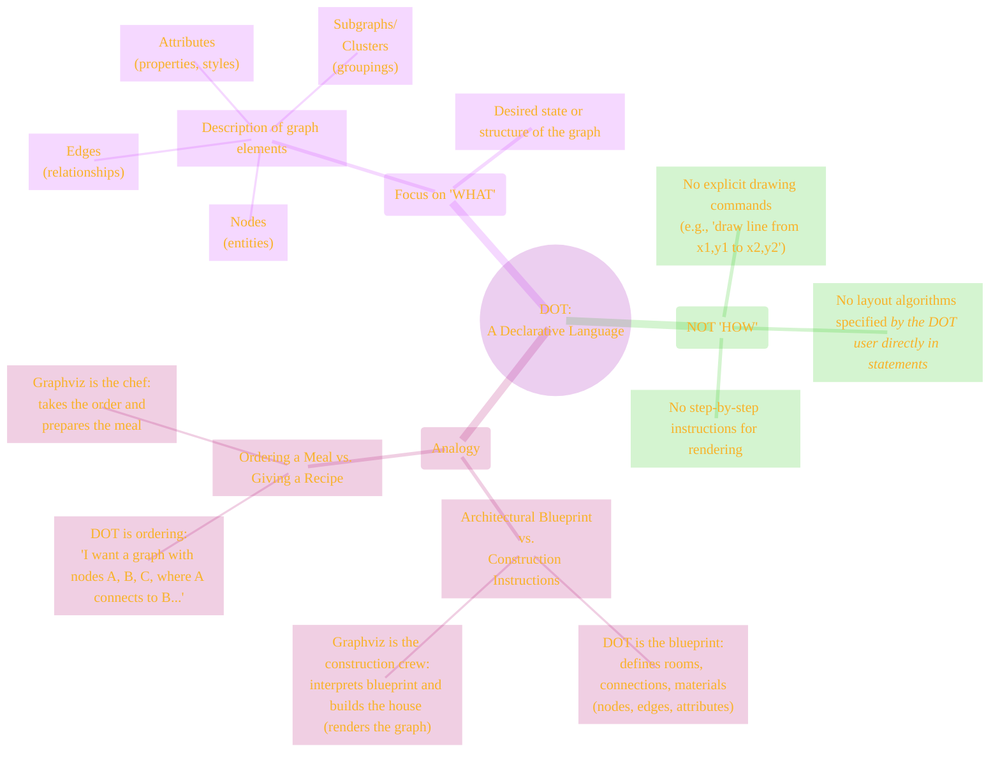

# Cultural Paradigm: The Declarative Nature of DOT
> **Disclaimer:**
>
> This document contains my personal notes on the topic,
> compiled from publicly available documentation and various cited sources.
> The materials are intended for educational purposes, personal study, and reference.
> The content is dual-licensed:
> 1. **MIT License:** Applies to all code implementations (Swift, Mermaid, and other programming languages).
> 2. **Creative Commons Attribution-ShareAlike 4.0 International License (CC BY-SA 4.0):** Applies to all non-code content, including text, explanations, diagrams, and illustrations.
---

The DOT language embodies a **declarative programming paradigm**. This is a fundamental aspect of its "culture" and dictates how users interact with it to describe graphs.

## What is Declarative Programming?

In declarative programming, you describe **what** you want to achieve, or **what** something *is*, rather than specifying a step-by-step sequence of instructions (**how** to achieve it). The system (in this case, a Graphviz layout engine) is responsible for figuring out the "how."

----

## DOT's Declarative Approach to Graphs

When you write a DOT file, you are making statements about the existence and properties of graph components:

*   `A -> B;` declares that a directed edge *exists* from node A to node B.
*   `nodeX [shape=box, color=red];` declares that nodeX *has* the properties of being box-shaped and having a red border.
*   `rankdir=LR;` declares that the graph's preferred layout direction *is* left-to-right.

You are not telling Graphviz:
*   "First, draw a circle for node A at coordinates (10,20)."
*   "Then, draw a line from node A to node B using a specific curve algorithm."
*   "Then, calculate the optimal position for node C based on its connections."

Instead, you provide the complete description of all components and their relationships. The Graphviz layout engine (e.g., `dot`, `neato`, `fdp`) then applies sophisticated algorithms to:

1.  Determine the positions of nodes.
2.  Route the edges between them.
3.  Apply the specified styles and attributes.
4.  Render the final image (e.g., SVG, PNG).

---

## Advantages of the Declarative Model for Graphs

*   **Simplicity & Readability:** DOT files are often more concise and easier to understand for humans, as they focus on the graph's structure rather than low-level drawing details.
*   **Abstraction:** Hides the complexity of graph layout algorithms. Users don't need to be experts in graph drawing to create visualizations.
*   **Portability & Reusability:** A DOT description can be rendered by different layout engines (though `dot` is the most common for hierarchical layouts implied by DOT syntax) or post-processed by various tools.
*   **Focus on Data:** Ideal for automatically generating graph descriptions from data sources, as the program writing the DOT needs only to map data entities and relationships to nodes and edges.
*   **Layout Optimization:** Allows specialized layout engines to apply their best algorithms for different types of graphs (hierarchical, force-directed, radial, etc.) without changing the DOT source.

----

## Contrast with Imperative Approaches

An imperative approach to graph drawing might involve:
*   A graphics library where you call functions like `drawNode(x, y, shape)`, `drawLine(x1, y1, x2, y2)`.
*   Manually calculating positions and paths.

While imperative approaches offer fine-grained control, they are much more complex for general graph visualization and less amenable to automatic layout.

DOT's declarative nature is a key reason for its success and widespread use in visualizing complex systems and relationships effectively. It lets users focus on the structure and meaning of their data, leaving the aesthetics of layout to powerful, specialized algorithms.

---

<!-- 

---
>**Licenses:**
>
>- **MIT License:**   - Full text in [LICENSE](LICENSE) file.
>- **Creative Commons Attribution-ShareAlike 4.0 International**: [CC BY-SA 4.0](https://creativecommons.org/licenses/by-sa/4.0/)  - Legal details in [LICENSE-CC-BY-SA-4.0](LICENSE-CC-BY-SA-4.0) and at [Creative Commons official site](https://creativecommons.org/licenses/by-sa/4.0/).
>
---