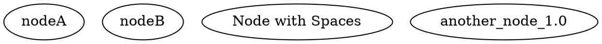
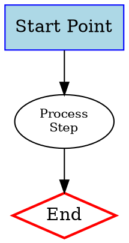
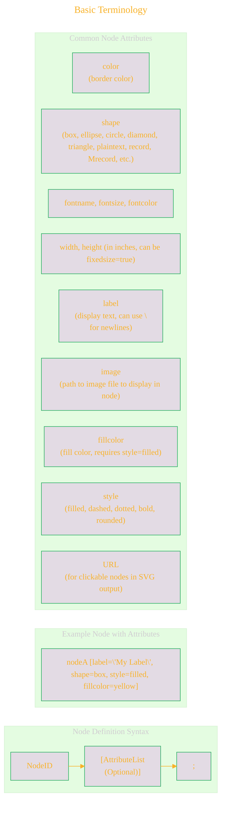
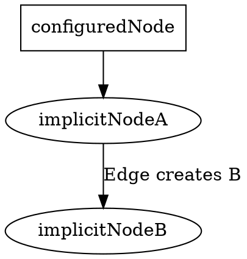
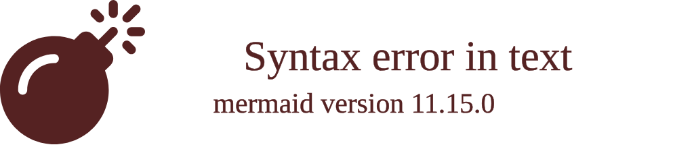

# Syntax Terrain: Defining Nodes in DOT
> This content is dual-licensed under your choice of the following licenses:
> 1.  **MIT License:** For the code implementations in Swift and Mermaid provided in this document.
> 2.  **Creative Commons Attribution 4.0 International License (CC BY 4.0):** For all other content, including the text, explanations, and the Mermaid diagrams and illustrations.

---

Nodes are the fundamental building blocks of any graph, representing entities or objects. In DOT, defining a node is straightforward, and its appearance can be heavily customized using attributes.

## Basic Node Definition

The simplest way to define a node is by stating its identifier (ID):

If a node ID is used in an edge definition (e.g. `nodeX -> nodeY;`) but not explicitly defined beforehand, it is implicitly created with default attributes. However, explicit definition is clearer and allows for attribute assignment.

---

## Node Attributes

Attributes are assigned to nodes in square brackets `[]` immediately following the node ID.

----

## Node Labels

*   **Simple Text:** `label="My Node"`
*   **Multi-line Text:** `label="Line 1\nLine 2"` (The `\n` sequence creates a newline). Graphviz will automatically break long labels based on node size if not explicitly formatted.

----

## Node Shapes

DOT provides a rich set of built-in shapes. Some common ones:

*   `box`, `rectangle`, `square`
*   `ellipse`, `oval`, `circle`
*   `diamond`
*   `triangle`, `point`
*   `plaintext` (no visible shape, just the label)
*   `record`, `Mrecord` (for complex, multi-part nodes, see "Advanced Features")
*   `polygon` (allows specifying sides, skew, distortion)
*   `underline`, `cylinder`, `note`, `tab`, `folder`, `box3d`

The default shape is often `ellipse`.

----

## Implicit Node Creation

Nodes are automatically created if they appear in an edge statement and haven't been explicitly defined. They will use default node attributes.

It's generally better practice to define nodes explicitly if you need to set specific attributes for them.

Mastering node definition and styling is crucial for creating understandable and visually appealing graph diagrams.

---

<!-- 

---
>**Licenses:**
>
>- **MIT License:**   - Full text in [LICENSE](LICENSE) file.
>- **Creative Commons Attribution-ShareAlike 4.0 International**: [CC BY-SA 4.0](https://creativecommons.org/licenses/by-sa/4.0/)  - Legal details in [LICENSE-CC-BY-SA-4.0](LICENSE-CC-BY-SA-4.0) and at [Creative Commons official site](https://creativecommons.org/licenses/by-sa/4.0/).
>
---