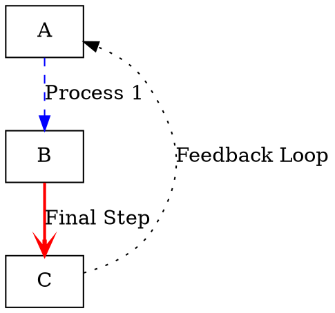

# Syntax Terrain: Defining Edges in DOT

> This content is dual-licensed under your choice of the following licenses:
> 1.  **MIT License:** For the code implementations in Swift and Mermaid provided in this document.
> 2.  **Creative Commons Attribution 4.0 International License (CC BY 4.0):** For all other content, including the text, explanations, and the Mermaid diagrams and illustrations.

---


Edges represent the connections or relationships between nodes in a graph. DOT provides distinct syntax for edges in directed (`digraph`) and undirected (`graph`) graphs, along with attributes to customize their appearance and behavior.

## Edge Definition Syntax

*   **Directed Edges (`digraph`):** Use `->` (an arrow) to indicate direction from a source node to a target node.
    ```dot
    digraph DirectedEdges {
        A -> B;         // Edge from A to B
        B -> C;
        A -> C;         // Another edge from A
    }
    ```

*   **Undirected Edges (`graph`):** Use `--` (a double dash) to indicate a connection without inherent direction.
    ```dot
    graph UndirectedEdges {
        A -- B;         // Edge between A and B
        B -- C;
        A -- C;
    }
    ```

*   **Chaining Edges:** You can chain edge definitions for brevity:
    ```dot
    digraph ChainedEdges {
        A -> B -> C -> D; // Equivalent to A->B; B->C; C->D;
    }
    graph ChainedUndirected {
        X -- Y -- Z;    // Equivalent to X--Y; Y--Z;
    }
    ```

----

## Edge Attributes

Similar to nodes, edges can have attributes specified in square brackets `[]` immediately following the edge definition.



```mermaid
graph LR
    subgraph "Edge Definition Syntax"
        direction LR
        S[SourceNode] --> Arrow["(-> or --)"]
        Arrow --> T[TargetNode]
        T --> AL["[AttributeList (Optional)]"]
        AL --> SC[";"]
    end

    subgraph "Example Edge with Attributes"
        N1["A -> B [label=\"Connects To\", color=green, style=bold];"]
    end

    subgraph "Common Edge Attributes"
        LAE["label (display text for the edge)"]
        COE["color (edge line color)"]
        STE["style (solid, dashed, dotted, bold)"]
        PWE["penwidth (thickness of the edge line)"]
        AHE["arrowhead (normal, dot, vee, curve, inv, diamond, etc.)"]
        ATE["arrowtail (same options as arrowhead, for start of edge)"]
        ARS["arrowsize (multiplier for arrowhead/tail size)"]
        DIE["dir (forward, back, both, none - for custom arrow display)"]
        CSE["constraint (true/false - whether edge influences node ranking/layout)"]
        LNE["len (preferred edge length in inches - for neato/fdp)"]
        WTE["weight (higher weight often means shorter, straighter edges)"]
        FOE["fontname, fontsize, fontcolor (for edge labels)"]
        URE["URL (for clickable edges in SVG output)"]
    end
```

----

## Connecting to Node Ports or Compass Points

For nodes with specific connection points (like 'record' shapes or using compass points), you can specify these in the edge definition using a colon `:`.

*   **Record Shapes:** If a node is defined with a `record` shape and has labeled fields (ports), edges can connect to these ports.
    ```dot
    digraph RecordPorts {
        nodeA [shape=record, label="<f0> Field 0 | <f1> Field 1 | <f2> Field 2"];
        nodeB [shape=box];
        nodeA:f1 -> nodeB [label="From Field 1"]; // Connects from port f1 of nodeA
    }
    ```

*   **Compass Points:** Nodes can be targeted at logical compass points (`n`, `ne`, `e`, `se`, `s`, `sw`, `w`, `nw`, `c` for center).
    ```dot
    digraph CompassPoints {
        A; B;
        A:e -> B:w [label="East of A to West of B"]; // Connect A's east side to B's west side
    }
    ```
    The actual visual effect depends on the layout engine and node shapes.

Edges are the lifelines of your graph, and effectively styling them greatly enhances the communication of relationships within your diagrams.


---


<!-- 
```mermaid
%% Current Mermaid version
info
```
-->


```mermaid
---
title: "CongLeSolutionX"
author: "Cong Le"
version: "1.0"
license(s): "MIT, CC BY 4.0"
copyright: "Copyright (c) 2025 Cong Le. All Rights Reserved."
config:
  theme: base
---
%%{
  init: {
    'flowchart': { 'htmlLabels': false },
    'fontFamily': 'Bradley Hand',
    'themeVariables': {
      'primaryColor': '#fc82',
      'primaryTextColor': '#F8B229',
      'primaryBorderColor': '#27AE60',
      'secondaryColor': '#81c784',
      'secondaryTextColor': '#6C3483',
      'lineColor': '#F8B229',
      'fontSize': '20px'
    }
  }
}%%
flowchart LR
    My_Meme@{ img: "https://raw.githubusercontent.com/CongLeSolutionX/MY_GRAPHIC_ASSETS/refs/heads/Designing_graphic_syntax/MY_MEME/My-meme-icon-design.png", label: "Ăn uống gì chưa ngừi đẹp?", pos: "b", w: 200, h: 150, constraint: "on" }

    Closing_quote@{ shape: braces, label: "I'll leave this Earth empty-handed anyway!<br/>YOLO" }

My_Meme ~~~ Closing_quote


```


---
>**Licenses:**
>
>- **MIT License:**  [](LICENSE) - Full text in [LICENSE](LICENSE) file.
>- **Creative Commons Attribution 4.0 International:** [](LICENSE-CC-BY) - Legal details in [LICENSE-CC-BY](LICENSE-CC-BY) and at [Creative Commons official site](http://creativecommons.org/licenses/by/4.0/).
>
---