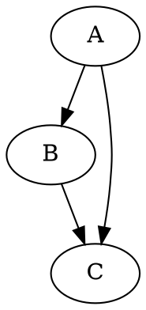
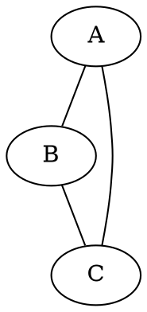
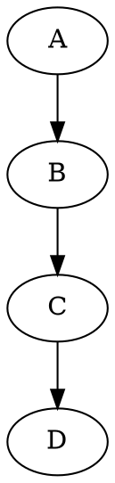
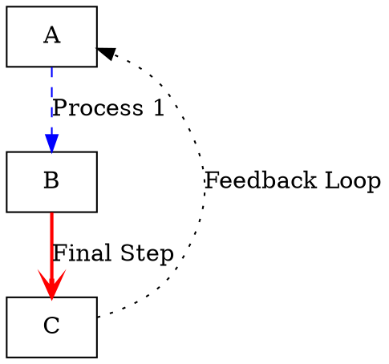
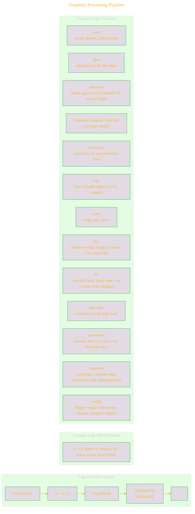
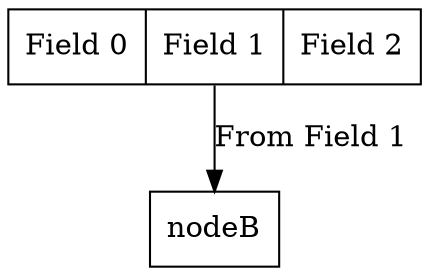
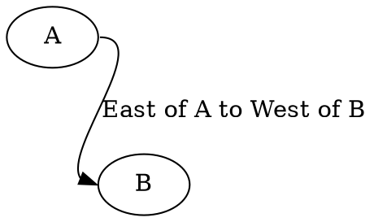

# Syntax Terrain: Defining Edges in DOT
> **Disclaimer:**
>
> This document contains my personal notes on the topic,
> compiled from publicly available documentation and various cited sources.
> The materials are intended for educational purposes, personal study, and reference.
> The content is dual-licensed:
> 1. **MIT License:** Applies to all code implementations (Swift, Mermaid, and other programming languages).
> 2. **Creative Commons Attribution-ShareAlike 4.0 International License (CC BY-SA 4.0):** Applies to all non-code content, including text, explanations, diagrams, and illustrations.
---

Edges represent the connections or relationships between nodes in a graph. DOT provides distinct syntax for edges in directed (`digraph`) and undirected (`graph`) graphs, along with attributes to customize their appearance and behavior.

## Edge Definition Syntax

*   **Directed Edges (`digraph`):** Use `->` (an arrow) to indicate direction from a source node to a target node.

*   **Undirected Edges (`graph`):** Use `--` (a double dash) to indicate a connection without inherent direction.

*   **Chaining Edges:** You can chain edge definitions for brevity:

----

## Edge Attributes

Similar to nodes, edges can have attributes specified in square brackets `[]` immediately following the edge definition.

----

## Connecting to Node Ports or Compass Points

For nodes with specific connection points (like 'record' shapes or using compass points), you can specify these in the edge definition using a colon `:`.

*   **Record Shapes:** If a node is defined with a `record` shape and has labeled fields (ports), edges can connect to these ports.

*   **Compass Points:** Nodes can be targeted at logical compass points (`n`, `ne`, `e`, `se`, `s`, `sw`, `w`, `nw`, `c` for center).

The actual visual effect depends on the layout engine and node shapes.

Edges are the lifelines of your graph, and effectively styling them greatly enhances the communication of relationships within your diagrams.

---

<!-- 

---
>**Licenses:**
>
>- **MIT License:**   - Full text in [LICENSE](LICENSE) file.
>- **Creative Commons Attribution-ShareAlike 4.0 International**: [CC BY-SA 4.0](https://creativecommons.org/licenses/by-sa/4.0/)  - Legal details in [LICENSE-CC-BY-SA-4.0](LICENSE-CC-BY-SA-4.0) and at [Creative Commons official site](https://creativecommons.org/licenses/by-sa/4.0/).
>
---