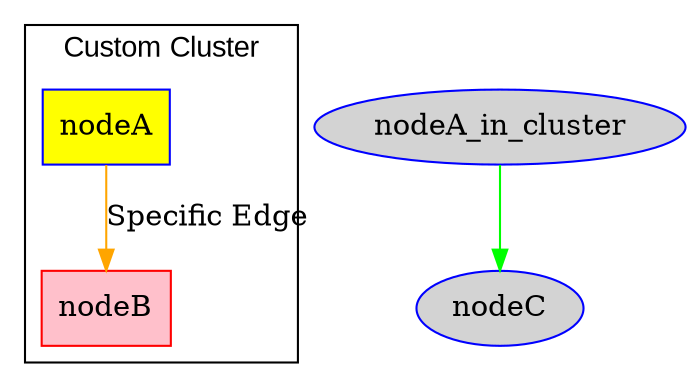

# Syntax Terrain: General Attributes Syntax in DOT

> This content is dual-licensed under your choice of the following licenses:
> 1.  **MIT License:** For the code implementations in Swift and Mermaid provided in this document.
> 2.  **Creative Commons Attribution 4.0 International License (CC BY 4.0):** For all other content, including the text, explanations, and the Mermaid diagrams and illustrations.


Attributes in DOT are key-value pairs that control the appearance, layout, and other properties of graphs, nodes, and edges. Understanding their syntax is crucial for customizing your diagrams.

## Basic Attribute Assignment

Attributes are generally assigned in one of two forms:

1.  **`ID = ID`**:
    *   Used when the value is a simple identifier (e.g., a color name like `red`, a shape name like `box`, or a boolean like `true`).
    *   Quotes are not strictly necessary if the ID conforms to DOT's ID rules (alphanumeric, underscores, not starting with a number).
    *   Example: `color=blue`, `shape=ellipse`, `constraint=false`

2.  **`ID = "String"`**:
    *   Used when the value is a string, especially if it contains spaces, special characters, or is a numerical value that you want to ensure is treated as a string.
    *   The string must be enclosed in double quotes `""`.
    *   Example: `label="My Node Label"`, `fontname="Arial"`, `URL="https://example.com"`

## Attribute Lists

Multiple attributes for a single graph element (graph, node, or edge) are enclosed in square brackets `[]`, separated by commas `,` or semicolons `;` (or even just whitespace, though commas are most common and clearest).

*   **Syntax:** `[ attribute1=value1, attribute2=value2, attributeN=valueN ]`

```mermaid
---
title: "CHANGE_ME_DADDY"
author: "Cong Le"
version: "1.0"
license(s): "MIT, CC BY 4.0"
copyright: "Copyright (c) 2025 Cong Le. All Rights Reserved."
config:
  theme: base
---
%%%%%%%% Mermaid version v11.4.1-b.14
%%{
  init: {
    'fontFamily': 'Monaco',
    'themeVariables': {
      'primaryColor': '#D5E3',
      'primaryTextColor': '#F8B229',
      'primaryBorderColor': '#27AE60',
      'secondaryColor': '#EBDEF0',
      'secondaryTextColor': '#6C3483',
      'secondaryBorderColor': '#A569BD',
      'fontSize': '20px'
    }
  }
}%%
mindmap
  root((Attribute Assignment))
    Key-Value Pair
      ID (Attribute Name)
      Equals (=)
      Value
        SimpleID
          ::icon(fa fa-tag)
          `color=blue`
          `shape=box`
          `true`, `false`
        QuotedString
          ::icon(fa fa-quote-left)
          `label="Node Text"`
          `fontname="Times New Roman"`
          `URL="http://..."`
          Numerical values like `fontsize="12"` (often numbers can be unquoted, but quotes are safer for consistency)

    Attribute List `[...]`
      ::icon(fa fa-list-ul)
      Enclosed in square brackets
      For graph, node, and edge statements
      Separators
        Comma (`,`) - Most common
        Semicolon (`;`) - Also valid
        Whitespace - Can work but less clear
      Example: `nodeA [label="Example", shape=rect, color=red];`
```

-----

## Attribute Scope and Precedence

Attributes can be set at different levels, forming a hierarchy of defaults:

1.  **Graph-level defaults:**
    *   `graph [attr=val, ...];` (sets defaults for the graph itself)
    *   `node [attr=val, ...];` (sets default attributes for all subsequent nodes)
    *   `edge [attr=val, ...];` (sets default attributes for all subsequent edges)

2.  **Subgraph/Cluster-level defaults:** Defined within a `subgraph` or `subgraph cluster_...` block, these override graph-level defaults for elements within that subgraph/cluster.

3.  **Individual Element attributes:** Defined directly on a node or edge statement, these override all higher-level defaults.
    *   `nodeID [attr=val, ...];`
    *   `sourceNode -> targetNode [attr=val, ...];`

**Precedence Example:**


*(Note: The `nodeA_in_cluster` is not `nodeA` from `cluster_custom` unless named identically. My example implies `nodeA` is distinct from `nodeA_in_cluster`. If they were the same node, `nodeA`'s attributes from the cluster would apply.)*

-----

## HTML-Like Labels

A special case for the `label` attribute is HTML-like labels. These are enclosed in `<` and `>` instead of quotes `""`. They allow for richer formatting, tables, and ports within node labels. See `05_Advanced_Features_Syntax.md` for more.

Example: `nodeX [label=< <B>Bold Text</B><BR/>New Line >];`

Correctly applying attributes with the proper syntax is fundamental to controlling the final rendered appearance of your Graphviz diagrams.


---

<!-- 
```mermaid
%% Current Mermaid version
info
```
-->


```mermaid
---
title: "CongLeSolutionX"
author: "Cong Le"
version: "1.0"
license(s): "MIT, CC BY 4.0"
copyright: "Copyright (c) 2025 Cong Le. All Rights Reserved."
config:
  theme: base
---
%%{
  init: {
    'flowchart': { 'htmlLabels': false },
    'fontFamily': 'Bradley Hand',
    'themeVariables': {
      'primaryColor': '#fc82',
      'primaryTextColor': '#F8B229',
      'primaryBorderColor': '#27AE60',
      'secondaryColor': '#81c784',
      'secondaryTextColor': '#6C3483',
      'lineColor': '#F8B229',
      'fontSize': '20px'
    }
  }
}%%
flowchart LR
    My_Meme@{ img: "https://raw.githubusercontent.com/CongLeSolutionX/MY_GRAPHIC_ASSETS/refs/heads/Designing_graphic_syntax/MY_MEME/My-meme-icon-design.png", label: "Ăn uống gì chưa ngừi đẹp?", pos: "b", w: 200, h: 150, constraint: "on" }

    Closing_quote@{ shape: braces, label: "I'll leave this Earth empty-handed anyway!<br/>YOLO" }

My_Meme ~~~ Closing_quote


```


---
>**Licenses:**
>
>- **MIT License:**  [](LICENSE) - Full text in [LICENSE](LICENSE) file.
>- **Creative Commons Attribution 4.0 International:** [](LICENSE-CC-BY) - Legal details in [LICENSE-CC-BY](LICENSE-CC-BY) and at [Creative Commons official site](http://creativecommons.org/licenses/by/4.0/).
>
---