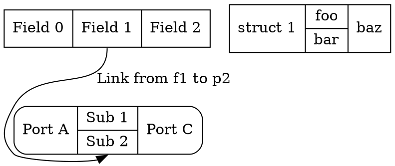
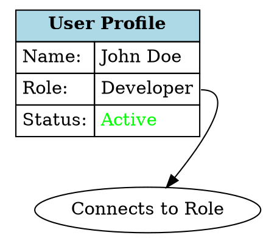
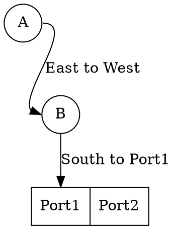
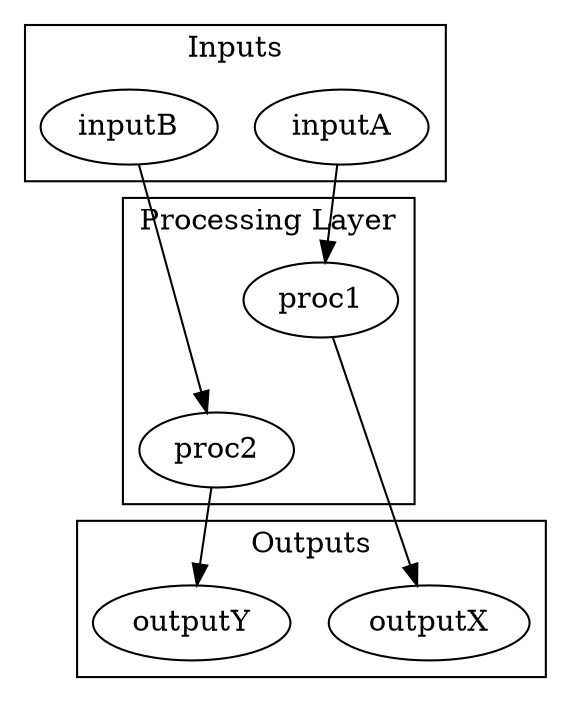

# Syntax Terrain: Advanced Syntax Features in DOT


> This content is dual-licensed under your choice of the following licenses:
> 1.  **MIT License:** For the code implementations in Swift and Mermaid provided in this document.
> 2.  **Creative Commons Attribution 4.0 International License (CC BY 4.0):** For all other content, including the text, explanations, and the Mermaid diagrams and illustrations.


Beyond basic node and edge definitions, DOT offers several advanced syntax features to create more complex, structured, and visually rich graphs.

## 1. Record-Based Nodes (`shape=record`, `shape=Mrecord`)

Record shapes allow nodes to be displayed as structures with fields, similar to records or structs in programming. Edges can connect to specific fields (ports) within these records.

*   **`shape=record`**: Fields are arranged horizontally or vertically.
    *   `|` separates horizontal fields.
    *   `{ ... | ... }` creates nested vertical fields.
*   **`shape=Mrecord`**: Similar to `record`, but with rounded corners for the node and its fields.

**Syntax for `label` with record shapes:**

Ports are identified by `<port_name>` within the label string.

```mermaid
graph TD
    subgraph "Record Shapes"
        RS["shape=record / Mrecord"] --> RSL["Label defines fields/ports"]
        RSL --> RSH["'|' for horizontal separation"]
        RSL --> RSV["'{...|...}' for vertical nesting"]
        RSL --> RSP["'<portName> Text' defines a port"]
        RS --> RSE["Edges can connect to ports: `node:portName -> ...`"]
    end
    R1["node [shape=record, label=\"<f0> Left | <f1> Middle | <f2> Right\"];"]
    R2["node [shape=Mrecord, label=\"Top | {<pA> NestA | <pB> NestB} | Bottom\"];"]
    RSE --> ExR["myNode:f1 -> anotherNode:pA;"]
```

----

## 2. HTML-Like Labels

For even more advanced formatting within nodes (and sometimes edges or graph labels), DOT supports a subset of HTML. This is powerful for creating tables, lists, and using different fonts/colors within a single label.

*   **Syntax:** The `label` value must be enclosed in `<` and `>` (e.g., `label=<...>`).
*   **Supported Tags (subset):** `<TABLE>`, `<TR>`, `<TD>`, `<FONT>`, `<BR/>`, ``, `<B>`, `<I>`, `<U>`, `<O>`, `<SUB>`, `<SUP>`, `<HR/>`, `<VR/>`.
*   **Attributes:** Tags like `<TABLE>` can have `BORDER`, `CELLBORDER`, `CELLSPACING`, `CELLPADDING`, `ALIGN`, `BGCOLOR`, `COLSPAN`, `ROWSPAN`. `<FONT>` has `COLOR`, `FACE`, `POINT-SIZE`. `` has `SRC`. `<TD>` can have `PORT` for edge connections.

**Example:**


----

## 3. Node Ports and Compass Points for Edges

As seen with record and HTML labels, nodes can have named **ports**. Edges can target these specific ports.

Syntax: `node_id:port_id` or `node_id:"port_id_with_spaces"`

Additionally, every node implicitly has **compass points** that edges can target. These are: `n`, `ne`, `e`, `se`, `s`, `sw`, `w`, `nw`, and `c` (center).

Syntax: `node_id:compass_point`

**Example:**


----

## 4. Ranking Control (`rank` attribute in subgraphs)

Within a subgraph, the `rank` attribute can influence the vertical or horizontal placement of nodes.

*   `rank=same`: Attempts to place all nodes in the subgraph on the same rank.
*   `rank=min`: Places nodes at the topmost (or leftmost for `rankdir=LR`) rank.
*   `rank=max`: Places nodes at the bottommost (or rightmost) rank.
*   `rank=source`: Similar to `min`, often used for entry points.
*   `rank=sink`: Similar to `max`, often used for exit points.

**Example:**


These advanced features significantly expand the expressive power of DOT, allowing for highly customized and structured graph visualizations.


---

<!-- 
```mermaid
%% Current Mermaid version
info
```
-->


```mermaid
---
title: "CongLeSolutionX"
author: "Cong Le"
version: "1.0"
license(s): "MIT, CC BY 4.0"
copyright: "Copyright (c) 2025 Cong Le. All Rights Reserved."
config:
  theme: base
---
%%{
  init: {
    'flowchart': { 'htmlLabels': false },
    'fontFamily': 'Bradley Hand',
    'themeVariables': {
      'primaryColor': '#fc82',
      'primaryTextColor': '#F8B229',
      'primaryBorderColor': '#27AE60',
      'secondaryColor': '#81c784',
      'secondaryTextColor': '#6C3483',
      'lineColor': '#F8B229',
      'fontSize': '20px'
    }
  }
}%%
flowchart LR
    My_Meme@{ img: "https://raw.githubusercontent.com/CongLeSolutionX/MY_GRAPHIC_ASSETS/refs/heads/Designing_graphic_syntax/MY_MEME/My-meme-icon-design.png", label: "Ăn uống gì chưa ngừi đẹp?", pos: "b", w: 200, h: 150, constraint: "on" }

    Closing_quote@{ shape: braces, label: "I'll leave this Earth empty-handed anyway!<br/>YOLO" }

My_Meme ~~~ Closing_quote


```


---
>**Licenses:**
>
>- **MIT License:**  [](LICENSE) - Full text in [LICENSE](LICENSE) file.
>- **Creative Commons Attribution 4.0 International:** [](LICENSE-CC-BY) - Legal details in [LICENSE-CC-BY](LICENSE-CC-BY) and at [Creative Commons official site](http://creativecommons.org/licenses/by/4.0/).
>
---