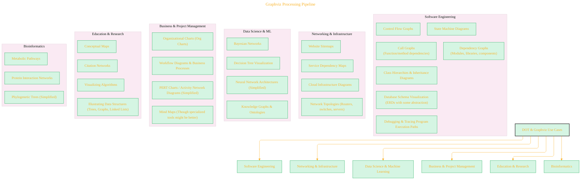

# Ecosystem Trade Routes: Common Use Cases for DOT & Graphviz

> This content is dual-licensed under your choice of the following licenses:
> 1.  **MIT License:** For the code implementations in Swift and Mermaid provided in this document.
> 2.  **Creative Commons Attribution 4.0 International License (CC BY 4.0):** For all other content, including the text, explanations, and the Mermaid diagrams and illustrations.


The DOT language, in conjunction with Graphviz, serves as a versatile "trade route" for visualizing a wide array of structures and systems across many domains. Its simplicity in describing graphs makes it a popular choice when a visual representation of relationships is needed.

## Key Application Areas



----

## Why DOT/Graphviz is Chosen for These Uses:

*   **Automation:** DOT files can be easily generated programmatically from code, logs, databases, or other structured data sources. This makes it excellent for dynamic visualization.
*   **Declarative Nature:** Users define *what* to visualize, not *how* to lay it out. Graphviz handles the complex layout algorithms.
*   **Text-Based Format:** DOT files are human-readable, version-controllable (with Git, etc.), and easy to edit manually or with scripts.
*   **Cross-Platform:** Graphviz tools are available on most operating systems.
*   **Multiple Output Formats:** Can generate vector graphics (SVG, PDF) for scalability and raster graphics (PNG, JPG) for easy embedding.
*   **Open Source:** Freely available and widely adopted.

While specialized tools exist for many of these use cases (e.g., dedicated UML modelers, ERD tools), DOT/Graphviz often provides a quick, flexible, and scriptable way to achieve visualizations, particularly when integration with other systems or automated generation is required. Its strength lies in its general-purpose graph description capabilities.


---


<!-- 
```mermaid
%% Current Mermaid version
info
```
-->


```mermaid
---
title: "CongLeSolutionX"
author: "Cong Le"
version: "1.0"
license(s): "MIT, CC BY 4.0"
copyright: "Copyright (c) 2025 Cong Le. All Rights Reserved."
config:
  theme: base
---
%%{
  init: {
    'flowchart': { 'htmlLabels': false },
    'fontFamily': 'Bradley Hand',
    'themeVariables': {
      'primaryColor': '#fc82',
      'primaryTextColor': '#F8B229',
      'primaryBorderColor': '#27AE60',
      'secondaryColor': '#81c784',
      'secondaryTextColor': '#6C3483',
      'lineColor': '#F8B229',
      'fontSize': '20px'
    }
  }
}%%
flowchart LR
    My_Meme@{ img: "https://raw.githubusercontent.com/CongLeSolutionX/MY_GRAPHIC_ASSETS/refs/heads/Designing_graphic_syntax/MY_MEME/My-meme-icon-design.png", label: "Ăn uống gì chưa ngừi đẹp?", pos: "b", w: 200, h: 150, constraint: "on" }

    Closing_quote@{ shape: braces, label: "I'll leave this Earth empty-handed anyway!<br/>YOLO" }

My_Meme ~~~ Closing_quote


```


---
>**Licenses:**
>
>- **MIT License:**  [](LICENSE) - Full text in [LICENSE](LICENSE) file.
>- **Creative Commons Attribution 4.0 International:** [](LICENSE-CC-BY) - Legal details in [LICENSE-CC-BY](LICENSE-CC-BY) and at [Creative Commons official site](http://creativecommons.org/licenses/by/4.0/).
>
---