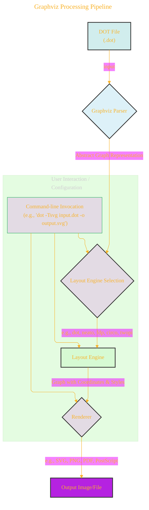

# Geological Survey: The Graphviz Pipeline

> This content is dual-licensed under your choice of the following licenses:
> 1.  **MIT License:** For the code implementations in Swift and Mermaid provided in this document.
> 2.  **Creative Commons Attribution 4.0 International License (CC BY 4.0):** For all other content, including the text, explanations, and the Mermaid diagrams and illustrations.

Understanding how a DOT file is transformed into a visual graph involves looking at the internal "geology" of Graphviz – its processing pipeline. DOT itself is just the description; Graphviz tools do the heavy lifting of interpretation, layout, and rendering.

## The Journey from DOT Script to Visual Graph

A DOT script undergoes several stages of processing within the Graphviz ecosystem:

**1. DOT File (.dot):**
*   This is the human-readable text file containing the graph description written in the DOT language. It defines nodes, edges, subgraphs, and their attributes.

**2. Graphviz Parser:**
*   The first step within a Graphviz tool (like `dot` or `neato`) is to parse the DOT file.
*   The parser reads the DOT syntax, validates it, and constructs an internal, abstract representation of the graph structure. This internal model captures all the elements and their properties defined in the DOT script.

**3. Layout Engine Selection:**
*   Graphviz offers several layout engines, each employing different algorithms suited for various types of graph structures or desired aesthetics.
*   The user typically selects the layout engine via a command-line tool (e.g., `dot` command for hierarchical layoutsデフォルト, `neato` for spring model layouts). Some attributes in the DOT file (like the `layout` graph attribute, though less common for direct engine choice) might also hint at preferences, but the command itself is primary.

**4. Layout Engine (e.g., `dot`, `neato`, `fdp`, `twopi`, `circo`):**
*   This is the core of the visualization process. The selected layout engine takes the abstract graph representation and applies its specific algorithms to:
    *   **Determine Node Positions:** Calculate the (x, y) coordinates for each node in the graph.
    *   **Route Edges:** Define the paths (lines, curves) for edges connecting the nodes, avoiding overlaps where possible.
    *   **Incorporate Attributes:** Considers attributes like `rankdir`, `nodesep`, `ranksep`, `len`, `splines`, node sizes, etc., to influence the layout.
*   The output of this stage is a graph representation enriched with concrete geometric information (positions, edge paths) and styling details.

**5. Renderer:**
*   Once the layout is complete (nodes have coordinates, edges have paths), the renderer takes this geometric and styled graph description.
*   It translates this information into a specific output format chosen by the user (e.g., via the `-Tformat` command-line option).
*   Different renderers exist for different output types (e.g., SVG, PNG, JPEG, PDF, PostScript, client-side image maps).

**6. Output Image/File:**
*   The final result is a file in the specified format, containing the visual representation of the graph. This file can then be displayed, embedded in documents, or further processed.

----

## Command-Line Example

The typical command-line invocation illustrates this pipeline:

`dot -Tsvg mygraph.dot -o mygraph.svg`

*   `dot`: Invokes the Graphviz tool, implicitly selecting the `dot` layout engine (for hierarchical layouts).
*   `-Tsvg`: Specifies the **renderer** to produce SVG output.
*   `mygraph.dot`: The input **DOT file**.
*   `-o mygraph.svg`: The name of the **output file**.

Understanding this pipeline helps in troubleshooting issues (e.g., is it a DOT syntax problem, a layout engine choice, or a rendering artifact?) and in appreciating how DOT's declarative descriptions are brought to life.

---

<!-- 

---
>**Licenses:**
>
>- **MIT License:**   - Full text in [LICENSE](LICENSE) file.
>- **Creative Commons Attribution-ShareAlike 4.0 International**: [CC BY-SA 4.0](https://creativecommons.org/licenses/by-sa/4.0/)  - Legal details in [LICENSE-CC-BY-SA-4.0](LICENSE-CC-BY-SA-4.0) and at [Creative Commons official site](https://creativecommons.org/licenses/by-sa/4.0/).
>
---