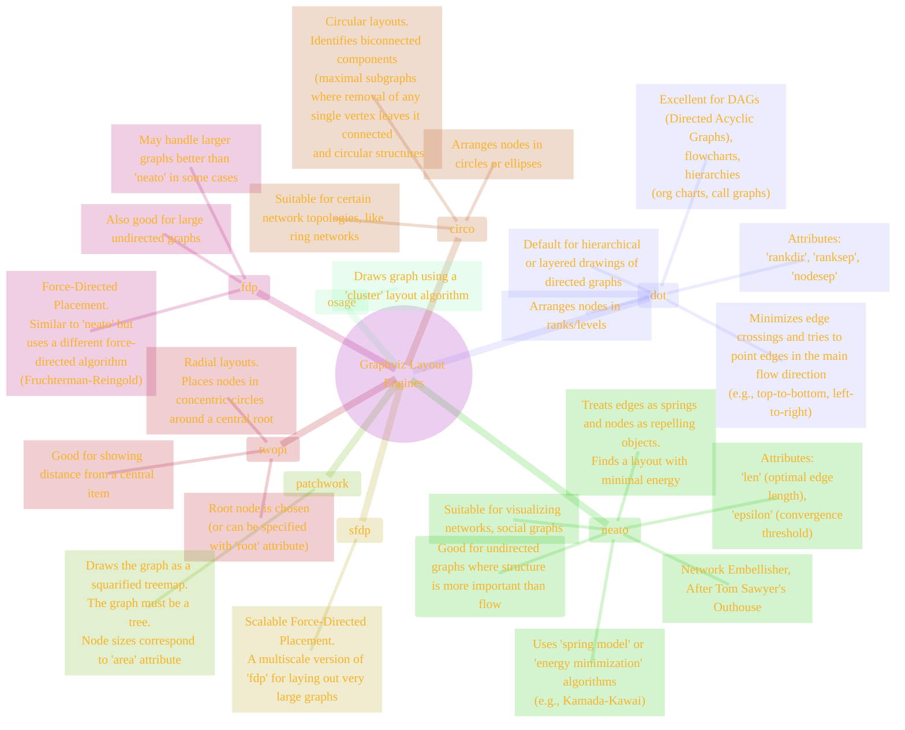

# Geological Survey: Graphviz Layout Engines Overview
> **Disclaimer:**
>
> This document contains my personal notes on the topic,
> compiled from publicly available documentation and various cited sources.
> The materials are intended for educational purposes, personal study, and reference.
> The content is dual-licensed:
> 1. **MIT License:** Applies to all code implementations (Swift, Mermaid, and other programming languages).
> 2. **Creative Commons Attribution-ShareAlike 4.0 International License (CC BY-SA 4.0):** Applies to all non-code content, including text, explanations, diagrams, and illustrations.
---

Graphviz is not a single layout algorithm but a suite of tools, each providing different layout engines. The choice of engine dramatically affects the final appearance of the graph. Users select an engine based on the type of graph structure and the desired visual emphasis.

The engine is typically chosen by the command used (e.g., `dot`, `neato`) or sometimes via a `-Kengine` flag.

---

## Common Layout Engines

----

## Choosing an Engine

*   **Hierarchies, Flowcharts, DAGs:** `dot` is almost always the best choice.
*   **Undirected Networks, Connectivity:** `neato` or `fdp` are good starting points. `sfdp` for very large graphs.
*   **Hub-and-Spoke, Center-Focused:** `twopi` can be effective.
*   **Ring or Cyclic Structures:** `circo` might produce interesting layouts.

**Example Command-Line Usage:**

*   `dot -Tpng input.dot -o output.png` (Uses `dot` engine)
*   `neato -Tpng input.dot -o output.png` (Uses `neato` engine)
*   `fdp -Tsvg input.dot -o output.svg` (Uses `fdp` engine)
*   `graphviz -Ktwopi -Tpdf input.dot -o output.pdf` (Generic `graphviz` command explicitly choosing `twopi` engine)

The DOT language itself primarily describes the graph's logical structure and attributes. The chosen layout engine then interprets this description to produce the geometric layout. While most DOT files are written with the `dot` engine's hierarchical layout in mind (e.g., using `rankdir`), the same DOT file can often be processed by other engines to yield different visual perspectives. Experimenting with different engines can sometimes reveal insights about the graph's structure that one engine alone might not highlight as effectively.

---

<!-- 

---
>**Licenses:**
>
>- **MIT License:**   - Full text in [LICENSE](LICENSE) file.
>- **Creative Commons Attribution-ShareAlike 4.0 International**: [CC BY-SA 4.0](https://creativecommons.org/licenses/by-sa/4.0/)  - Legal details in [LICENSE-CC-BY-SA-4.0](LICENSE-CC-BY-SA-4.0) and at [Creative Commons official site](https://creativecommons.org/licenses/by-sa/4.0/).
>
---