# Ecosystem Trade Routes: Tools Generating or Consuming DOT Files

> This content is dual-licensed under your choice of the following licenses:
> 1.  **MIT License:** For the code implementations in Swift and Mermaid provided in this document.
> 2.  **Creative Commons Attribution 4.0 International License (CC BY 4.0):** For all other content, including the text, explanations, and the Mermaid diagrams and illustrations.

The DOT language and Graphviz form a central hub in a larger ecosystem of tools. Many applications and libraries can either **generate** DOT files as output for visualization, or **consume** DOT files to import graph structures.

## Tools Generating DOT Output

These tools create `.dot` files, allowing users to visualize data or structures using Graphviz.

```mermaid
---
title: "Graphviz Processing Pipeline"
author: "Cong Le"
version: "1.0"
license(s): "MIT, CC BY 4.0"
copyright: "Copyright (c) 2025 Cong Le. All Rights Reserved."
config:
  layout: elk
  theme: base
---
%%%%%%%% Mermaid version v11.4.1-b.14
%%%%%%%% Available curve styles include the following keywords:
%% basis, bumpX, bumpY, cardinal, catmullRom, linear, monotoneX, monotoneY, natural, step, stepAfter, stepBefore.
%%{
  init: {
    'flowchart': { 'htmlLabels': true, 'curve': 'linear' },
    'fontFamily': 'Monaco',
    'themeVariables': {
      'primaryColor': '#D5E3',
      'primaryTextColor': '#F8B229',
      'lineColor': '#F8B229',
      'primaryBorderColor': '#27AE60',
      'secondaryColor': '#EBDEF0',
      'secondaryTextColor': '#6C3483',
      'secondaryBorderColor': '#A569BD',
      'fontSize': '15px'
    }
  }
}%%
graph LR
    A["Tools Generating DOT"] --> B["Documentation Generators"]
    A --> C["Programming Language Libraries"]
    A --> D["Static Analysis Tools"]
    A --> E["Build Systems & Compilers"]
    A --> F["Database Tools"]
    A --> G["Other Specialized Tools"]

    subgraph B_DocGen["Documentation Generators"]
        B1["Doxygen<br/>(C++, C, Java, Python, etc.)<br/>Generates call graphs, inheritance diagrams"]
        B2["Sphinx<br/>(Python, reStructuredText)<br/>With extensions like 'sphinx.ext.graphviz'"]
        B3["Javadoc<br/>(with custom doclets)"]
    end

    subgraph C_ProgLib["Programming Libraries"]
        C1["Python:<br/>'graphviz' library, 'pydot', 'pygraphviz'"]
        C2["Java:<br/>'graphviz-java', 'GuruNeil/graphviz-java'"]
        C3["Ruby:<br/>'ruby-graphviz'"]
        C4["Perl:<br/>'GraphViz' module"]
        C5["JavaScript (Node.js):<br/>'graphviz' NPM package"]
        C6["Many other languages have similar libraries for programmatic DOT generation"]
    end

    subgraph D_Static["Static Analysis Tools"]
        D1["Valgrind<br/>(Callgrind tool)<br/>Can output call graph data for visualization"]
        D2["Understand<br/>(Code analysis tool)"]
        D3["Dependency analysis tools for various languages/ecosystems"]
    end

    subgraph E_Build["Build Systems &<br/> Compilers"]
        E1["LLVM<br/>Can output control flow graphs,<br/> call graphs in DOT format ('-dot-cfg', etc.)."]
        E2["GCC<br/>(with specific flags/plugins)"]
        E3["Build systems like Bazel or Make (via custom rules/scripts) to show dependencies"]
    end

    subgraph F_DB["Database Tools"]
        F1["SchemaSpy<br/>Analyzes database metadata and can generate ERDs."]
        F2["Some ORM tools or scripts that introspect schemas."]
    end
    
    subgraph G_Other["Other Tools"]
        G1["'tree' command<br/>(with options to output DOT for directory structures)"]
        G2["Wireshark<br/>(can export packet flow graphs in some forms)"]
        G3["Finite State Machine design tools"]
    end
```

---

## Tools Consuming or Displaying DOT Files

These tools can read `.dot` files to display, edit, or analyze the graph.

```mermaid
---
title: "Tools Consuming or Displaying DOT Files"
author: "Cong Le"
version: "1.0"
license(s): "MIT, CC BY 4.0"
copyright: "Copyright (c) 2025 Cong Le. All Rights Reserved."
config:
  layout: elk
  theme: base
---
%%%%%%%% Mermaid version v11.4.1-b.14
%%%%%%%% Available curve styles include the following keywords:
%% basis, bumpX, bumpY, cardinal, catmullRom, linear, monotoneX, monotoneY, natural, step, stepAfter, stepBefore.
%%{
  init: {
    'flowchart': { 'htmlLabels': true, 'curve': 'linear' },
    'fontFamily': 'Monaco',
    'themeVariables': {
      'primaryColor': '#D5E3',
      'primaryTextColor': '#F8B229',
      'lineColor': '#F8B229',
      'primaryBorderColor': '#27AE60',
      'secondaryColor': '#EBDEF0',
      'secondaryTextColor': '#6C3483',
      'secondaryBorderColor': '#A569BD',
      'fontSize': '15px'
    }
  }
}%%
graph LR
    X["Tools Consuming/Displaying DOT"] --> Y["Core Graphviz Suite"]
    X --> Z["Graph Editors &<br/> Viewers"]
    X --> W["IDE &<br/> Editor Extensions"]
    X --> V["Web Applications &<br/> Libraries"]
    X --> U["Data Analysis &<br/> Network Science Tools"]

    subgraph Y_Graphviz["Core Graphviz Suite"]
        Y1["'dot', 'neato', 'fdp', 'twopi', 'circo', 'sfdp'<br/>Command-line tools for layout and rendering"]
        Y2["'gvpr'<br/>(Graphviz pattern scanning and processing language)"]
        Y3["'dotty', 'lefty'<br/>(older interactive viewers, less common now)"]
    end

    subgraph Z_Editors["Graph Editors &<br/> Viewers"]
        Z1["Gephi<br/>(Network analysis and visualization software, can import DOT via plugins)"]
        Z2["yEd Graph Editor<br/>(Can import DOT via .gv extension)"]
        Z3["Cytoscape<br/>(Bioinformatics platform for network visualization, can import DOT)"]
        Z4["XDot.py<br/>(Interactive viewer for DOT files)"]
        Z5["ZGRViewer<br/>(SVG-based DOT viewer)"]
    end

    subgraph W_IDE["IDE &<br/> Editor Extensions"]
        W1["VS Code:<br/> Extensions like 'Graphviz (dot) language support' by Stephanvs,<br/> 'Graphviz Interactive Preview'"]
        W2["Atom:<br/> Packages like 'graphviz-preview'"]
        W3["Sublime Text:<br/> 'GraphvizPreview' package"]
        W4["IntelliJ IDEA / PyCharm:<br/> Plugins for Graphviz support."]
    end

    subgraph V_Web["Web Applications &<br/> Libraries"]
        V1["Viz.js<br/>(Graphviz compiled to JavaScript for client-side rendering)"]
        V2["d3-graphviz<br/>(Combines D3.js with Viz.js for interactive web visualizations)"]
        V3["Various online DOT renderers/editors<br/>(e.g., Edotor, Sketchviz)"]
    end

    subgraph U_Analysis["Data Analysis &<br/> Network Science"]
        U1["Python libraries like 'NetworkX' can read/write DOT<br/>(often via 'pygraphviz' or 'pydot')"]
        U2["R language:<br/> 'DiagrammeR' package can render Graphviz diagrams"]
    end
```

This rich ecosystem highlights DOT's role as a lingua franca for graph descriptions. Its simple, text-based format allows for easy integration, making it a valuable conduit between diverse software tools and the powerful visualization capabilities of Graphviz.

---

<!-- 

---
>**Licenses:**
>
>- **MIT License:**   - Full text in [LICENSE](LICENSE) file.
>- **Creative Commons Attribution-ShareAlike 4.0 International**: [CC BY-SA 4.0](https://creativecommons.org/licenses/by-sa/4.0/)  - Legal details in [LICENSE-CC-BY-SA-4.0](LICENSE-CC-BY-SA-4.0) and at [Creative Commons official site](https://creativecommons.org/licenses/by-sa/4.0/).
>
---