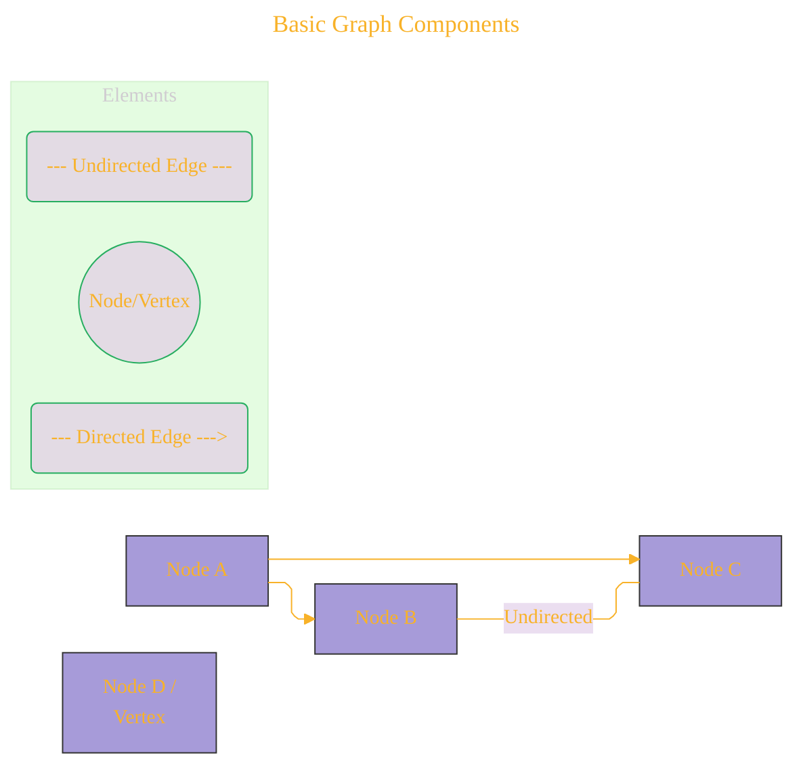
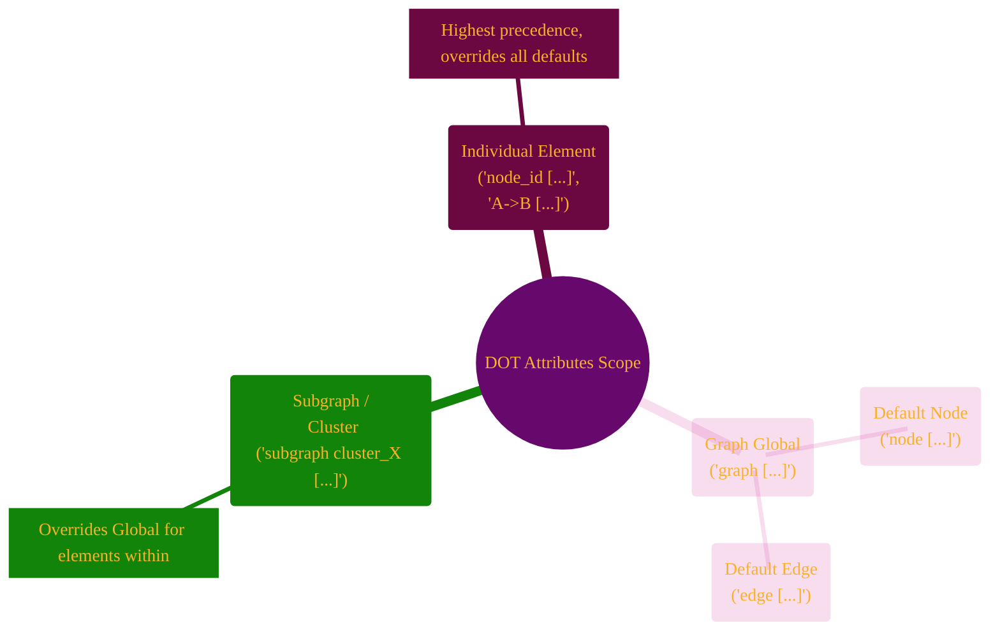
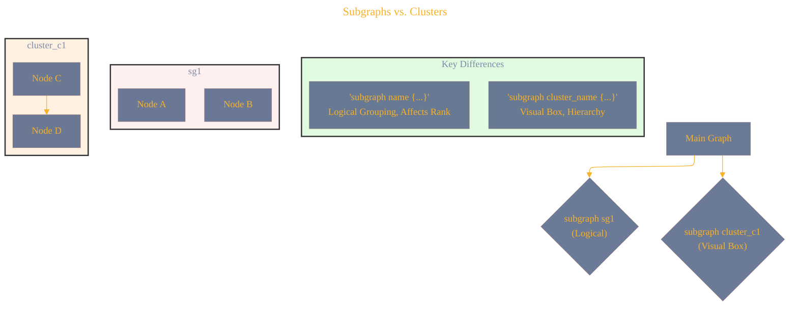
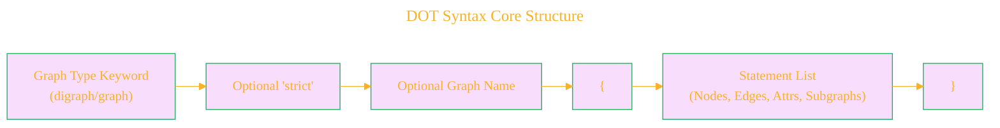
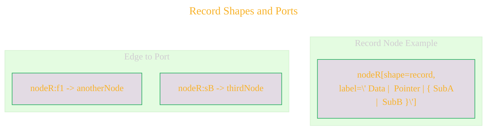
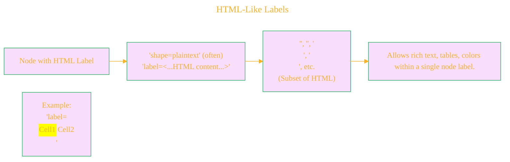
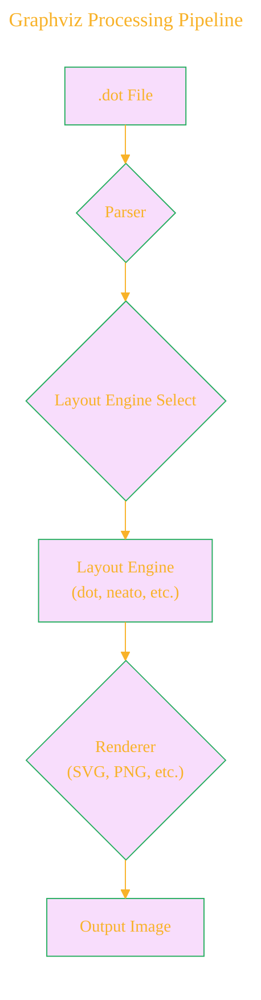
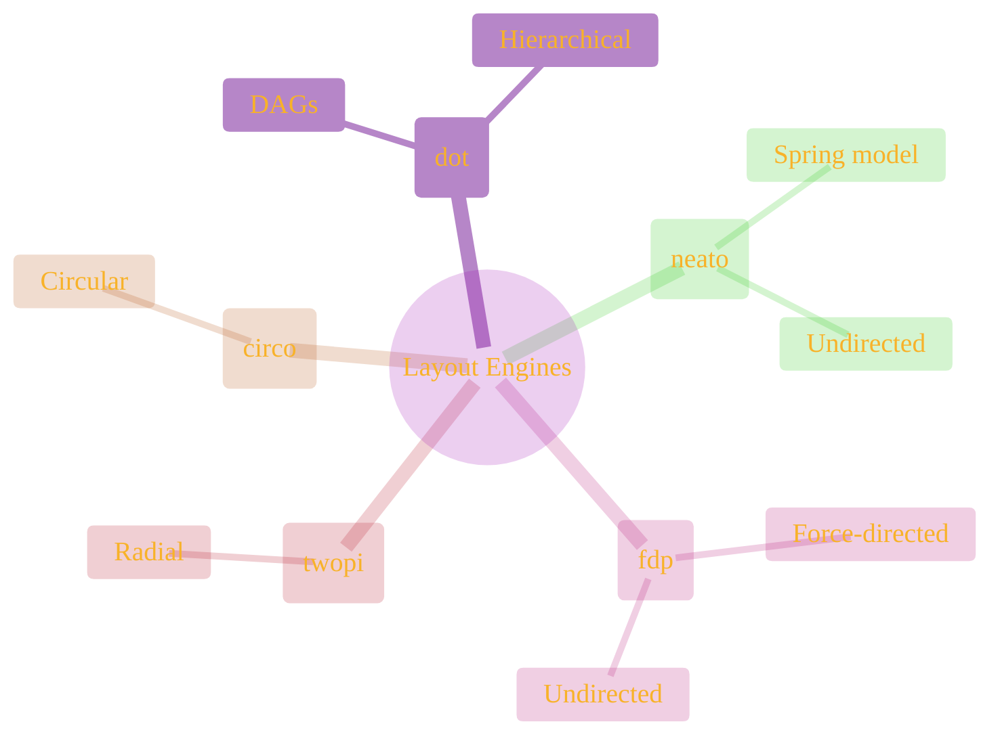

# Scenic Visual Tour: Gallery of DOT & Graphviz Concepts
> This content is dual-licensed under your choice of the following licenses:
> 1.  **MIT License:** For the code implementations in Swift and Mermaid provided in this document.
> 2.  **Creative Commons Attribution 4.0 International License (CC BY 4.0):** For all other content, including the text, explanations, and the Mermaid diagrams and illustrations.

This gallery provides a quick visual summary of key concepts related to the DOT language and its use with Graphviz, primarily using Mermaid diagrams to illustrate the ideas as discussed throughout this regional guide.

## 1. Basic Graph Components

*Caption: Fundamental building blocks: nodes (entities) and edges (relationships).*

----

## 2. DOT Attribute Scopes

*Caption: Attributes can be defined at graph, default node/edge, subgraph/cluster, or individual element levels, with specific overrides.*

---

## 3. Subgraphs vs. Clusters

*Caption: `subgraph` for logical grouping and rank control; `subgraph cluster_...` for visual encapsulation with a bounding box.*

----

## 4. DOT Syntax Core Structure

*Caption: The basic syntax for a DOT file: type, optional name, and statements within curly braces.*

---

## 5. Record Shapes and Ports

*Caption: Record shapes allow structured nodes with fields (ports) that edges can connect to specifically.*

---

## 6. HTML-Like Labels

*Caption: HTML-like labels provide advanced formatting capabilities for node content.*

---

## 7. Graphviz Processing Pipeline

*Caption: The journey of a DOT file through Graphviz: Parsing, Layout, and Rendering.*

----

## 8. Common Graphviz Layout Engines

*Caption: Key Graphviz layout engines and their typical applications.*

This concludes our scenic tour. These visualizations aim to reinforce the core concepts explored in the DOT Language Region.

---

And with that, Fellow Explorer, the initial charting of the **DOT Language Region** is largely complete according to the Atlas's structure!

Each file aims to be a "map" or "guide" for its respective topic, employing `Mermaid.js` for visual aids directly within the Markdown, fulfilling the cartographic goals set out in the README. This structure allows for both deep dives into specific landmarks and a broader overview of the linguistic terrain.

---

<!-- 

---
>**Licenses:**
>
>- **MIT License:**   - Full text in [LICENSE](LICENSE) file.
>- **Creative Commons Attribution-ShareAlike 4.0 International**: [CC BY-SA 4.0](https://creativecommons.org/licenses/by-sa/4.0/)  - Legal details in [LICENSE-CC-BY-SA-4.0](LICENSE-CC-BY-SA-4.0) and at [Creative Commons official site](https://creativecommons.org/licenses/by-sa/4.0/).
>
---