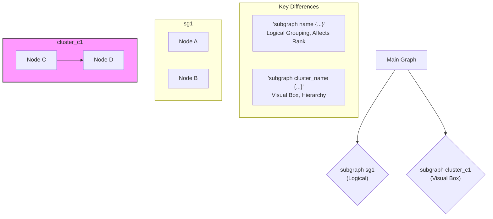
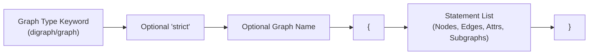
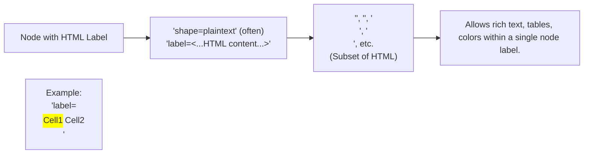
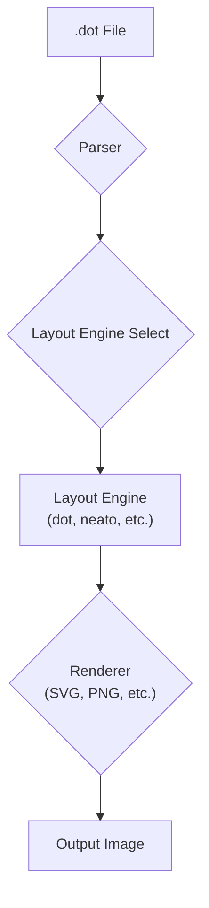
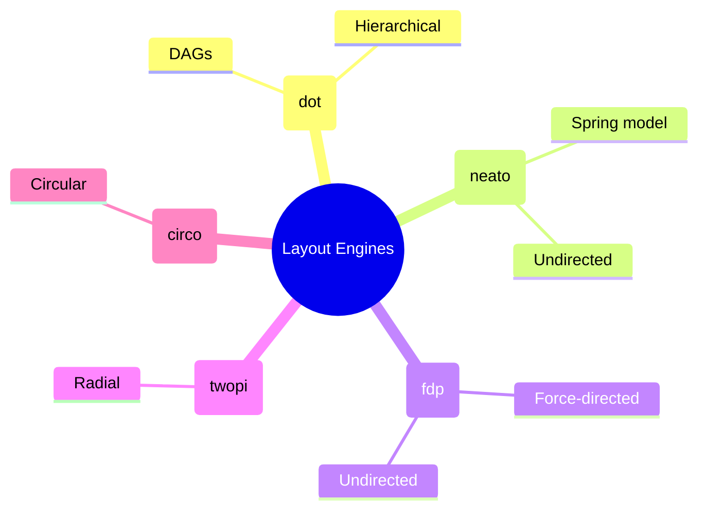

# Scenic Visual Tour: Gallery of DOT & Graphviz Concepts


> This content is dual-licensed under your choice of the following licenses:
> 1.  **MIT License:** For the code implementations in Swift and Mermaid provided in this document.
> 2.  **Creative Commons Attribution 4.0 International License (CC BY 4.0):** For all other content, including the text, explanations, and the Mermaid diagrams and illustrations.


This gallery provides a quick visual summary of key concepts related to the DOT language and its use with Graphviz, primarily using Mermaid diagrams to illustrate the ideas as discussed throughout this regional guide.

## 1. Basic Graph Components

```mermaid
graph LR
    A[Node A] --> B[Node B]
    B -- Undirected --- C[Node C]
    A --> C
    D[Node D / Vertex]

    subgraph "Elements"
        N((Node/Vertex))
        DE(--- Directed Edge --->)
        UE(--- Undirected Edge ---)
    end
    style A fill:#87CEEB,stroke:#333
    style B fill:#87CEEB,stroke:#333
    style C fill:#87CEEB,stroke:#333
    style D fill:#87CEEB,stroke:#333
```
*Caption: Fundamental building blocks: nodes (entities) and edges (relationships).*

----

## 2. DOT Attribute Scopes

```mermaid
mindmap
  root((DOT Attributes Scope))
    Graph Global (`graph [...]`)
      ::icon(fa fa-globe)
      Default Node (`node [...]`)
      Default Edge (`edge [...]`)
    Subgraph / Cluster (`subgraph cluster_X [...]`)
      ::icon(fa fa-object-group)
      Overrides Global for elements within
    Individual Element (`node_id [...]`, `A->B [...]`)
      ::icon(fa fa-paint-brush)
      Highest precedence, overrides all defaults
```
*Caption: Attributes can be defined at graph, default node/edge, subgraph/cluster, or individual element levels, with specific overrides.*

---

## 3. Subgraphs vs. Clusters


*Caption: `subgraph` for logical grouping and rank control; `subgraph cluster_...` for visual encapsulation with a bounding box.*

----

## 4. DOT Syntax Core Structure


*Caption: The basic syntax for a DOT file: type, optional name, and statements within curly braces.*

---

## 5. Record Shapes and Ports

```mermaid
graph TD
    subgraph Record_Node_Example["Record Node Example"]
        R1["nodeR["shape=record, label=\'<f0> Data | <f1> Pointer | { SubA | <sB> SubB }\'];"]
    end
    subgraph Edge_to_Port["Edge to Port"]
        E1["nodeR:f1 -> anotherNode;"]
        E2["nodeR:sB -> thirdNode;"]
    end
```
*Caption: Record shapes allow structured nodes with fields (ports) that edges can connect to specifically.*

---

## 6. HTML-Like Labels


*Caption: HTML-like labels provide advanced formatting capabilities for node content.*

---

## 7. Graphviz Processing Pipeline


*Caption: The journey of a DOT file through Graphviz: Parsing, Layout, and Rendering.*

----

## 8. Common Graphviz Layout Engines


*Caption: Key Graphviz layout engines and their typical applications.*

This concludes our scenic tour. These visualizations aim to reinforce the core concepts explored in the DOT Language Region.

---

And with that, Fellow Explorer, the initial charting of the **DOT Language Region** is largely complete according to the Atlas's structure!

Each file aims to be a "map" or "guide" for its respective topic, employing Mermaid.js for visual aids directly within the Markdown, fulfilling the cartographic goals set out in the README. This structure allows for both deep dives into specific landmarks and a broader overview of the linguistic terrain.

This expedition has yielded a comprehensive set of charts and logs for future navigators of the DOT language.


---

<!-- 


---
>**Licenses:**
>
>- **MIT License:**  [](LICENSE) - Full text in [LICENSE](LICENSE) file.
>- **Creative Commons Attribution 4.0 International:** [](LICENSE-CC-BY) - Legal details in [LICENSE-CC-BY](LICENSE-CC-BY) and at [Creative Commons official site](http://creativecommons.org/licenses/by/4.0/).
>
---