```dot
/*
 * title: CI/CD (Continuous Integration / Continuous Delivery) Pipeline
 * author: Cong Le
 * version: 1.0
 * license(s): MIT, CC BY-SA 4.0
 * copyright: Copyright (c) 2025 Cong Le. All Rights Reserved.
 * 
 * 
 */
digraph Advanced_CICD_Pipeline {
    // --- Graph Defaults ---
    graph [
        layout=dot,
        rankdir=LR, // Left-to-Right for pipeline flow
        label="Simplified CI/CD Pipeline Stages",
        fontsize=22,
        fontname="Arial",
        bgcolor="ghostwhite",
        nodesep=0.5,
        ranksep=1.2, // Increased space between stages
        splines=polyline, // Polyline or ortho often good for pipelines
        newrank=true    // Helps with complex rank arrangements and subgraphs
    ];

    // --- Node Defaults ---
    node [
        shape=rectangle,
        style="filled,rounded",
        fontname="Helvetica",
        fontsize=11,
        width=2.0,       // Give nodes a bit more width
        height=0.8,      // And height
        fixedsize=true,
        margin="0.15,0.08"
    ];

    // --- Edge Defaults ---
    edge [
        fontname="Helvetica",
        fontsize=9,
        color=darkslategray,
        arrowhead=normal,
        arrowsize=0.7,
        minlen=2 // Ensure edges span at least a little horizontal distance
    ];

    // --- Stages as Clusters ---

    subgraph cluster_SourceControl {
        label="1. Source Control & Trigger";
        bgcolor="lightgoldenrodyellow";
        style="filled,rounded";
        color="goldenrod";

        Developer [shape=circle, label="Developer", fillcolor=lightblue, width=1.2, height=1.2];
        GitRepo [shape=cylinder, label="Git Repository\n(GitHub/GitLab)", fillcolor=whitesmoke, width=1.8];
        Webhook [shape=cds, label="Webhook\nTrigger", fillcolor=lightpink, width=1.5];

        Developer -> GitRepo [label="git push"];
        GitRepo -> Webhook [label="Push Event"];
    }

    subgraph cluster_Build {
        label="2. Build & Unit Test";
        bgcolor="lightskyblue";
        style="filled,rounded";
        color="dodgerblue";

        FetchCode [label="Fetch Code", fillcolor=azure];
        BuildApp [label="Build Application\n(Compile, Package)", fillcolor=azure];
        RunUnitTests [label="Run Unit Tests", fillcolor=azure];
        StaticAnalysis [label="Static Code Analysis\n(Lint, Security Scan)", fillcolor=azure, group=analysis];
        PublishArtifact [label="Publish Build Artifact\n(e.g., to Nexus/Artifactory)", fillcolor=palegreen];

        // Align build and analysis tasks
        subgraph {
            rank=same;
            BuildApp; StaticAnalysis;
        }
    }

    subgraph cluster_IntegrationTest {
        label="3. Deploy to Staging & Integration Test";
        bgcolor="lightgreen";
        style="filled,rounded";
        color="seagreen";

        DeployStaging [label="Deploy to Staging\nEnvironment", fillcolor=honeydew];
        RunIntegrationTests [label="Run Integration Tests\n(API, E2E)", fillcolor=honeydew, height=1.0]; // Taller node
        PerformanceTests [label="Run Performance Tests", fillcolor=honeydew, group=perf];
    }

    subgraph cluster_Approval {
        label="4. Manual Approval (Optional)";
        bgcolor="lightcoral";
        style="filled,rounded";
        color="firebrick";

        ManualApproval [
            label="Manual Approval Gate\n(e.g., QA Sign-off)",
            shape=septagon, // Use a distinct shape
            fillcolor=mistyrose,
            width=2.2,
            height=1.2
        ];
        NotifyTeam [label="Notify Team\n(Slack/Email)", shape=note, fillcolor=ivory, constraint=false]; // Annotation
    }

    subgraph cluster_ProductionDeploy {
        label="5. Production Deployment";
        bgcolor="mediumpurple";
        style="filled,rounded";
        color="indigo";
        fontcolor=white; // Text color for dark background

        node [fontcolor=black]; // Override node font color for this cluster's nodes

        DeployProd_Canary [label="Deploy Canary\n(Small % Users)", fillcolor=lavender];
        MonitorCanary [label="Monitor Canary Release", fillcolor=lavender, group=monitoring];
        RolloutProd_Full [label="Full Production Rollout", fillcolor=plum];
        PostDeployChecks [label="Post-Deployment\nHealth Checks", fillcolor=thistle, group=monitoring];

        // Align canary and full rollout if desired, though sequential might be better
        // { rank=same; DeployProd_Canary; MonitorCanary;}
        // { rank=same; RolloutProd_Full; PostDeployChecks;}
    }

    subgraph cluster_MonitoringFeedback {
        label="6. Monitoring & Feedback";
        bgcolor="lightsalmon";
        style="filled,rounded";
        color="orangered";

        MonitoringSystem [
            label="Production Monitoring\n(Prometheus, Datadog)",
            shape=tab, // Use a tab shape for system
            fillcolor=seashell,
            height=1.0
        ];
        LogAggregation [
            label="Log Aggregation\n(ELK Stack, Splunk)",
            shape=folder, // Folder shape for logs
            fillcolor=seashell,
            height=1.0
        ];
        FeedbackLoop [shape=circle, label="Alerts &\nFeedback", fillcolor=peachpuff, style="dashed,filled", width=1.2, height=1.2];

        // Align monitoring components
         subgraph {
            rank=same;
            MonitoringSystem; LogAggregation;
         }
    }


    // --- Pipeline Flow Edges ---

    // Source Control to Build
    Webhook -> FetchCode [label="Trigger Build", weight=10, style=bold, lhead=cluster_Build];

    // Build Stage Flow
    FetchCode -> BuildApp [weight=5];
    FetchCode -> StaticAnalysis [weight=3]; // Parallel tasks
    BuildApp -> RunUnitTests [label="Build Output", weight=5];
    StaticAnalysis -> RunUnitTests [label="Analysis Results", weight=3, style=dashed]; // Analysis might feed into or gate tests

    RunUnitTests -> PublishArtifact [label="Tests Passed", weight=5];
    RunUnitTests -> NotifyTeam [label="Tests Failed", color=red, style=dotted, constraint=false, ltail=cluster_Build, lhead=cluster_Approval]; // Feedback loop / notification

    // Build to Integration Test
    PublishArtifact -> DeployStaging [label="Artifact Available", weight=10, style=bold, lhead=cluster_IntegrationTest];

    // Integration Test Stage Flow
    DeployStaging -> RunIntegrationTests [weight=5];
    DeployStaging -> PerformanceTests [weight=3]; // Parallel tasks
    
    // Combine test results before proceeding
    RunIntegrationTests -> ManualApproval [label="Tests Passed", weight=5, lhead=cluster_Approval];
    PerformanceTests -> ManualApproval [label="Perf OK", weight=3, style=dashed, lhead=cluster_Approval];
    RunIntegrationTests -> NotifyTeam [label="Tests Failed", color=red, style=dotted, constraint=false, ltail=cluster_IntegrationTest, lhead=cluster_Approval];

    // Approval to Production
    ManualApproval -> DeployProd_Canary [label="Approved", weight=10, style=bold, lhead=cluster_ProductionDeploy];
    ManualApproval -> NotifyTeam [label="Rejected", color=orange, style=dotted, constraint=false, ltail=cluster_Approval, lhead=cluster_Approval];

    // Production Deployment Flow
    DeployProd_Canary -> MonitorCanary [weight=5];
    MonitorCanary -> RolloutProd_Full [label="Canary Healthy", weight=5];
    MonitorCanary -> DeployProd_Canary [label="Rollback Canary", color=red, style=dashed, weight=1, constraint=false]; // Rollback path
    RolloutProd_Full -> PostDeployChecks [weight=5];
    
    // Production to Monitoring
    PostDeployChecks -> MonitoringSystem [label="App Deployed", weight=10, style=bold, lhead=cluster_MonitoringFeedback];
    PostDeployChecks -> LogAggregation [label=" ", style=invis];   // Invisible edge to help ordering if needed
    RolloutProd_Full -> MonitoringSystem [style=invis]; // To ensure MonitoringSystem is to the right

    // Feedback Loop
    MonitoringSystem -> FeedbackLoop [label="Metrics/Traces", weight=2];
    LogAggregation -> FeedbackLoop [label="Logs", weight=2];
    FeedbackLoop -> Developer [label=" Alerts/Insights", color=blue, style=dotted, constraint=false, weight=1, ltail=cluster_MonitoringFeedback, headport=w, tailport=e];


    // Explicitly sink monitoring nodes if necessary (usually not needed with LR and cluster flow)
    // { rank=sink; MonitoringSystem; LogAggregation; FeedbackLoop; }

}
```

# A Simplified CI/CD (Continuous Integration / Continuous Delivery) Pipeline
> **Disclaimer:**
>
> This document contains my personal notes on the topic,
> compiled from publicly available documentation and various cited sources.
> The materials are intended for educational purposes, personal study, and reference.
> The content is dual-licensed:
> 1. **MIT License:** Applies to all code implementations (Swift, Mermaid, and other programming languages).
> 2. **Creative Commons Attribution-ShareAlike 4.0 International License (CC BY-SA 4.0):** Applies to all non-code content, including text, explanations, diagrams, and illustrations.
---


Alright, Fellow Explorer, let's chart another practical and advanced example using the `dot` engine!

This time, we'll model a **Simplified CI/CD (Continuous Integration / Continuous Delivery) Pipeline**. This will allow us to demonstrate stages, parallel tasks, conditional flows, and feedback loops, which are common in such systems.

## CI/CD (Continuous Integration / Continuous Delivery) Pipeline Diagram

---


<details>
<summary>Rendered code for CI/CD Pipeline Diagram Example</summary>
ci_cd_pipeline_diagram_example
digraph advanced_cicd_pipeline {
    graph [
        layout=dot,
        rankdir=LR,
        label="Simplified CI/CD Pipeline Stages",
        fontsize=22,
        fontname="Arial",
        bgcolor="ghostwhite",
        nodesep=0.5,
        ranksep=1.2,
        splines=polyline,
        newrank=true
    ];
    node [
        shape=rectangle,
        style="filled,rounded",
        fontname="Helvetica",
        fontsize=11,
        width=2.0,
        height=0.8,
        fixedsize=true,
        margin="0.15,0.08"
    ];
    edge [
        fontname="Helvetica",
        fontsize=9,
        color=darkslategray,
        arrowhead=normal,
        arrowsize=0.7,
        minlen=2
    ];
    subgraph cluster_source_control {
        label="1. Source Control & Trigger";
        bgcolor="lightgoldenrodyellow";
        style="filled,rounded";
        color="goldenrod";
        Developer [shape=circle, label="Developer", fillcolor=lightblue, width=1.2, height=1.2];
        GitRepo [shape=cylinder, label="Git Repository\n(GitHub/GitLab)", fillcolor=whitesmoke, width=1.8];
        Webhook [shape=cds, label="Webhook\nTrigger", fillcolor=lightpink, width=1.5];
        Developer -> GitRepo [label="git push"];
        GitRepo -> Webhook [label="Push Event"];
    }
    subgraph cluster_build {
        label="2. Build & Unit Test";
        bgcolor="lightskyblue";
        style="filled,rounded";
        color="dodgerblue";
        FetchCode [label="Fetch Code", fillcolor=azure];
        BuildApp [label="Build Application\n(Compile, Package)", fillcolor=azure];
        RunUnitTests [label="Run Unit Tests", fillcolor=azure];
        StaticAnalysis [label="Static Code Analysis\n(Lint, Security Scan)", fillcolor=azure, group=analysis];
        PublishArtifact [label="Publish Build Artifact\n(e.g., to Nexus/Artifactory)", fillcolor=palegreen];
        subgraph {
            rank=same;
            BuildApp; StaticAnalysis;
        }
    }
    subgraph cluster_integration_test {
        label="3. Deploy to Staging & Integration Test";
        bgcolor="lightgreen";
        style="filled,rounded";
        color="seagreen";
        DeployStaging [label="Deploy to Staging\nEnvironment", fillcolor=honeydew];
        RunIntegrationTests [label="Run Integration Tests\n(API, E2E)", fillcolor=honeydew, height=1.0];
        PerformanceTests [label="Run Performance Tests", fillcolor=honeydew, group=perf];
    }
    subgraph cluster_approval {
        label="4. Manual Approval (Optional)";
        bgcolor="lightcoral";
        style="filled,rounded";
        color="firebrick";
        ManualApproval [
            label="Manual Approval Gate\n(e.g., QA Sign-off)",
            shape=septagon,
            fillcolor=mistyrose,
            width=2.2,
            height=1.2
        ];
        NotifyTeam [label="Notify Team\n(Slack/Email)", shape=note, fillcolor=ivory, constraint=false];
    }
    subgraph cluster_production_deploy {
        label="5. Production Deployment";
        bgcolor="mediumpurple";
        style="filled,rounded";
        color="indigo";
        fontcolor=white;
        node [fontcolor=black];
        DeployProd_Canary [label="Deploy Canary\n(Small % Users)", fillcolor=lavender];
        MonitorCanary [label="Monitor Canary Release", fillcolor=lavender, group=monitoring];
        RolloutProd_Full [label="Full Production Rollout", fillcolor=plum];
        PostDeployChecks [label="Post-Deployment\nHealth Checks", fillcolor=thistle, group=monitoring];
        { rank=same; DeployProd_Canary; MonitorCanary;}
        { rank=same; RolloutProd_Full; PostDeployChecks;}
    }
    subgraph cluster_monitoring_feedback {
        label="6. Monitoring & Feedback";
        bgcolor="lightsalmon";
        style="filled,rounded";
        color="orangered";
        MonitoringSystem [
            label="Production Monitoring\n(Prometheus, Datadog)",
            shape=tab,
            fillcolor=seashell,
            height=1.0
        ];
        LogAggregation [
            label="Log Aggregation\n(ELK Stack, Splunk)",
            shape=folder,
            fillcolor=seashell,
            height=1.0
        ];
        FeedbackLoop [shape=circle, label="Alerts &\nFeedback", fillcolor=peachpuff, style="dashed,filled", width=1.2, height=1.2];
         subgraph {
            rank=same;
            MonitoringSystem; LogAggregation;
         }
    }
    Webhook -> FetchCode [label="Trigger Build", weight=10, style=bold, lhead=cluster_Build];
    FetchCode -> BuildApp [weight=5];
    FetchCode -> StaticAnalysis [weight=3];
    BuildApp -> RunUnitTests [label="Build Output", weight=5];
    StaticAnalysis -> RunUnitTests [label="Analysis Results", weight=3, style=dashed];
    RunUnitTests -> PublishArtifact [label="Tests Passed", weight=5];
    RunUnitTests -> NotifyTeam [label="Tests Failed", color=red, style=dotted, constraint=false, ltail=cluster_Build, lhead=cluster_Approval];
    PublishArtifact -> DeployStaging [label="Artifact Available", weight=10, style=bold, lhead=cluster_IntegrationTest];
    DeployStaging -> RunIntegrationTests [weight=5];
    DeployStaging -> PerformanceTests [weight=3];
    RunIntegrationTests -> ManualApproval [label="Tests Passed", weight=5, lhead=cluster_Approval];
    PerformanceTests -> ManualApproval [label="Perf OK", weight=3, style=dashed, lhead=cluster_Approval];
    RunIntegrationTests -> NotifyTeam [label="Tests Failed", color=red, style=dotted, constraint=false, ltail=cluster_IntegrationTest, lhead=cluster_Approval];
    ManualApproval -> DeployProd_Canary [label="Approved", weight=10, style=bold, lhead=cluster_ProductionDeploy];
    ManualApproval -> NotifyTeam [label="Rejected", color=orange, style=dotted, constraint=false, ltail=cluster_Approval, lhead=cluster_Approval];
    DeployProd_Canary -> MonitorCanary [weight=5];
    MonitorCanary -> RolloutProd_Full [label="Canary Healthy", weight=5];
    MonitorCanary -> DeployProd_Canary [label="Rollback Canary", color=red, style=dashed, weight=1, constraint=false];
    RolloutProd_Full -> PostDeployChecks [weight=5];
    PostDeployChecks -> MonitoringSystem [label="App Deployed", weight=10, style=bold, lhead=cluster_MonitoringFeedback];
    PostDeployChecks -> LogAggregation [label=" ", style=invis];
    RolloutProd_Full -> MonitoringSystem [style=invis];
    MonitoringSystem -> FeedbackLoop [label="Metrics/Traces", weight=2];
    LogAggregation -> FeedbackLoop [label="Logs", weight=2];
    FeedbackLoop -> Developer [label=" Alerts/Insights", color=blue, style=dotted, constraint=false, weight=1, ltail=cluster_MonitoringFeedback, headport=w, tailport=e];
    { rank=sink; MonitoringSystem; LogAggregation; FeedbackLoop; }
}
ci_cd_pipeline_diagram_example
</details>
  

---

<details open>
<summary>Click to show/hide the full DOT implementation with comment documentation.</summary>



</details>


---

## To Generate this Diagram

1.  Save the code above as `advanced_cicd_pipeline.gv` (or `.dot`).
2.  Run Graphviz:
    ```bash
    dot -Tpng advanced_cicd_pipeline.gv -o advanced_cicd_pipeline.png
    ```
    Or for SVG:
    ```bash
    dot -Tsvg advanced_cicd_pipeline.gv -o advanced_cicd_pipeline.svg
    ```

---

## Key Advanced Features Used in this Example

1.  **`rankdir=LR`:** Essential for visualizing a typical pipeline flow from left to right.
2.  **Clusters for Stages:** Each major phase of the CI/CD pipeline is encapsulated in a `subgraph cluster_...` which helps organize the diagram visually and also allows for `lhead`/`ltail` connections.
3.  **`newrank=true`:** Global graph attribute that can sometimes help with complex ranking across subgraphs, especially when `rank=same` is used within them.
4.  **Parallel Tasks within Stages:**
    *   `FetchCode` to `BuildApp` and `StaticAnalysis`.
    *   `DeployStaging` to `RunIntegrationTests` and `PerformanceTests`.
    *   This is primarily achieved by having a common source node pointing to multiple subsequent nodes that are not directly dependent on each other. `rank=same` can be used to align them visually if desired (as shown in Build stage).
5.  **Conditional Flows / Feedback:**
    *   Edges like "Tests Failed" or "Rejected" show alternative paths.
    *   `constraint=false` is used for some feedback edges (like `NotifyTeam`) so they don't disrupt the main pipeline flow.
    *   Rollback path shown from `MonitorCanary` back to `DeployProd_Canary`.
6.  **`lhead` and `ltail`:** Used for edges that logically connect to/from a cluster, making the graph cleaner by not having the edge arrow penetrate deep into the cluster to find a specific node. (e.g., `Webhook -> FetchCode [lhead=cluster_Build]`).
7.  **Varying Node Shapes and Styles:** To differentiate types of components (e.g., `Developer` as circle, `GitRepo` as cylinder, `ManualApproval` as septagon).
8.  **`minlen` on Edges:** To ensure edges have a certain visual length, contributing to separation between stages.
9.  **`weight` on Edges:** To give priority to main flow paths (`style=bold` also emphasizes this).
10. **`group` Attribute:** Used less for strict layout here, more as a semantic grouping (e.g., `analysis`, `perf`, `monitoring`). `dot` might use it as a weak hint for node ordering.
11. **Comments and Readability:** The DOT source is commented to explain different sections.

This CI/CD pipeline example demonstrates how `dot` can effectively visualize processes with stages, parallel activities, and decision points, which are common in many software engineering and operational workflows. The use of clusters is particularly powerful for managing the visual complexity.


---

<!-- 


---
>**Licenses:**
>
>- **MIT License:**  [](LICENSE) - Full text in [LICENSE](LICENSE) file.
>- **Creative Commons Attribution-ShareAlike 4.0 International**: [CC BY-SA 4.0](https://creativecommons.org/licenses/by-sa/4.0/) [](https://creativecommons.org/licenses/by-sa/4.0/) - Legal details in [LICENSE-CC-BY-SA-4.0](LICENSE-CC-BY-SA-4.0) and at [Creative Commons official site](https://creativecommons.org/licenses/by-sa/4.0/).
>
---