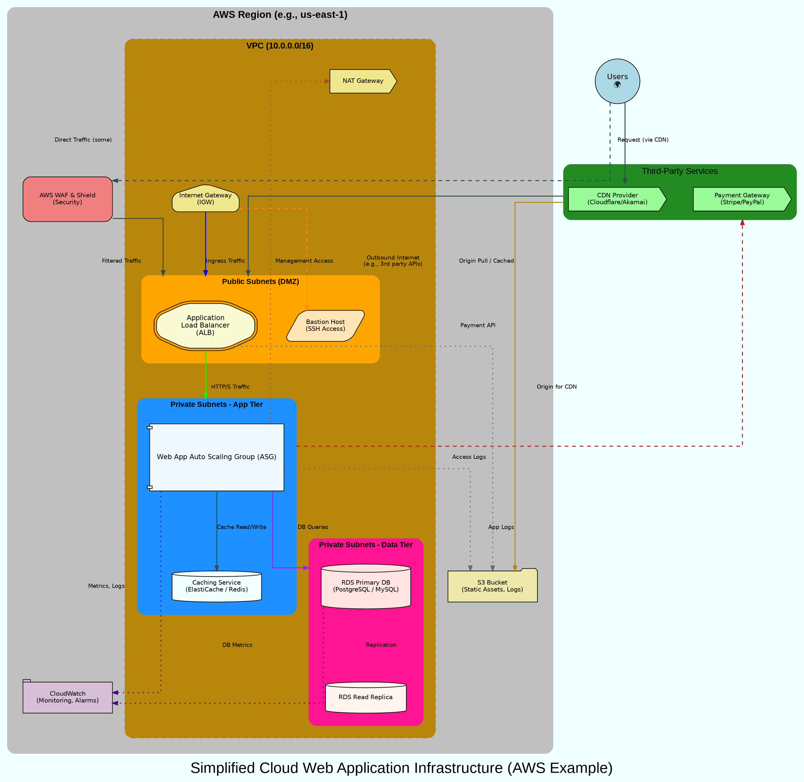

#  A Simplified Cloud Infrastructure Diagram for a Web Application
> This content is dual-licensed under your choice of the following licenses:
> 1.  **MIT License:** For the code implementations in Swift and Mermaid provided in this document.
> 2.  **Creative Commons Attribution 4.0 International License (CC BY 4.0):** For all other content, including the text, explanations, and the Mermaid diagrams and illustrations.

---

Fellow Explorer! Let's tackle another practical, advanced example using the `dot` engine.

This time, we'll model a **Simplified Cloud Infrastructure Diagram for a Web Application**, including networking components like VPCs, subnets, load balancers, and different tiers of services. This will allow us to focus on grouping, network flow, and showing different zones of responsibility.




**To Generate this Diagram:**

1.  Save the code above as `advanced_cloud_infra.gv` (or `.dot`).
2.  Run Graphviz:
    ```bash
    dot -Tpng advanced_cloud_infra.gv -o advanced_cloud_infra.png
    ```
    Or for SVG:
    ```bash
    dot -Tsvg advanced_cloud_infra.gv -o advanced_cloud_infra.svg
    ```

**Key Advanced Features Used in this Example:**

1.  **Nested Clusters:** `cluster_AWS_Region` contains `cluster_VPC`, which in turn contains `cluster_PublicSubnets`, `cluster_PrivateSubnets_App`, and `cluster_PrivateSubnets_Data`. This is powerful for showing hierarchical containment.
2.  **`compound=true`:** Absolutely essential for drawing edges *to* and *from* clusters (`lhead`, `ltail` implicitly used sometimes, or explicitly if needed).
3.  **`concentrate=true`:** Attempts to merge parallel edge paths, which can reduce clutter in network diagrams.
4.  **`splines=ortho`:** Good choice for structured diagrams like infrastructure, making connections clear.
5.  **Semantic Shapes:** Different shapes (`house` for IGW, `doubleoctagon` for ALB, `cylinder` for DBs/Caching, `component` for ASG, `shield` for WAF) to visually distinguish component types.
6.  **`rankdir=TB`:** Typical for showing layers of an infrastructure from user/internet down to backend services.
7.  **Logical Grouping for Flow:** Edges attempt to show typical request/data flow directions.
8.  **Different Line Styles/Colors for Edges:** To differentiate types of traffic or interaction (e.g., main traffic bold green, management access dashed orange, DB queries purple).
9.  **Varying `nodesep` and `ranksep`:** To provide adequate spacing between elements and layers.
10. **Using `margin` within cluster definitions and for the main graph:** To control padding.
11. **Fixed Size Nodes with Margins:** Ensures nodes have a consistent appearance.
12. **HTML-like labels are not heavily used here**, but could be for more detailed node information (e.g., IP addresses, instance types within a node). This example prioritizes component shapes and connections.

This cloud infrastructure example highlights how `dot` can be used to represent complex, layered systems with clear boundaries and relationships between components. Iteration and fine-tuning of spacing, edge weights, and sometimes invisible edges (though not heavily used here) are often part of creating a polished final diagram.


---

<!-- 


---
>**Licenses:**
>
>- **MIT License:**  [](LICENSE) - Full text in [LICENSE](LICENSE) file.
>- **Creative Commons Attribution-ShareAlike 4.0 International**: [CC BY-SA 4.0](https://creativecommons.org/licenses/by-sa/4.0/) [](https://creativecommons.org/licenses/by-sa/4.0/) - Legal details in [LICENSE-CC-BY-SA-4.0](LICENSE-CC-BY-SA-4.0) and at [Creative Commons official site](https://creativecommons.org/licenses/by-sa/4.0/).
>
---