# A Simplified Database Schema
> This content is dual-licensed under your choice of the following licenses:
> 1.  **MIT License:** For the code implementations in Swift and Mermaid provided in this document.
> 2.  **Creative Commons Attribution 4.0 International License (CC BY 4.0):** For all other content, including the text, explanations, and the Mermaid diagrams and illustrations.

---


Okay, Fellow Explorer! Let's create another distinct and practical advanced example using the `dot` engine.

This time, we'll visualize a **Simplified Database Schema** for a small E-commerce platform. This will focus on representing tables, columns (with data types), primary keys (PK), foreign keys (FK), and relationships (one-to-many, many-to-many).

```dot
digraph Advanced_Ecommerce_Schema {
    // --- Graph Defaults ---
    graph [
        layout=dot,
        rankdir=TB, // Top-to-Bottom or LR can work for schemas
        label="Simplified E-Commerce Database Schema",
        fontsize=24,
        fontname="Arial",
        bgcolor="beige",
        nodesep=0.8,    // Generous separation between tables
        ranksep=1.5,    // Generous separation between ranks of tables
        splines=ortho,  // Orthogonal lines clearly show relationships
        concentrate=false // Keep FK->PK lines distinct if tables are far
    ];

    // --- Node Defaults (for Tables) ---
    node [
        shape=none, // We'll use HTML-like labels (plaintext shape) for tables
        margin="0.0",
        fontname="Helvetica"
    ];

    // --- Edge Defaults (for Relationships) ---
    edge [
        fontname="Helvetica",
        fontsize=9,
        color=darkslategray,
        penwidth=1.5,
        // Arrow shapes for relationships:
        // crow: one (looks like a crow's foot)
        // tee: many (perpendicular line)
        // odot/dot: optional/mandatory (circle)
        // We will use labels for cardinality and standard arrows for FK direction
        arrowhead=normal, // Points from FK to PK
        arrowtail=none
    ];


    // --- Define Tables using HTML-like Labels ---

    // Users Table
    Users [label=<
        <TABLE BORDER="0" CELLBORDER="1" CELLSPACING="0" CELLPADDING="4" BGCOLOR="lightyellow">
            <TR><TD COLSPAN="3" BGCOLOR="palegoldenrod"><B>Users</B></TD></TR>
            <TR><TD ALIGN="LEFT" PORT="user_id"><I>user_id (PK)</I></TD><TD ALIGN="LEFT">INT</TD><TD ALIGN="LEFT">PRIMARY KEY, AUTO_INCREMENT</TD></TR>
            <TR><TD ALIGN="LEFT">username</TD><TD ALIGN="LEFT">VARCHAR(50)</TD><TD ALIGN="LEFT">UNIQUE, NOT NULL</TD></TR>
            <TR><TD ALIGN="LEFT">email</TD><TD ALIGN="LEFT">VARCHAR(100)</TD><TD ALIGN="LEFT">UNIQUE, NOT NULL</TD></TR>
            <TR><TD ALIGN="LEFT">password_hash</TD><TD ALIGN="LEFT">VARCHAR(255)</TD><TD ALIGN="LEFT">NOT NULL</TD></TR>
            <TR><TD ALIGN="LEFT">created_at</TD><TD ALIGN="LEFT">TIMESTAMP</TD><TD ALIGN="LEFT">DEFAULT CURRENT_TIMESTAMP</TD></TR>
        </TABLE>
    >];

    // Products Table
    Products [label=<
        <TABLE BORDER="0" CELLBORDER="1" CELLSPACING="0" CELLPADDING="4" BGCOLOR="lightcyan">
            <TR><TD COLSPAN="3" BGCOLOR="paleturquoise"><B>Products</B></TD></TR>
            <TR><TD ALIGN="LEFT" PORT="product_id"><I>product_id (PK)</I></TD><TD ALIGN="LEFT">INT</TD><TD ALIGN="LEFT">PRIMARY KEY, AUTO_INCREMENT</TD></TR>
            <TR><TD ALIGN="LEFT" PORT="category_id_fk"><I>category_id (FK)</I></TD><TD ALIGN="LEFT">INT</TD><TD ALIGN="LEFT">FOREIGN KEY</TD></TR>
            <TR><TD ALIGN="LEFT">name</TD><TD ALIGN="LEFT">VARCHAR(255)</TD><TD ALIGN="LEFT">NOT NULL</TD></TR>
            <TR><TD ALIGN="LEFT">description</TD><TD ALIGN="LEFT">TEXT</TD><TD ALIGN="LEFT"></TD></TR>
            <TR><TD ALIGN="LEFT">price</TD><TD ALIGN="LEFT">DECIMAL(10,2)</TD><TD ALIGN="LEFT">NOT NULL</TD></TR>
            <TR><TD ALIGN="LEFT">stock_quantity</TD><TD ALIGN="LEFT">INT</TD><TD ALIGN="LEFT">DEFAULT 0</TD></TR>
        </TABLE>
    >];

    // Categories Table
    Categories [label=<
        <TABLE BORDER="0" CELLBORDER="1" CELLSPACING="0" CELLPADDING="4" BGCOLOR="lightgreen">
            <TR><TD COLSPAN="3" BGCOLOR="palegreen"><B>Categories</B></TD></TR>
            <TR><TD ALIGN="LEFT" PORT="category_id"><I>category_id (PK)</I></TD><TD ALIGN="LEFT">INT</TD><TD ALIGN="LEFT">PRIMARY KEY, AUTO_INCREMENT</TD></TR>
            <TR><TD ALIGN="LEFT">name</TD><TD ALIGN="LEFT">VARCHAR(100)</TD><TD ALIGN="LEFT">UNIQUE, NOT NULL</TD></TR>
        </TABLE>
    >];

    // Orders Table
    Orders [label=<
        <TABLE BORDER="0" CELLBORDER="1" CELLSPACING="0" CELLPADDING="4" BGCOLOR="lavenderblush">
            <TR><TD COLSPAN="3" BGCOLOR="pink"><B>Orders</B></TD></TR>
            <TR><TD ALIGN="LEFT" PORT="order_id"><I>order_id (PK)</I></TD><TD ALIGN="LEFT">INT</TD><TD ALIGN_LEFT="LEFT">PRIMARY KEY, AUTO_INCREMENT</TD></TR>
            <TR><TD ALIGN="LEFT" PORT="user_id_fk"><I>user_id (FK)</I></TD><TD ALIGN="LEFT">INT</TD><TD ALIGN="LEFT">FOREIGN KEY</TD></TR>
            <TR><TD ALIGN="LEFT">order_date</TD><TD ALIGN="LEFT">TIMESTAMP</TD><TD ALIGN_LEFT="LEFT">DEFAULT CURRENT_TIMESTAMP</TD></TR>
            <TR><TD ALIGN="LEFT">total_amount</TD><TD ALIGN="LEFT">DECIMAL(10,2)</TD><TD ALIGN_LEFT="LEFT">NOT NULL</TD></TR>
            <TR><TD ALIGN="LEFT">status</TD><TD ALIGN="LEFT">VARCHAR(50)</TD><TD ALIGN_LEFT="LEFT">e.g., pending, shipped</TD></TR>
        </TABLE>
    >];

    // OrderItems Table (Junction Table for Many-to-Many between Orders and Products)
    OrderItems [label=<
        <TABLE BORDER="0" CELLBORDER="1" CELLSPACING="0" CELLPADDING="4" BGCOLOR="lightcoral">
            <TR><TD COLSPAN="3" BGCOLOR="salmon"><B>OrderItems</B> (Junction)</TD></TR>
            <TR><TD ALIGN="LEFT" PORT="order_item_id"><I>order_item_id (PK)</I></TD><TD ALIGN="LEFT">INT</TD><TD ALIGN="LEFT">PRIMARY KEY, AUTO_INCREMENT</TD></TR>
            <TR><TD ALIGN="LEFT" PORT="order_id_fk"><I>order_id (FK)</I></TD><TD ALIGN="LEFT">INT</TD><TD ALIGN="LEFT">FOREIGN KEY</TD></TR>
            <TR><TD ALIGN="LEFT" PORT="product_id_fk"><I>product_id (FK)</I></TD><TD ALIGN="LEFT">INT</TD><TD ALIGN="LEFT">FOREIGN KEY</TD></TR>
            <TR><TD ALIGN="LEFT">quantity</TD><TD ALIGN="LEFT">INT</TD><TD ALIGN="LEFT">NOT NULL</TD></TR>
            <TR><TD ALIGN="LEFT">price_at_purchase</TD><TD ALIGN="LEFT">DECIMAL(10,2)</TD><TD ALIGN="LEFT">NOT NULL</TD></TR>
        </TABLE>
    >];

    // Addresses Table
    Addresses [label=<
        <TABLE BORDER="0" CELLBORDER="1" CELLSPACING="0" CELLPADDING="4" BGCOLOR="lightskyblue">
            <TR><TD COLSPAN="3" BGCOLOR="skyblue"><B>Addresses</B></TD></TR>
            <TR><TD ALIGN="LEFT" PORT="address_id"><I>address_id (PK)</I></TD><TD ALIGN="LEFT">INT</TD><TD ALIGN="LEFT">PRIMARY KEY, AUTO_INCREMENT</TD></TR>
            <TR><TD ALIGN="LEFT" PORT="user_id_fk"><I>user_id (FK)</I></TD><TD ALIGN="LEFT">INT</TD><TD ALIGN="LEFT">FOREIGN KEY</TD></TR>
            <TR><TD ALIGN="LEFT">street</TD><TD ALIGN="LEFT">VARCHAR(255)</TD><TD ALIGN="LEFT">NOT NULL</TD></TR>
            <TR><TD ALIGN="LEFT">city</TD><TD ALIGN="LEFT">VARCHAR(100)</TD><TD ALIGN="LEFT">NOT NULL</TD></TR>
            <TR><TD ALIGN="LEFT">postal_code</TD><TD ALIGN="LEFT">VARCHAR(20)</TD><TD ALIGN="LEFT">NOT NULL</TD></TR>
            <TR><TD ALIGN="LEFT">country</TD><TD ALIGN="LEFT">VARCHAR(50)</TD><TD ALIGN="LEFT">NOT NULL</TD></TR>
            <TR><TD ALIGN="LEFT">is_default_shipping</TD><TD ALIGN="LEFT">BOOLEAN</TD><TD ALIGN="LEFT">DEFAULT FALSE</TD></TR>
        </TABLE>
    >];


    // --- Define Relationships ---

    // Users to Orders (One User -> Many Orders)
    Users:user_id:e -> Orders:user_id_fk:w [
        label="1..N",
        taillabel="1", headlabel="0..N", // Crow's foot notation could be mimicked with multiple lines or more complex arrows
        color=blue,
        dir=forward // FK points to PK
    ];

    // Users to Addresses (One User -> Many Addresses)
    Users:user_id:e -> Addresses:user_id_fk:w [
        label="1..N",
        taillabel="1", headlabel="0..N",
        color=green
    ];

    // Categories to Products (One Category -> Many Products)
    Categories:category_id:s -> Products:category_id_fk:n [ // Using s(outh) and n(orth) ports for vertical flow
        label="1..N",
        taillabel="1", headlabel="0..N",
        color=purple
    ];

    // Orders to OrderItems (One Order -> Many OrderItems)
    Orders:order_id:e -> OrderItems:order_id_fk:w [
        label="1..N",
        taillabel="1", headlabel="1..N",
        color=red,
        constraint=true // Important for layout
    ];

    // Products to OrderItems (One Product -> Many OrderItems)
    Products:product_id:e -> OrderItems:product_id_fk:w [
        label="1..N",
        taillabel="1", headlabel="1..N",
        color=orange,
        constraint=true // Important for layout
    ];


    // --- Grouping related tables (optional for layout hints) ---
    // For instance, master data vs transactional data
    subgraph cluster_MasterData {
        label="Master Data";
        bgcolor="transparent"; // Or a very light shade
        style=dotted;
        // Users; Products; Categories; // Let dot place them based on connections
    }

    subgraph cluster_TransactionalData {
        label="Transactional Data";
        bgcolor="transparent";
        style=dotted;
        // Orders; OrderItems; // Let dot place them
    }

    // Placing key tables for better flow
    // {rank=same; Users; Categories;} // Top level master
    // Products -> Orders [style=invis, weight=10]; // Ensure Products is somewhat left of Orders if TB
    // {rank=same; Orders; Addresses;} // User related transactions/info

    // This helps position junction table between its parents if rankdir=TB
    Products -> OrderItems [style=invis, weight=5];
    Orders -> OrderItems [style=invis, weight=5];
}
```




**To Generate this Diagram:**

1.  Save the code above as `advanced_ecommerce_schema.gv` (or `.dot`).
2.  Run Graphviz:
    ```bash
    dot -Tpng advanced_ecommerce_schema.gv -o advanced_ecommerce_schema.png
    ```
    Or for SVG:
    ```bash
    dot -Tsvg advanced_ecommerce_schema.gv -o advanced_ecommerce_schema.svg
    ```

**Key Advanced Features Used in this Example:**

1.  **HTML-Like Labels for Tables:** This is the core of this example. Each table is defined as a `TABLE` structure, allowing for rich formatting of columns, data types, PK/FK indicators, and constraints.
    *   `BORDER="0" CELLBORDER="1" CELLSPACING="0" CELLPADDING="4"`: Standard HTML table attributes for styling.
    *   `<B>`, `<I>`: Bold and Italic tags.
    *   `COLSPAN`: To make headers span multiple columns.
    *   `ALIGN="LEFT"`: For text alignment.
    *   `BGCOLOR`: For header and table background colors.
    *   `PORT="field_name"`: Crucial for connecting edges (relationships) to specific fields (rows in the HTML table).
2.  **`shape=none` for Table Nodes:** The HTML label itself defines the visual appearance, so the default node shape is disabled.
3.  **Specific Edge Connections to Ports:** Edges connect from `TableName:ForeignKeyPort` to `ReferencedTable:PrimaryKeyPort`. The `:e` (east) and `:w` (west) or `:n` (north) and `:s` (south) parts of the port name are compass points to suggest edge routing from the sides/top/bottom of the HTML table.
4.  **Relationship Labels (`label="1..N"`)**: Indicate cardinality. `taillabel` and `headlabel` can provide more detail directly on the edge ends.
    *   *Note*: True Crow's Foot notation is complex in `dot`. This uses labels as a common and clear alternative.
5.  **`splines=ortho`:** Creates clean, right-angled lines for relationships, which is common in ERDs.
6.  **`concentrate=false`:** For schema diagrams, it's often better *not* to merge parallel relationship lines, especially if they represent different FKs to the same table, to maintain clarity.
7.  **Color-Coded Relationships & Tables:** Helps visually distinguish different entities and their connections.
8.  **Junction Table (`OrderItems`):** Clearly shows the many-to-many relationship between `Orders` and `Products`. The `constraint=true` on edges to junction tables helps `dot` layout these critical paths.
9.  **Conceptual Grouping with `subgraph cluster_...`:** While not strictly enforcing layout to fixed positions, clusters like `MasterData` and `TransactionalData` can provide high-level organization. Using `style=dotted` and `bgcolor=transparent` makes them subtle visual cues.
10. **Invisible Edges for Layout Tweaking (used sparingly):** `style=invis` edges can be added with high `weight` to influence the relative positioning of tables if `dot`'s default placement isn't ideal. For example, ensuring a junction table falls between its parent tables in a `TB` layout.

This database schema example demonstrates how `dot` can be pushed to create highly detailed and structured diagrams using its HTML-like label capabilities and precise edge routing. It’s a very effective way to communicate database structure.


-----


<!-- 
```mermaid
%% Current Mermaid version
info
```
-->


```mermaid
---
title: "CongLeSolutionX"
author: "Cong Le"
version: "1.0"
license(s): "MIT, CC BY 4.0"
copyright: "Copyright (c) 2025 Cong Le. All Rights Reserved."
config:
  theme: base
---
%%{
  init: {
    'flowchart': { 'htmlLabels': false },
    'fontFamily': 'Bradley Hand',
    'themeVariables': {
      'primaryColor': '#fc82',
      'primaryTextColor': '#F8B229',
      'primaryBorderColor': '#27AE60',
      'secondaryColor': '#81c784',
      'secondaryTextColor': '#6C3483',
      'lineColor': '#F8B229',
      'fontSize': '20px'
    }
  }
}%%
flowchart LR
    My_Meme@{ img: "https://raw.githubusercontent.com/CongLeSolutionX/MY_GRAPHIC_ASSETS/refs/heads/Designing_graphic_syntax/MY_MEME/My-meme-icon-design.png", label: "Ăn uống gì chưa ngừi đẹp?", pos: "b", w: 200, h: 150, constraint: "on" }

    Closing_quote@{ shape: braces, label: "I'll leave this Earth empty-handed anyway!<br/>YOLO" }

My_Meme ~~~ Closing_quote


```


---
>**Licenses:**
>
>- **MIT License:**  [](LICENSE) - Full text in [LICENSE](LICENSE) file.
>- **Creative Commons Attribution 4.0 International:** [](LICENSE-CC-BY) - Legal details in [LICENSE-CC-BY](LICENSE-CC-BY) and at [Creative Commons official site](http://creativecommons.org/licenses/by/4.0/).
>
---