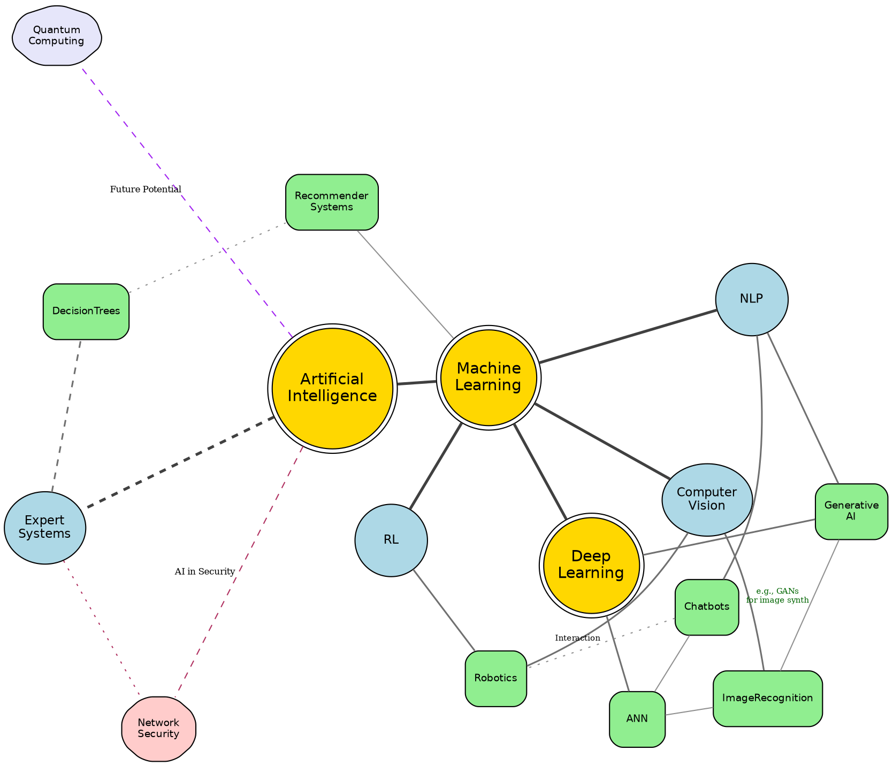

# An advanced example using fdp engine
> This content is dual-licensed under your choice of the following licenses:
> 1.  **MIT License:** For the code implementations in Swift and Mermaid provided in this document.
> 2.  **Creative Commons Attribution 4.0 International License (CC BY 4.0):** For all other content, including the text, explanations, and the Mermaid diagrams and illustrations.

---


Alright, Fellow Explorer, let's craft an advanced example for the `fdp` engine. 

This example will aim to showcase several features working together:
*   **Node clustering** (visual, not structural like `dot`'s `subgraph cluster_...`) by using similar attributes.
*   **Varying node sizes** based on a conceptual "importance" or "degree."
*   **Varying edge weights** to influence spring stiffness slightly.
*   **Using `K` and `iterations`** for layout tuning.
*   **Labels and different shapes.**
*   **Purpose:** To visualize a conceptual "knowledge graph" or "concept map" where related concepts cluster together, and more central/connected concepts are larger.

---

## KnowledgeMap 



---

## To Compile This Example

Save the code above as `advanced_fdp_example.dot`. Then run from your terminal:
```bash
dot -Kfdp -Tsvg advanced_fdp_example.dot -o advanced_fdp_example.svg
# Or for PNG:
# dot -Kfdp -Tpng advanced_fdp_example.dot -o advanced_fdp_example.png
```
Open `advanced_fdp_example.svg` (or `.png`) in a suitable viewer. SVG is recommended for scalability and clarity.


---


## What This Example Tries to Achieve with `fdp`

1.  **Visual Clustering:**
    *   Nodes representing "Core Concepts", "Sub-Fields", and "Applications" are given distinct colors, shapes, and sizes. `fdp` will naturally try to keep connected nodes together, and these visual cues will reinforce the groupings.
2.  **Centrality and Importance:**
    *   `CoreAI` and `MachineLearning` are larger and have more strong connections, so `fdp` should naturally place them more centrally within their connected components.
3.  **Edge Influence:**
    *   `weight` and `len` attributes on edges attempt to influence the "springs." Stronger weights/shorter desired lengths might pull nodes closer (though `K` is a global factor).
    *   Different `penwidth` and `color` for edges can also visually denote connection strength or type.
4.  **Layout Parameters (`K`, `iterations`, `overlap`, `sep`):**
    *   `K=0.9` attempts to give nodes a bit more breathing room than the default.
    *   `iterations=600` provides more time for the layout to settle.
    *   `overlap=prism` uses a more advanced method for untangling nodes. If it's too slow or not available in your Graphviz build, try `overlap=scale` or `overlap=true`.
    *   `sep="+8"` provides a bit of extra padding.
5.  **Organic Structure:**
    *   The resulting layout should feel more "organic" than a strict `dot` hierarchy, showing the interconnectedness of AI concepts.
6.  **Labels and Readability:**
    *   Newline characters (`\n`) are used in labels for better formatting on nodes. Edge labels are also used.
    *   Different `fontsize` values are used to match node "importance."
7.  **Isolated/Peripheral Concepts:**
    *   `QuantumComputing` and `NetworkSecurity` have fewer or weaker connections to the main cluster, so `fdp` should position them more peripherally.

---


## Experimentation Encouraged

*   **Change `K`:** Try `K=0.5` (tighter) or `K=1.5` (much looser).
*   **Adjust `iterations`:** See if more or fewer iterations make a noticeable difference.
*   **Modify `edge` weights and `len` values:** Observe their subtle impact on local node arrangements.
*   **Toggle `splines`:** See the difference between `splines=true` and `splines=false` (or not setting it, which often defaults to straight lines for `fdp`).
*   **Different `overlap` methods:** `scale`, `scalexy`, `compress`, `false`.
*   Add/remove nodes and edges to see how the "physical system" rebalances.


---


This example demonstrates that while `fdp` offers a different layout philosophy, you still have many levers through attributes to guide and refine the final visualization. It often requires more iterative tuning than `dot` to get the desired aesthetic and clarity for complex, non-hierarchical data.


---


<!-- 
```mermaid
%% Current Mermaid version
info
```
-->


```mermaid
---
title: "CongLeSolutionX"
author: "Cong Le"
version: "1.0"
license(s): "MIT, CC BY 4.0"
copyright: "Copyright (c) 2025 Cong Le. All Rights Reserved."
config:
  theme: base
---
%%{
  init: {
    'flowchart': { 'htmlLabels': false },
    'fontFamily': 'Bradley Hand',
    'themeVariables': {
      'primaryColor': '#fc82',
      'primaryTextColor': '#F8B229',
      'primaryBorderColor': '#27AE60',
      'secondaryColor': '#81c784',
      'secondaryTextColor': '#6C3483',
      'lineColor': '#F8B229',
      'fontSize': '20px'
    }
  }
}%%
flowchart LR
    My_Meme@{ img: "https://raw.githubusercontent.com/CongLeSolutionX/MY_GRAPHIC_ASSETS/refs/heads/Designing_graphic_syntax/MY_MEME/My-meme-icon-design.png", label: "Ăn uống gì chưa ngừi đẹp?", pos: "b", w: 200, h: 150, constraint: "on" }

    Closing_quote@{ shape: braces, label: "I'll leave this Earth empty-handed anyway!<br/>YOLO" }

My_Meme ~~~ Closing_quote


```


---
>**Licenses:**
>
>- **MIT License:**  [](LICENSE) - Full text in [LICENSE](LICENSE) file.
>- **Creative Commons Attribution 4.0 International:** [](LICENSE-CC-BY) - Legal details in [LICENSE-CC-BY](LICENSE-CC-BY) and at [Creative Commons official site](http://creativecommons.org/licenses/by/4.0/).
>
---