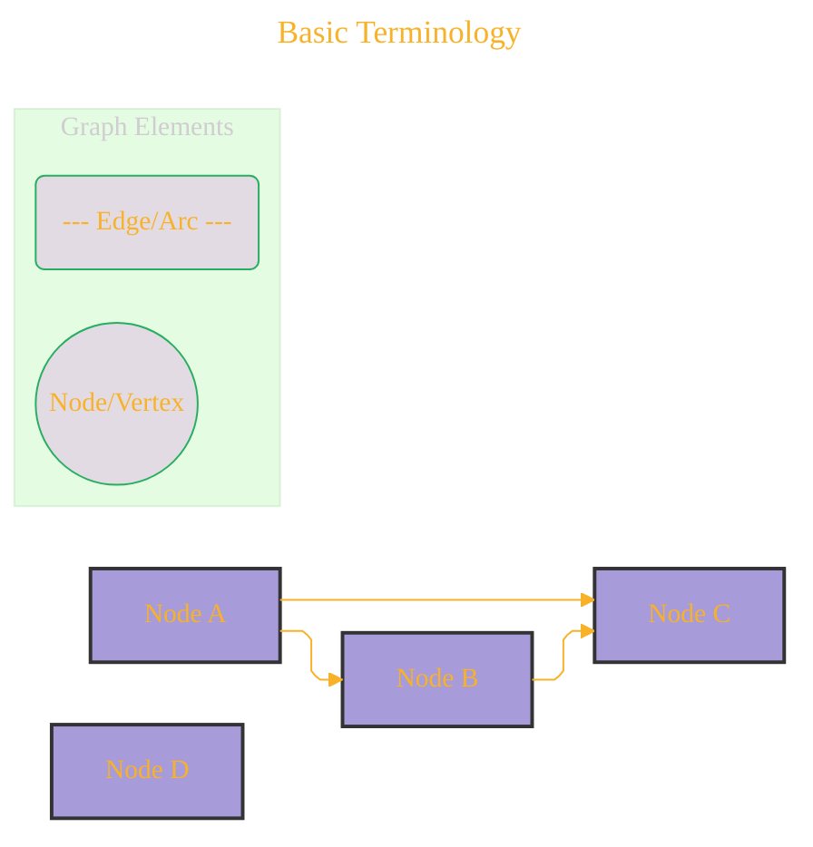

# Landmark: Understanding Graphs in DOT
> **Disclaimer:**
>
> This document contains my personal notes on the topic,
> compiled from publicly available documentation and various cited sources.
> The materials are intended for educational purposes, personal study, and reference.
> The content is dual-licensed:
> 1. **MIT License:** Applies to all code implementations (Swift, Mermaid, and other programming languages).
> 2. **Creative Commons Attribution-ShareAlike 4.0 International License (CC BY-SA 4.0):** Applies to all non-code content, including text, explanations, diagrams, and illustrations.
---


The DOT language is fundamentally about describing **graphs**. Before diving into DOT syntax, it's crucial to understand the core components of what constitutes a graph in this context.

## Basic Terminology

At its heart, a graph is a collection of **nodes** (also called vertices) connected by **edges** (also called links or arcs).



*   **Nodes:** Represent entities or objects. In DOT, nodes can have names (identifiers) and various attributes like labels, shapes, colors, etc.
*   **Edges:** Represent relationships or connections between nodes. Edges can also have attributes, such as labels, colors, styles (dashed, solid), and directionality.

---

## Types of Graphs

DOT can describe several types of graphs:

1.  **Undirected Graphs (`graph`)**: Edges have no inherent direction. A connection between A and B is the same as B to A. Defined using the `graph` keyword.
    *   Edge syntax: `A -- B;`

2.  **Directed Graphs (`digraph`)**: Edges have a specific direction, from a source node to a target node. A connection from A to B is distinct from B to A. Defined using the `digraph` keyword. This is the most common type.
    *   Edge syntax: `A -> B;`

3.  **Strict Graphs**: In a strict graph (either directed or undirected, specified with the `strict` keyword), multiple edges between the same pair of nodes (in the same direction for digraphs) are forbidden or merged. If an attribute is redefined for an existing edge, it's updated.

---

## Core Declaration

A DOT file typically starts by declaring the type of graph:

````
```dot
/*
 * title: Core Declaration
 * author: Cong Le
 * version: 1.0
 * license(s): MIT, CC BY-SA 4.0
 * copyright: Copyright (c) 2025 Cong Le. All Rights Reserved.
 * 
 */
// Example of a simple directed graph
digraph MyFirstGraph {
    // Nodes and edges will be defined here
}

// Example of a simple undirected graph
graph MySecondGraph {
    // Nodes and edges will be defined here
}
```
````

This foundational understanding of graph theory elements is key to effectively using the DOT language to describe and, subsequently, visualize complex structures.


---

<!-- 


---
>**Licenses:**
>
>- **MIT License:**  [](LICENSE) - Full text in [LICENSE](LICENSE) file.
>- **Creative Commons Attribution-ShareAlike 4.0 International**: [CC BY-SA 4.0](https://creativecommons.org/licenses/by-sa/4.0/) [](https://creativecommons.org/licenses/by-sa/4.0/) - Legal details in [LICENSE-CC-BY-SA-4.0](LICENSE-CC-BY-SA-4.0) and at [Creative Commons official site](https://creativecommons.org/licenses/by-sa/4.0/).
>
---