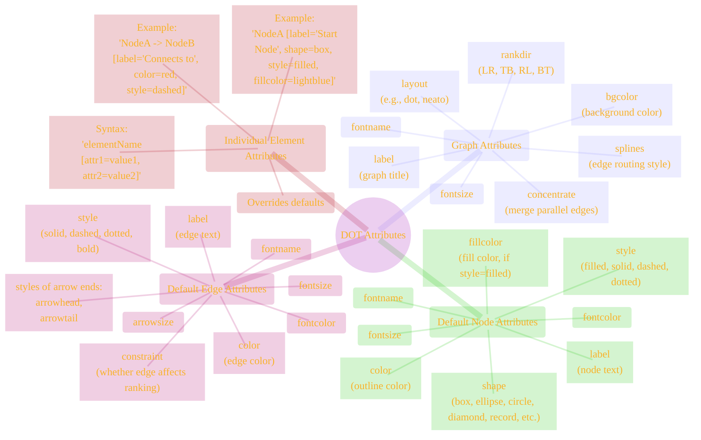
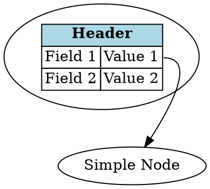

# Landmark: Attributes and Styling in DOT
> This content is dual-licensed under your choice of the following licenses:
> 1.  **MIT License:** For the code implementations in Swift and Mermaid provided in this document.
> 2.  **Creative Commons Attribution 4.0 International License (CC BY 4.0):** For all other content, including the text, explanations, and the Mermaid diagrams and illustrations.

Attributes are the primary mechanism in DOT for controlling the appearance and layout of graph elements (graphs, nodes, and edges). They allow for customization of labels, colors, shapes, styles, fonts, and much more.

## Attribute Scope

Attributes can be set at different levels, establishing defaults that can be overridden:

1.  **Graph Attributes (`graph [...]`)**: Apply to the graph as a whole (e.g., background color, layout direction, default node/edge styles).
2.  **Default Node Attributes (`node [...]`)**: Set default properties for all nodes defined subsequently.
3.  **Default Edge Attributes (`edge [...]`)**: Set default properties for all edges defined subsequently.
4.  **Individual Node/Edge Attributes**: Set properties for a specific node or edge, overriding defaults.

---

## Common Attributes

Here's a table of some frequently used attributes:

| Attribute   | Applies To      | Description                               | Example Value(s)                 |
|-------------|-----------------|-------------------------------------------|---------------------------------|
| `label`     | Graph, Node, Edge | Text displayed for the element.             | `"My Node"`, `"Process Data"`   |
| `shape`     | Node            | Visual shape of the node.                 | `box`, `ellipse`, `record`, `plaintext` |
| `style`     | Node, Edge      | Visual style.                             | `filled`, `dashed`, `dotted`, `bold` |
| `color`     | Node (border), Edge | Color of the border or edge line.       | `red`, `blue`, `#FF0000`         |
| `fillcolor` | Node            | Fill color (if `style=filled`).         | `lightgrey`, `yellow`           |
| `fontname`  | Graph, Node, Edge | Font used for labels.                     | `Arial`, `Helvetica`            |
| `fontsize`  | Graph, Node, Edge | Size of the font for labels.              | `12`, `10`                      |
| `rankdir`   | Graph           | Layout direction (`TB`, `LR`, `BT`, `RL`). | `LR` (Left to Right)            |
| `arrowhead` | Edge            | Style of the arrow at the target node.    | `normal`, `dot`, `vee`, `empty` |
| `arrowtail` | Edge            | Style of the arrow at the source node.    | `normal`, `inv`                 |
| `width`     | Node            | Minimum width of a node in inches.        | `0.75`                          |
| `height`    | Node            | Minimum height of a node in inches.       | `0.5`                           |
| `URL`       | Graph, Node, Edge | Hyperlink for clickable diagrams (SVG).   | `"https://example.com"`         |

*(Note: Numerical values for attributes like `fontsize`, `width`, `height` often do not need quotes unless they contain special characters. String values always need quotes.)*

**HTML-Like Labels:** For more complex node labels, DOT supports a subset of HTML-like syntax within the `label` attribute, allowing for tables, font specifications, and structured content within a node. This is specified by surrounding the label value with `<` and `>`.

Example:

Mastering attributes is key to producing clear, aesthetically pleasing, and informative graph visualizations with DOT and Graphviz.

---

<!-- 

---
>**Licenses:**
>
>- **MIT License:**   - Full text in [LICENSE](LICENSE) file.
>- **Creative Commons Attribution-ShareAlike 4.0 International**: [CC BY-SA 4.0](https://creativecommons.org/licenses/by-sa/4.0/)  - Legal details in [LICENSE-CC-BY-SA-4.0](LICENSE-CC-BY-SA-4.0) and at [Creative Commons official site](https://creativecommons.org/licenses/by-sa/4.0/).
>
---