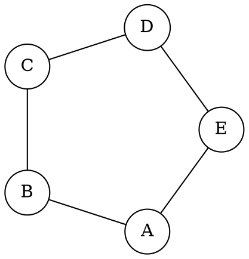
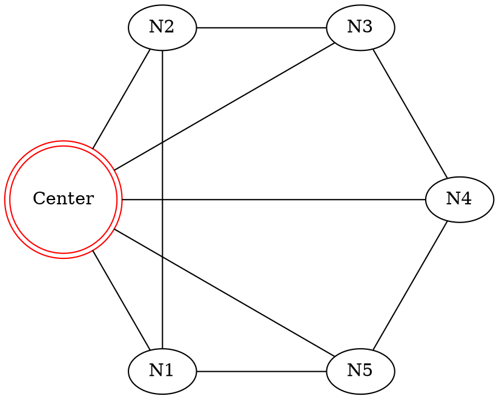
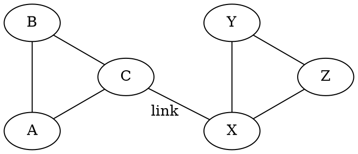
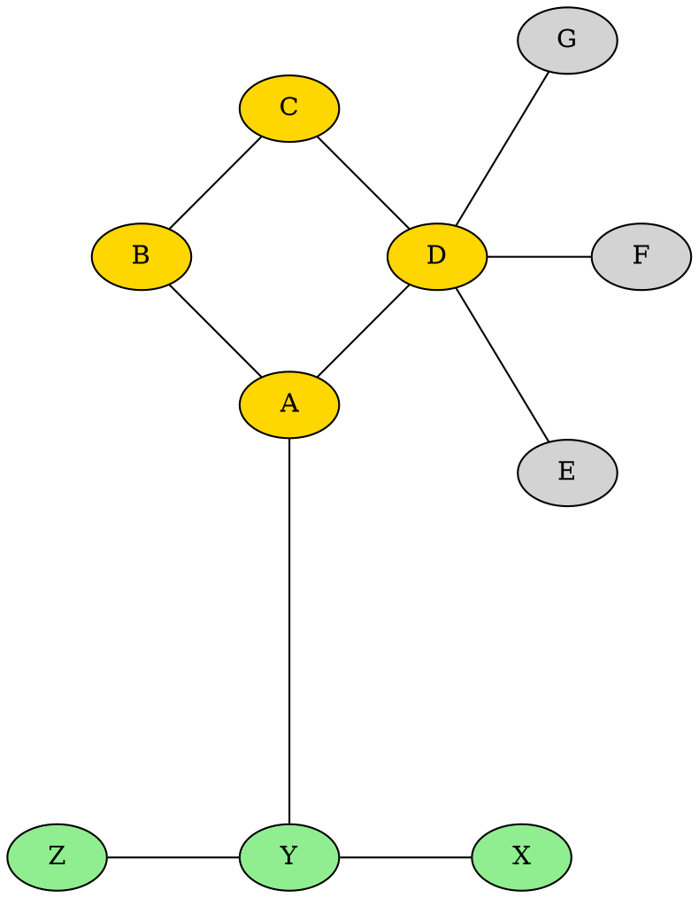

# Layout Engine Study: `circo` - The Circular Arranger
> This content is dual-licensed under your choice of the following licenses:
> 1.  **MIT License:** For the code implementations in Swift and Mermaid provided in this document.
> 2.  **Creative Commons Attribution 4.0 International License (CC BY 4.0):** For all other content, including the text, explanations, and the Mermaid diagrams and illustrations.

---


The `circo` layout engine in Graphviz is designed to produce circular layouts of graphs. It identifies biconnected components (subgraphs that remain connected if any single vertex is removed) and S-R components (split-rewind components, related to graph planarity), and draws them as circles or ellipses. It's particularly useful for certain network topologies, ring structures, or when highlighting cyclical relationships is important.

## Core Concepts of `circo`

*   **Circular Embedding:** `circo` attempts to arrange nodes of a biconnected component along the circumference of a circle.
*   **Root Node Selection:** The `root` attribute on a node can influence its placement, often placing it at the center of its biconnected component circle. If multiple roots are specified, or components are complex, the "center" concept becomes more nuanced.
*   **Biconnected Components:** `circo` identifies these and tries to lay out each as a circle. Articulation points (nodes connecting biconnected components) become junction points between these circular arrangements.
*   **Non-Biconnected Graphs:** For graphs that are not entirely biconnected (e.g., trees attached to circular components), `circo` will still attempt to lay out the biconnected parts circularly and arrange other parts around them.
*   **Edge Routing:** Edges within a circular component are typically drawn as chords or arcs within the circle. Edges between components are routed as directly as possible.

---

## When to Use `circo`

*   **Visualizing Ring Topologies:** Ideal for showing network rings, token rings, or any system where elements are arranged in a loop.
*   **Highlighting Symmetries or Cycles:** Circular layouts can often make cyclic structures more apparent than hierarchical or force-directed layouts.
*   **Emphasis on Connectivity:** Can be good for showing how nodes are connected in a closed loop or as part of a circular hub-and-spoke-like pattern if a root is central.
*   **Artistic or Stylized Representations:** Sometimes chosen for aesthetic reasons when a circular motif is desired.

---

## Key Attributes Influencing `circo`

While many standard DOT attributes apply, some have a particular impact or interpretation with `circo`:

*   **`root` (Node attribute):**
    *   `root=true`: Suggests to `circo` that this node should be a central point for its component.
    *   If a single node in a biconnected component is marked as root, it's often placed at the center, with other nodes of that component arranged circularly around it.
    *   If no `root` is specified, `circo` picks a node.
*   **`rankdir` (Graph attribute):** Usually less impactful for `circo` than for `dot`, as the primary arrangement is circular, not ranked. However, it might subtly influence the orientation of disconnected components or the overall canvas.
*   **`ordering` (Graph attribute):**
    *   `ordering=out`: Can affect the order of nodes around a circle, especially for nodes adjacent to a root node.
*   **`nodesep` (Graph attribute):** Controls the minimum separation between nodes. Can affect the radius of the circles.
*   **`mindist` (Graph attribute):** Minimum distance between nodes. Affects packing.
*   **`len` (Edge attribute):** While `circo` doesn't strictly enforce edge lengths like `neato`, desired lengths can influence the layout to some extent, especially for edges not part of a primary cycle.
*   **`normalize` (Graph attribute):** `normalize=true` can sometimes help in ensuring nodes are placed on a circle.
*   **`overlap` (Graph attribute):** Controls whether nodes can overlap. `overlap=false` (default) prevents overlaps. `overlap=scale` will scale the drawing down to avoid overlaps.

---

## Command-Line Invocation

To use the `circo` layout engine, specify it with the `-K` option:

```bash
dot -Kcirco -Tpng my_graph.dot -o my_graph_circo.png
dot -Kcirco -Tsvg my_graph.dot -o my_graph_circo.svg
```

---

## `circo` Examples

### Example 1: Simple Ring


*Expected Output: Nodes A, B, C, D, E arranged in a circle.*


### Example 2: Ring with a Central Root Node


*Expected Output: `Center` node in the middle, with N1-N5 forming a circle around it, connected both to the center and to each other in a ring.*


### Example 3: Two Biconnected Components (Dumbbell)


*Expected Output: Two distinct circular arrangements (A-B-C and X-Y-Z) connected at C and X.*

### Example 4: More Complex Structure with a Tree Attached


*Expected Output: A-B-C-D will form a circle. E, F, G will radiate from D. X-Y-Z will form another structure, possibly a smaller circular or linear arrangement, connected to the main ring via Y-A.*

---

## Limitations and Considerations

*   **Not for Hierarchies:** `circo` is generally unsuitable for displaying strict hierarchies or directed acyclic graphs where rank direction is paramount. `dot` is better for that.
*   **Large, Dense Graphs:** For very large or densely connected graphs, the circular layout can become cluttered, with many overlapping edges, making it hard to interpret.
*   **Predictability:** While good for specific structures, the layout of more arbitrary graphs can sometimes be less predictable than with `dot` or force-directed engines for general-purpose viewing.
*   **Edge Crossings:** `circo` tries to minimize edge crossings within components, but crossings are still possible, especially between complex components.
*   **Cluster Rendering:** While `subgraph cluster_...` syntax is parsed, the visual representation of clusters as distinct bounding boxes is less prominent or guaranteed in `circo` compared to `dot`. The grouping still influences layout, but the visual box might not always appear as clearly defined.

---

## Conclusion

The `circo` layout engine provides a valuable alternative for visualizing graphs where circular patterns, cycles, or ring structures are significant. By understanding its behavior and a few key attributes like `root`, you can guide `circo` to produce clear and aesthetically pleasing circular diagrams. It's a specialized tool in the Graphviz suite, best applied to graph structures that benefit from this specific style of arrangement.


---
The `circo` engine indeed offers a distinct perspective, Fellow Explorer! It transforms our understanding of how graphs can be visually represented, emphasizing cycles and symmetrical connections.

With `dot` for hierarchies and `circo` for circular patterns explored, we could next:
1.  Investigate another layout engine like **`neato`** or **`fdp`** (force-directed layouts).
2.  Return to **Troubleshooting Common DOT Errors**.
3.  Do a **Deep Dive into a Specific Use Case** applying `circo` or other engines.

What uncharted territory of the Graphviz world shall we explore next?


----


<!-- 
```mermaid
%% Current Mermaid version
info
```
-->


```mermaid
---
title: "CongLeSolutionX"
author: "Cong Le"
version: "1.0"
license(s): "MIT, CC BY 4.0"
copyright: "Copyright (c) 2025 Cong Le. All Rights Reserved."
config:
  theme: base
---
%%{
  init: {
    'flowchart': { 'htmlLabels': false },
    'fontFamily': 'Bradley Hand',
    'themeVariables': {
      'primaryColor': '#fc82',
      'primaryTextColor': '#F8B229',
      'primaryBorderColor': '#27AE60',
      'secondaryColor': '#81c784',
      'secondaryTextColor': '#6C3483',
      'lineColor': '#F8B229',
      'fontSize': '20px'
    }
  }
}%%
flowchart LR
    My_Meme@{ img: "https://raw.githubusercontent.com/CongLeSolutionX/MY_GRAPHIC_ASSETS/refs/heads/Designing_graphic_syntax/MY_MEME/My-meme-icon-design.png", label: "Ăn uống gì chưa ngừi đẹp?", pos: "b", w: 200, h: 150, constraint: "on" }

    Closing_quote@{ shape: braces, label: "I'll leave this Earth empty-handed anyway!<br/>YOLO" }

My_Meme ~~~ Closing_quote


```


---
>**Licenses:**
>
>- **MIT License:**  [](LICENSE) - Full text in [LICENSE](LICENSE) file.
>- **Creative Commons Attribution 4.0 International:** [](LICENSE-CC-BY) - Legal details in [LICENSE-CC-BY](LICENSE-CC-BY) and at [Creative Commons official site](http://creativecommons.org/licenses/by/4.0/).
>
---