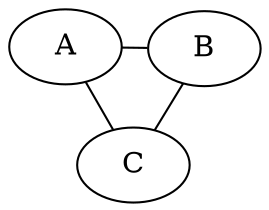
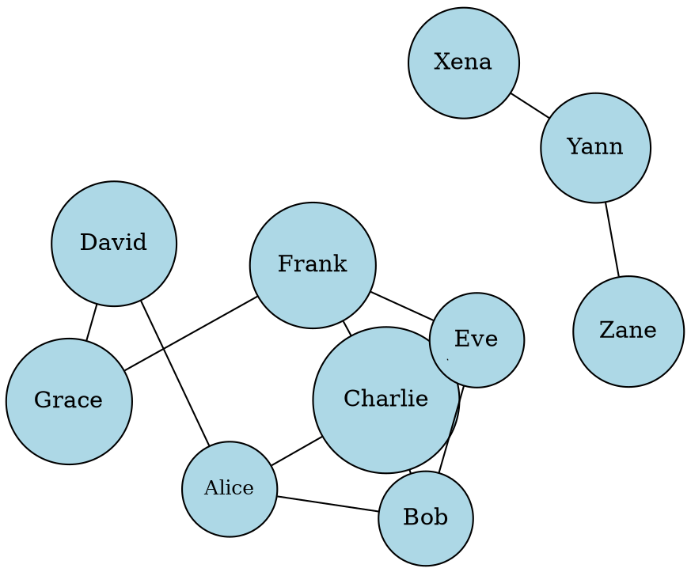

# Layout Engine Exploration: `fdp` (Force-Directed Placement)
> This content is dual-licensed under your choice of the following licenses:
> 1.  **MIT License:** For the code implementations in Swift and Mermaid provided in this document.
> 2.  **Creative Commons Attribution 4.0 International License (CC BY 4.0):** For all other content, including the text, explanations, and the Mermaid diagrams and illustrations.

---


`fdp` is one of Graphviz's "spring model" or force-directed layout engines. Unlike `dot`, which is designed for directed, hierarchical graphs, `fdp` is well-suited for undirected graphs or graphs where the emphasis is on showing connectivity and community structure. It attempts to position nodes such that edge lengths are minimized, and nodes do not overlap excessively.


---

## Core Concept: The Spring Model Analogy

Imagine the graph as a physical system:
*   **Nodes are like charged particles:** They repel each other to avoid overlap.
*   **Edges are like springs:** They try to pull connected nodes closer together.

The `fdp` algorithm iteratively adjusts node positions until the "energy" of this system reaches a minimum, resulting in a balanced layout.

---

## When to Use `fdp`

*   **Undirected Graphs:** Its primary strength. When the direction of edges isn't the main focus.
*   **Network Visualization:** Social networks, protein interaction networks, computer networks where showing clusters and connectivity is key.
*   **Discovering Structure:** When you want the layout to reveal inherent groupings or central nodes rather than imposing a strict hierarchy.
*   **Large, Dense Graphs:** Can sometimes produce more readable layouts for complex, highly connected graphs than `dot`.
*   When a more "organic" or "natural" layout aesthetic is desired.

----

## Invoking `fdp`

You use the `-Kengine` flag with the `dot` command-line tool (or specify the engine in Graphviz libraries).

```bash
dot -Kfdp -Tpng my_undirected_graph.dot -o my_graph_fdp.png
```

Or, within the DOT file itself (though less common nowadays as command-line override is preferred):

*Cartographer's Note: Using `layout=fdp` inside the DOT file ties the graph to a specific engine, which might not always be desired if you want flexibility in rendering. The command-line `-Kfdp` is generally more versatile.*

---

## Key `fdp`-Specific Graph Attributes

While many general Graphviz attributes apply, some are particularly relevant or have specific interpretations for `fdp`:

*   **`K` (float, default: 0.3):** The optimal distance between nodes (strength of the repulsive force or spring constant).
    *   Larger `K` values tend to spread nodes out more.
    *   Smaller `K` values allow nodes to be closer.
    *   This is often the **most important attribute to tune** for `fdp` layouts.
    *   Example: `graph [K=0.6];`

*   **`iterations` (int, default: implementation-dependent, often around 100-600):** The maximum number of iterations the layout algorithm will run.
    *   More iterations can lead to a more stable layout (less "energy") but take longer.
    *   If the layout seems unsettled or nodes are too jumbled, increasing iterations might help.
    *   Example: `graph [iterations=500];`

*   **`dim` (int, default: 2):** Number of dimensions for layout. `fdp` can theoretically lay out in higher dimensions (e.g., `dim=3`), but visualization is usually 2D projected. For 2D output, `dim=2` is standard.

*   **`start` (string):** Controls the initial layout.
    *   `regular`: Nodes are placed on a regular grid initially.
    *   `self`: Uses the current positions of nodes as the starting point (if available in the input DOT, e.g., from a previous layout or manual `pos` attributes).
    *   `random` (with `seed`): Nodes are placed randomly.
        *   **`seed` (int, default: 1):** The random seed for initial placement. Changing the seed can result in different initial layouts, potentially leading to different final layouts if the algorithm settles into a different local minimum.
    *   Example: `graph [start=random, seed=123];`

*   **`overlap` (string or bool):** Controls node overlap removal.
    *   `true` (default): Attempts to remove overlaps.
    *   `false`: Skips overlap removal, which can be faster but result in overlapping nodes.
    *   `scale`: Scales the layout to reduce overlaps.
    *   `scalexy`: Scales an initial layout separately in x and y.
    *   `compress`: Compresses the layout.
    *   `vpsc`: Uses a "Voronoi-based Paired Steepest Ascent" method.
    *   `prism`: A prism-based algorithm for overlap removal (good for many components). Requires `dim=3`.
    *   `ipsep`: Similar to `prism` using incremental proximity based separation.
    *   Example: `graph [overlap=scale];`

*   **`sep` (adderdouble, default: `"+4"`):** Separation between nodes and clusters. Additive values like `"+8"` or `"+1.0"` increase separation beyond what's derived from node sizes. `"*1.2"` scales separation.
    *   Example: `graph [sep="+10"];`


*   **`splines` (string or bool):** While `dot` uses splines for hierarchical edges, `fdp` typically draws straight lines or short splines.
    *   `true`: May attempt to draw splines if edges cross nodes (can be computationally intensive).
    *   `false` or `line` (often implied): Straight line edges.
    *   Example: `graph [splines=true];`


*   **`len` (float, on edges):** Desired edge length. `fdp` tries to make edge lengths approximately equal to this value (scaled by `K`).
    *   Example: `A -- B [len=2.0];`

*   **`weight` (float/int, on edges):** In `fdp`, higher edge weights can make the "spring" stiffer for that edge, pulling its nodes closer or making the edge shorter/more prominent, but its influence is less direct than in `dot`'s ranking. Primarily influences edge length relative to other edges.

---

## Attributes Less Influential or Interpreted Differently with `fdp`

*   **`rankdir`, `rank=same`:** These are specific to `dot`'s hierarchical layout and generally have no effect with `fdp`.
*   **`lhead`, `ltail` (for cluster edges):** While clusters are still drawn, the specific routing for edges to clusters might behave differently. `fdp` doesn't have the same notion of ranks for placing cluster ports.
*   **`constraint` (on edges):** Has less meaning as `fdp` doesn't build a layout based on ranked constraints.

---

## `fdp` Strengths

*   Good for visualizing the inherent "shape" and clustering of undirected data.
*   Can produce aesthetically pleasing, organic-looking layouts.
*   Often better than `dot` for graphs with no clear top-to-bottom or left-to-right flow.

---

## `fdp` Challenges and Considerations

*   **Non-Deterministic (Potentially):** For some graphs, slight changes in input or different starting positions (e.g., random seed) can lead to different final layouts, as the algorithm might find different local energy minima.
*   **Computational Cost:** For very large graphs, `fdp` can be computationally intensive and slow due to the iterative nature of force calculations.
*   **Tuning:** Finding the optimal `K` value and other parameters often requires experimentation.
*   **Edge Crossings:** While it tries to minimize them, `fdp` doesn't explicitly guarantee avoiding edge crossings in the way `dot` sometimes can for planar-like hierarchies.
*   **Overlap Removal:** Can sometimes be imperfect or significantly alter the layout achieved by the force-directed phase.

---

## Example: Social Network


*When run with `dot -Kfdp -Tpng social.dot -o social_fdp.png`, this would show Alice, Bob, Charlie, Eve, and Frank likely forming a central cluster, with David and Grace connected, and Xena, Yann, Zane forming a separate small chain.*

---

## Charting with Forces

The `fdp` layout engine offers a different cartographic perspective, focusing on the intrinsic connections and forces within a graph. It's an invaluable tool when exploring network structures where hierarchy is secondary to connectivity and community. Experimentation with its parameters, especially `K`, is key to producing clear and insightful visualizations.

---

Having explored the `fdp` engine, our understanding of Graphviz's layout capabilities is considerably broader. We've seen how different scenarios call for different tools.

Where shall our expedition lead us next, Fellow Explorer?
1.  **Explore another layout engine (e.g., `neato` - similar to `fdp` but with different algorithms, or `circo`, `twopi`).**
2.  **Return to a topic like "Troubleshooting Common DOT Errors."**
3.  **A Deep Dive into a Specific Use Case, perhaps one suited for `fdp` or `neato`.**
4.  Conclude our current exploration of DOT and Graphviz.


----


<!-- 
```mermaid
%% Current Mermaid version
info
```
-->


```mermaid
---
title: "CongLeSolutionX"
author: "Cong Le"
version: "1.0"
license(s): "MIT, CC BY 4.0"
copyright: "Copyright (c) 2025 Cong Le. All Rights Reserved."
config:
  theme: base
---
%%{
  init: {
    'flowchart': { 'htmlLabels': false },
    'fontFamily': 'Bradley Hand',
    'themeVariables': {
      'primaryColor': '#fc82',
      'primaryTextColor': '#F8B229',
      'primaryBorderColor': '#27AE60',
      'secondaryColor': '#81c784',
      'secondaryTextColor': '#6C3483',
      'lineColor': '#F8B229',
      'fontSize': '20px'
    }
  }
}%%
flowchart LR
    My_Meme@{ img: "https://raw.githubusercontent.com/CongLeSolutionX/MY_GRAPHIC_ASSETS/refs/heads/Designing_graphic_syntax/MY_MEME/My-meme-icon-design.png", label: "Ăn uống gì chưa ngừi đẹp?", pos: "b", w: 200, h: 150, constraint: "on" }

    Closing_quote@{ shape: braces, label: "I'll leave this Earth empty-handed anyway!<br/>YOLO" }

My_Meme ~~~ Closing_quote


```


---
>**Licenses:**
>
>- **MIT License:**  [](LICENSE) - Full text in [LICENSE](LICENSE) file.
>- **Creative Commons Attribution 4.0 International:** [](LICENSE-CC-BY) - Legal details in [LICENSE-CC-BY](LICENSE-CC-BY) and at [Creative Commons official site](http://creativecommons.org/licenses/by/4.0/).
>
---