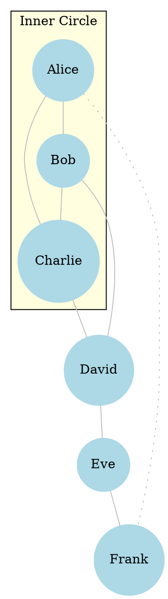

# Layout Engine Exploration: `neato`
> **Disclaimer:**
>
> This document contains my personal notes on the topic,
> compiled from publicly available documentation and various cited sources.
> The materials are intended for educational purposes, personal study, and reference.
> The content is dual-licensed:
> 1. **MIT License:** Applies to all code implementations (Swift, Mermaid, and other programming languages).
> 2. **Creative Commons Attribution-ShareAlike 4.0 International License (CC BY-SA 4.0):** Applies to all non-code content, including text, explanations, diagrams, and illustrations.
---


The `neato` layout engine in Graphviz is designed for "spring model" or "energy-minimizing" layouts. It's primarily used for undirected graphs where the emphasis is on showing the inherent structure of the graph, connectivity, and clustering, rather than a strict hierarchical or directional flow.

## Core Concept: Spring Model

Imagine nodes as objects and edges as springs connecting them.
*   **Springs (Edges):** Try to pull connected nodes together to an ideal length.
*   **Repulsive Forces (Nodes):** Nodes try to push each other apart to avoid overlap.
`neato` attempts to find a layout where the "energy" of this system is minimized, resulting in a balanced and often aesthetically pleasing arrangement.


----

## When to Use `neato`

*   **Undirected Graphs:** Its primary strength. While it can process directed graphs, it doesn't enforce edge directionality in layout ranks like `dot`. Arrows will be drawn, but node placement is based on the spring model.
*   **Network Topologies:** Visualizing computer networks, social networks, protein interaction networks, etc.
*   **Connectivity and Clustering:** When the goal is to highlight groups of densely connected nodes or central nodes.
*   **Symmetric or Highly Regular Structures:** `neato` can often produce pleasing layouts for graphs with inherent symmetries.
*   When a hierarchical `dot` layout feels too rigid or doesn't represent the graph's natural structure well.

---
## Invoking `neato`

You instruct Graphviz to use the `neato` engine via the `-K` command-line option:

```bash
dot -Kneato -Tpng my_graph.dot -o my_graph_neato.png
# or simply:
# neato -Tpng my_graph.dot -o my_graph_neato.png
# (if `neato` is directly available as a command, which it often is)
```

---

## Key `neato`-Specific Attributes and Behaviors

While `neato` respects many general DOT attributes, some have particular importance or slightly different interpretations.

1.  **`len` (Edge Attribute):**
    *   Specifies the desired (optimal) length of an edge in inches.
    *   `neato` tries to make the geometric length of the edge close to this value.
    *   **Example:** `A -- B [len=2.0];` // Tries to make edge A-B 2 inches long.

2.  **`weight` (Edge Attribute - Different Meaning than in `dot`):**
    *   In `dot`, `weight` influences rank assignment and edge direction.
    *   In `neato`, a higher `weight` generally means the edge is "stronger" or "shorter" in the spring model, effectively increasing its attractive force or reducing its ideal length relative to other edges. The documentation notes it's more like "spring constant" or "1/ideal_length".
    *   Highly weighted edges tend to be shorter.

3.  **`dim` (Graph Attribute):**
    *   Sets the number of dimensions for the layout. Default is `2`.
    *   `dim=3` can produce 3D layouts (output often needs specific viewers or formats like VRML, or a 2D projection is generated).
    *   `dimen` is another synonym for `dim`.

4.  **`model` (Graph Attribute):**
    *   Controls the layout model.
    *   `model="shortpath"`: Uses a shortest-path distance model. Nodes are placed so that distances between them approximate graph-theoretic shortest path distances.
    *   `model="circuit"`: Suitable for circuit layouts. Requires `neato -n1` or `neato -n2`.
    *   `model="mds"`: Multi-dimensional scaling. Node positions computed using an MDS algorithm.
    *   `model="subset"` (default or `spring`): The standard spring model.
    *   Using `neato -n<val>` or `neato -n2` command-line options sets different underlying algorithms for the spring model, sometimes overriding the `model` attribute or interacting with it. `-n` is typically for no-op, `-n1` and `-n2` for different layout modes.

5.  **`diredge` (Graph Attribute) and `dir` (Edge Attribute):**
    *   `neato` mostly treats graphs as undirected for layout. If you need to show edge direction on some edges from an undirected layout, you might need to use `dir=forward` etc. on the edge.
    *   `diredge=true` (experimental) might attempt to treat edges as directed.

6.  **`overlap` (Graph Attribute):**
    *   Controls how node overlaps are handled.
    *   `overlap=true` (default): Allows overlaps.
    *   `overlap=false`: Tries to prevent node overlaps (can increase layout time).
    *   `overlap=scale`: Scales the layout up to remove overlaps.
    *   `overlap=scalexy`: Scales x and y independently.
    *   `overlap=prism`: Uses a proximity-based algorithm (expensive).
    *   `overlap=compress`: Compresses the layout to reduce overlaps, may cause some.
    *   `overlap=vpsc`: Uses a constraint-based overlap removal.

7.  **`sep` (Graph Attribute):**
    *   Sets separation between nodes. If `sep` starts with `'+'`, it's an additive margin. Otherwise, it's a multiplier.
    *   Example: `sep="+10"` adds 10 points margin. `sep="0.5"` means nodes can be half their size apart.
    *   Crucial when `overlap=false` or similar.

8.  **`pin` (Node Attribute):**
    *   If `pin=true`, the node's input `pos` attribute is used as its fixed position, and the layout algorithm works around it.
    *   Example: `MyNode [pos="100,200!", pin=true];` (The `!` marks the position as fixed).

9.  **`pos` (Node Attribute):**
    *   Sets or gets the position of a node.
    *   If providing input positions for `neato` (e.g., for minor adjustments or with `pin=true`), ensure the `!` is used if you want it fixed: `node [pos="x,y!"];`
    *   `neato -s<val>` scales input positions.

10. **`epsilon` (Graph Attribute):**
    *   Convergence tolerance for layout iterations. Smaller values lead to more iterations and potentially "better" layouts but take longer.

11. **`maxiter` (Graph Attribute):**
    *   Maximum number of iterations for the layout algorithm.

---

## Example `neato` DOT File:



**To render this with `neato`:**
`neato -Tpng social_network.dot -o social_network_neato.png`

---

## Considerations and Best Practices for `neato`

*   **Iterative Refinement:** Layout can sometimes be unpredictable. Be prepared to tweak attributes like `len`, `weight`, `sep`, and `overlap` to get the desired result.
*   **Start Simple:** Begin with default `neato` settings and add complexity gradually.
*   **Disconnected Components:** `neato` will lay out disconnected graph components independently. They might overlap if `overlap` is not managed.
*   **Large Graphs:** Layout can become computationally expensive for very large graphs. Consider `sfdp` (Scalable Force-Directed Placement) for huge graphs, which uses a multi-level approach similar to `fdp`.
*   **`-n` and `-n2` options:** Experiment with `neato -n ...` or `neato -n2 ...` command-line flags.
    *   `neato -n`: Uses the Kamada-Kawai algorithm based on graph theoretic distances (similar to `model=shortpath`). Often good for regular structures.
    *   `neato -n2`: (Often the default if no other model is specified) Uses a stress majorization algorithm. Tends to be good for general undirected graphs. This option tries to lay out the graph such that straight-line distances in the layout correspond to graph-theoretic distances.

The `neato` engine provides a powerful alternative to `dot` for visualizing the inherent structure and connectivity of networks. Its spring model approach often yields natural and intuitive layouts for undirected graph data.


---

We have now successfully charted the territory of the `neato` layout engine! This gives us a more specialized tool in our Graphviz toolkit.

Would you like to:
1.  Explore another layout engine like `fdp` (another force-directed option, often good for larger graphs) or `circo` (for circular layouts)?
2.  Delve into **Troubleshooting Common DOT Errors**?
3.  Revisit any previous topic for more detail?

The map is open, Fellow Explorer!


---

<!-- 


---
>**Licenses:**
>
>- **MIT License:**  [](LICENSE) - Full text in [LICENSE](LICENSE) file.
>- **Creative Commons Attribution-ShareAlike 4.0 International**: [CC BY-SA 4.0](https://creativecommons.org/licenses/by-sa/4.0/) [](https://creativecommons.org/licenses/by-sa/4.0/) - Legal details in [LICENSE-CC-BY-SA-4.0](LICENSE-CC-BY-SA-4.0) and at [Creative Commons official site](https://creativecommons.org/licenses/by-sa/4.0/).
>
---