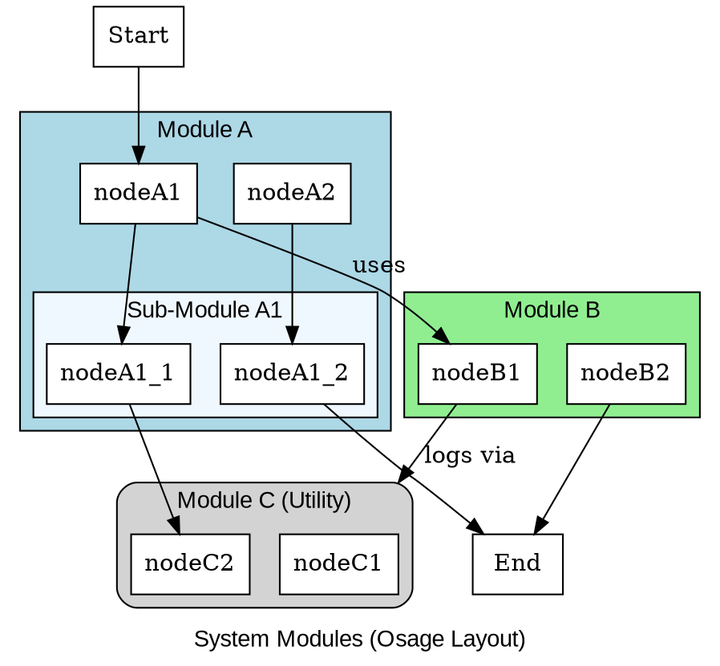
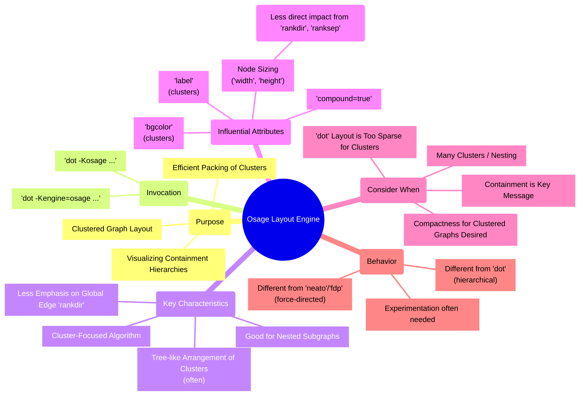

# Layout Engine Exploration: Osage
> **Disclaimer:**
>
> This document contains my personal notes on the topic,
> compiled from publicly available documentation and various cited sources.
> The materials are intended for educational purposes, personal study, and reference.
> The content is dual-licensed:
> 1. **MIT License:** Applies to all code implementations (Swift, Mermaid, and other programming languages).
> 2. **Creative Commons Attribution-ShareAlike 4.0 International License (CC BY-SA 4.0):** Applies to all non-code content, including text, explanations, diagrams, and illustrations.
---


The Osage layout engine is a specialized tool within the Graphviz suite designed primarily for the layout of **clustered graphs**. Unlike `dot` which focuses on directed acyclic graphs and hierarchical structures, or `neato`/`fdp` which use force-directed algorithms for general undirected graphs, Osage employs a different strategy tailored to highlighting containment and relationships between clusters and their contents.

## Key Characteristics and Purpose

*   **Cluster-Focused:** Osage's primary strength lies in its ability to arrange graphs where nodes are grouped into clusters (subgraphs with names starting with `cluster_`).
*   **Packing Algorithm:** It attempts to "pack" clusters and nodes efficiently, often resulting in a more compact layout for clustered graphs than what `dot` might produce, especially when the inter-cluster relationships are not strictly hierarchical.
*   **Tree-like Structure for Clusters:** Osage often lays out the clusters themselves as if they form a tree or a set of trees, and then arranges the nodes within each cluster.
*   **Less Emphasis on Edge Direction:** While it respects edge connections, the overall flow and ranking seen in `dot` (e.g., `rankdir=LR`) are not primary drivers for Osage. The containment hierarchy of clusters plays a more significant role.
*   **Good for Nested Structures:** It can be effective for visualizing systems with multiple levels of nesting or containment, like software module hierarchies or organizational structures.

---

## When to Consider Using Osage

*   You have a graph with many clusters, potentially nested.
*   The primary information you want to convey is the grouping of nodes within clusters and the high-level relationships between these clusters.
*   You desire a more compact layout for a heavily clustered graph and are less concerned with a strict directional flow for all edges.
*   `dot`'s layout of your clustered graph feels too sparse or doesn't emphasize the cluster containment effectively.

---

## How to Use Osage

You invoke Osage using the `-K` (or `-Kengine=`) command-line option with the `dot` command:

```bash
dot -Kosage -Tpng my_clustered_graph.dot -o my_clustered_graph_osage.png
# or
dot -Kengine=osage -Tsvg my_clustered_graph.dot -o my_clustered_graph_osage.svg
```

---

## Attributes Influencing Osage Layout

While many standard Graphviz attributes apply, some have a more pronounced effect or should be considered in the context of Osage's behavior:

*   **`label` (for clusters):** Clearly labels the clusters.
*   **`bgcolor` (for clusters):** Helps visually distinguish cluster boundaries.
*   **`rankdir`, `rank`, `ranksep`, `nodesep`**: These layout-tuning attributes, which are critical for `dot`, have *less direct control or different interpretations* in Osage. Osage's packing algorithm takes precedence. While `nodesep` might still provide some spacing, `rankdir` generally doesn't dictate a global flow in the same way.
*   **`compound=true` (graph attribute):** Still important if you have edges that logically connect to clusters (using `lhead` or `ltail`).
*   **`pack=true` or `packmode` (graph attribute):** While these are more strongly associated with `neato` and `fdp` (for graph packing), experimenting with them *might* sometimes influence Osage, though its internal packing is its core feature. (Typically, Osage tries to pack clusters by default).
*   **`overlap` (graph attribute):** Setting `overlap=false` or related values (`overlap=scale`, `overlap=scalexy`) can sometimes help if nodes or clusters are overlapping undesirably, though Osage tries to avoid overlaps. `overlap=prism` might be attempted for very dense graphs.
*   **Node `width`, `height`, `fixedsize`**: Accurate sizing of nodes can help Osage's packing algorithm.

It's often a process of experimentation to see how various attributes influence an Osage layout, as its behavior is distinct from `dot`.

----

## Example Scenario

Let's consider a DOT file with nested clusters.

**`nested_clusters.dot`:**


---


## Testing number 2


```


<details> 
<summary></summary>
custom_2	
@startuml
start
:init;
-> test of color;
if (color?) is (<color:red>red) then
:print red;
else 
:print not red;
note right: no color
endif
partition End {
:end;
}
-> this is the end;
end
@enduml
custom_2
</details>
```

---

## Testing 3 


---

## Testing 4 


---


**Rendering with `dot` (default engine):**
```bash
dot -Tpng nested_clusters.dot -o nested_dot.png
```
You would likely see a hierarchical layout, potentially with clusters aligned based on the implied directionality of edges.

**Rendering with `osage`:**
```bash
dot -Kosage -Tpng nested_clusters.dot -o nested_osage.png
```
The Osage layout will prioritize the cluster containment. Clusters might be arranged more compactly, possibly in a way that doesn't strictly follow a top-to-bottom or left-to-right flow for all edges if doing so allows for better packing of the clusters themselves. Module C, being referenced by an edge to the cluster, might be placed according to Osage's cluster packing logic relative to Module B.



---

## Limitations and Considerations

*   **Not a General-Purpose Engine:** Osage is not ideal for graphs without significant clustering or where a clear directional flow (like in `dot`) is paramount.
*   **Edge Readability:** In very dense graphs, or if clusters are packed very tightly, edge routing might become complex or edges might overlap if not carefully managed.
*   **Predictability:** Compared to `dot`'s rank-based system, the final layout from Osage can sometimes be less predictable as its packing heuristics are complex.
*   **Performance:** For extremely large and complex clustered graphs, Osage's computation might be intensive.

---

## Conclusion

Osage provides a valuable alternative layout strategy within the Graphviz suite, specifically tailored to the challenges of visualizing clustered graphs. When the primary goal is to show how elements are grouped and how these groups relate to each other in a compact manner, Osage can produce more effective and intuitive diagrams than general-purpose layout engines. Like all Graphviz engines, achieving the perfect Osage layout often involves some experimentation with node/cluster attributes and observing the results.

By adding Osage to your cartographer's toolkit, you gain another specialized instrument for mapping complex structured data.

---

The Osage engine certainly offers a unique perspective for our diagramming!

Having explored this specialized layout engine, we could:
1.  Investigate another layout engine like `neato` or `fdp` to understand force-directed layouts.
2.  Return to the idea of **Troubleshooting Common DOT Errors**.
3.  Conduct a **Deep Dive into a Specific Use Case** (e.g., drawing a complex software architecture with clusters, perhaps comparing `dot` vs `osage` output for it).

What is your preference for our next heading, Fellow Explorer?


---

<!-- 


---
>**Licenses:**
>
>- **MIT License:**  [](LICENSE) - Full text in [LICENSE](LICENSE) file.
>- **Creative Commons Attribution-ShareAlike 4.0 International**: [CC BY-SA 4.0](https://creativecommons.org/licenses/by-sa/4.0/) [](https://creativecommons.org/licenses/by-sa/4.0/) - Legal details in [LICENSE-CC-BY-SA-4.0](LICENSE-CC-BY-SA-4.0) and at [Creative Commons official site](https://creativecommons.org/licenses/by-sa/4.0/).
>
---