# Aquatic - Undersea Theme
> **Disclaimer:**
>
> This document contains my personal notes on the topic,
> compiled from publicly available documentation and various cited sources.
> The materials are intended for educational purposes, personal study, and reference.
> The content is dual-licensed:
> 1. **MIT License:** Applies to all code implementations (Swift, Mermaid, and other programming languages).
> 2. **Creative Commons Attribution-ShareAlike 4.0 International License (CC BY-SA 4.0):** Applies to all non-code content, including text, explanations, diagrams, and illustrations.
---

For the **"Aquatic / Undersea"** theme, a **System Flow Diagram detailing a "Submersible Research Drone's Mission Cycle"** would be thematically appropriate. 

This allows us to use aquatic imagery and themes for processes, decisions, and states.

---

The diagram will show:
*   Deployment and descent.
*   Different research tasks (e.g., sample collection, sensor readings).
*   Obstacle avoidance/environmental hazard checks.
*   Data transmission.
*   Ascent and recovery.

We'll use blues, greens, teals, flowing lines, and shapes that evoke bubbles, currents, and marine life/technology.

Here's the DOT code in Markdown format:

---

## Submersible Research Drone's Mission Cycle - Aquatic - Undersea Theme

```dot
/*
 * title: Aquatic - Undersea Theme
 * author: Cong Le
 * version: 1.0
 * license(s): MIT, CC BY-SA 4.0
 * copyright: Copyright (c) 2025 Cong Le. All Rights Reserved.
 * 
 */
digraph SubmersibleDroneMission_Aquatic {
    // === GRAPH DEFINITION: Aquatic / Undersea Theme ===
    graph [
        rankdir=TD, // Top-Down flow, like descent and ascent
        bgcolor="#0B2447", // Deep Ocean Blue background
        fontname="Quicksand", // Rounded, friendly sans-serif
        fontsize=10,
        fontcolor="#A5D7E8", // Light Aqua text for general labels
        nodesep=0.7,
        ranksep=1.2, // More vertical spacing for "depth"
        splines=curved, // Flowing, water-like connections
        label="Submersible Research Drone: Mission Cycle\n(Project Aquarius - Log Alpha-7)",
        labelloc=t,
        fontnames="Arial" // Fallback for graph label font
    ];

    // === DEFAULT NODE STYLES: Evoking Water & Marine Tech ===
    node [
        fontname="Quicksand",
        fontsize=9,
        style="filled,rounded",
        margin="0.2,0.15",
        penwidth=1.5,
        color="#19376D", // Darker Blue border, like deeper water
        fontcolor="#F0F8FF" // AliceBlue / Very Light text
    ];

    // Default node fill - like a lighter water column
    node [fillcolor="#576CBC88"]; // Bluish with some transparency (if renderer supports alpha)

    // === DEFAULT EDGE STYLES: Simulating Currents / Tethers ===
    edge [
        fontname="Quicksand",
        fontsize=8,
        color="#87C4FF", // Light Blue, like a faint current or data stream
        fontcolor="#B4E4FF", // Lighter text for edge labels
        arrowhead=vee, // A slightly more "hydrodynamic" arrow
        arrowsize=0.8,
        penwidth=1.2
    ];

    // === SPECIALIZED NODE STYLES ===
    // Surface / Deployment Nodes
    node_surface [
        shape=ellipse,
        fillcolor="#A5D7E8", // Surface Water / Sky reflection
        color="#4B82C3", // Lighter blue border
        fontcolor="#0A2647" // Dark blue text for contrast
    ];

    // Action / Task Nodes - like drone modules or operations
    node_action [
        shape=component, // Looks like a tech module
        fillcolor="#1F6E8CBB", // Teal-Blue, slightly transparent
        color="#0E8388", // Dark Teal border
        fontstyle=bold
    ];

    // Data Nodes - like information packets or sensor buoys
    node_data [
        shape=ellipse, // Bubble-like
        style="filled,radial",
        fillcolor="#ABE7FF:#5272F2", // Gradient: Light sky blue to deeper blue
        gradientangle=45,
        color="#29ADB2", // Bright Teal border
        fontcolor="#001C30",
        penwidth=1.0
    ];

    // Hazard / Decision Nodes - more cautious look
    node_hazard [
        shape=Mdiamond, // Warning diamond
        fillcolor="#FF8B13AA", // Amber/Orange warning, slightly transparent
        color="#D95B00", // Dark Orange border
        fontcolor="#3D0000" // Dark Red-Brown text
    ];

    // Success / Completion Nodes
    node_success [
        shape=doublecircle,
        fillcolor="#38E54D", // Bright, positive Green
        color="#17594A", // Dark Sea Green border
        fontcolor="#002B00",
        style="filled,bold"
    ];

    // Failure / Abort Nodes
    node_failure [
        shape=octagon, // Stop sign-like
        fillcolor="#D21312AA", // Alert Red, slightly transparent
        color="#8B0000", // Dark Red border
        fontcolor="#FFFFE0" // Light Yellow text for high contrast
    ];

    // === CLUSTER DEFINITIONS: ZONES OF OPERATION ===
    subgraph cluster_0_surface_ops {
        label="Surface Operations & Deployment Zone";
        style="filled,rounded";
        bgcolor="#6DA9E960"; // Lighter blue, semi-transparent "surface layer"
        color="#25629C";
        fontcolor="#001253";
        node [fontcolor="#001253"]; // Override node text color within this cluster

        Deploy [label="Launch Drone\n(RV Nautilus)", shape=house, style="filled", fillcolor="#E0F4FF", color="#5C95CE", fontcolor="#10345F", peripheries=2];
        SystemCheck [label="Pre-Dive Systems\nCheck (All Green)", node_style=node_surface];
    }

    subgraph cluster_1_descent_transit {
        label="Descent & Transit Zone";
        style="filled,rounded";
        bgcolor="#3E7CB160"; // Mid-depth blue
        color="#154273";
        fontcolor="#E3F2FD";

        Descend [label="Commence Descent\n(Target Depth: 500m)", node_style=node_action, shape=invtrapezium];
        NavigateTransit [label="Navigate to\nSurvey Area Alpha", node_style=node_action];
    }

    subgraph cluster_2_survey_operations {
        label="Deep Survey & Research Zone (500m - 700m)";
        style="filled,rounded";
        bgcolor="#19376D70"; // Deep water blue
        color="#08203E";
        fontcolor="#C9EEFF";

        ReachSurveyArea [label="Arrive at Survey\nArea Alpha", node_style=node_data, shape=septagon, fillcolor="#61A3BA"];
        ScanEnvironment [label="Sonar & Lidar Scan\nof Seabed", node_style=node_action];
        DetectAnomaly [label="Anomaly Detected?\n(Magnetic Signature)", node_style=node_hazard];

        InvestigateAnomaly [label="Investigate Target\n(Close Proximity Imaging)", node_style=node_action, shape=hexagon];
        CollectSample [label="Deploy Robotic Arm\n(Sediment Sample)", node_style=node_action];
        SampleSecured [label="Sample Secured\n(Bio-Sealed Container)", node_style=node_data, shape=cylinder];

        SensorSweep [label="Conduct Sensor Sweep\n(Temp, Salinity, pH)", node_style=node_action, shape=folder];
        DataLogged [label="Environmental Data\nLogged", node_style=node_data];

        EncounterHazard [label="Obstacle/Hazard?\n(Strong Current/Marine Life)", node_style=node_hazard, shape=diamond];
        EvasiveManeuver [label="Execute Evasive\nManeuver", node_style=node_action, color="#FF6000"];
        AbortSurvey [label="Abort Survey Area\n(Hazard Persists)", node_style=node_failure, shape=parallelogram];
    }

    subgraph cluster_3_ascent_recovery {
        label="Ascent & Recovery Zone";
        style="filled,rounded";
        bgcolor="#306FA460"; // Becoming Lighter Blue
        color="#1A5082";
        fontcolor="#DAF5FF";

        MissionCompleteQuery [label="All Survey Objectives Met?", node_style=node_hazard, fillcolor="#FFD700AA" /* Yellow for query */, color="#B8860B"];
        PrepareAscent [label="Prepare for Ascent\n(Ballast Adjust)", node_style=node_action];
        TransmitDataBuoy [label="Deploy Data Buoy\n(Burst Transmission)", node_style=node_action, shape=triangle, dir=back];
        DataBuoySurface [label="Data Buoy Reaches Surface\n(Signal Acquired By Ship)", node_style=node_data, fillcolor="#F22BB9"];

        AscendSurface [label="Ascend to Surface\n(Controlled Rate)", node_style=node_action, shape=invhouse];
        SurfaceReached [label="Drone Surfaced\n(GPS Beacon Active)", node_style=node_surface];
        RecoverDrone [label="Recover Drone\n(Aboard RV Nautilus)", node_style=node_success, shape=doubleoctagon, peripheries=3];
    }

    // === CONNECTIONS / MISSION FLOW ===
    // Surface Ops
    Deploy -> SystemCheck [label="Deploy Sequence", arrowhead=normal];
    SystemCheck -> Descend [label="All Systems Nominal", style=bold, color="#A0E9FF", penwidth=2];

    // Descent
    Descend -> NavigateTransit [label="Descending...", style=dashed, len=1.5];
    NavigateTransit -> ReachSurveyArea [label="Transit Complete", arrowhead=open, dir=forward, color="#A0E9FF", style=bold, penwidth=2];

    // Survey Area Alpha - Main Path
    ReachSurveyArea -> ScanEnvironment [label="Initiate Survey Protocol", minlen=1.5];
    ScanEnvironment -> DetectAnomaly [label="Scan Data Analyzed"];
    DetectAnomaly -> InvestigateAnomaly [label="Anomaly Confirmed\nInvestigate", color="#76ABAE", style="bold"];
    DetectAnomaly -> SensorSweep [label="No Significant\nAnomalies", style=dashed, color="#B2C8DF"];
    InvestigateAnomaly -> CollectSample [label="Target Acquired"];
    CollectSample -> SampleSecured [label="Collection Successful"];
    SampleSecured -> SensorSweep [label="Proceed with Sweep", style=dotted];

    // Survey Area Alpha - Environmental Sweep
    SensorSweep -> DataLogged [label="Sweep Complete"];
    DataLogged -> EncounterHazard [label="Assess Environment", weight=0.5]; // Lower weight, less critical path

    // Hazard Handling
    EncounterHazard -> EvasiveManeuver [label="Hazard Detected!", color="#FF6D28", style=bold, constraint=true];
    EncounterHazard -> MissionCompleteQuery [label="Area Clear / No Hazard", style=dashed, color="#B2C8DF", weight=0.5];
    EvasiveManeuver -> EncounterHazard [label="Re-assess Path", style=dotted, constraint=false]; // Loop back
    EvasiveManeuver -> AbortSurvey [label="Evasion Fails Repeatedly", color="#C70039", style=bold, weight=2];

    AbortSurvey -> PrepareAscent [label="Emergency Ascent Protocol", style=bold, color="#FF1E1E", penwidth=2.5];

    // Mission Completion Query & Ascent
    MissionCompleteQuery -> PrepareAscent [label="Objectives Met\nOR Survey Aborted", color="#76ABAE", style=bold];
    MissionCompleteQuery -> ReachSurveyArea [label="Further Objectives\nIn Area Alpha", style=dashed, color="#B2C8DF", constraint=false]; // Optional: loop back for more survey in same area (if logic allows)

    PrepareAscent -> TransmitDataBuoy [label="Initiate Ascent Sequence", weight=1];
    TransmitDataBuoy -> DataBuoySurface [label="Buoy Deployed", style="dashed,bold", color="#3490DE", penwidth=1.8];
    DataBuoySurface -> AscendSurface [style=invis, weight=0.1]; // Weak link, just for layout if needed
    PrepareAscent -> AscendSurface [label="Drone Ascending", style=bold, color="#A0E9FF", penwidth=2, minlen=2];

    // Recovery
    AscendSurface -> SurfaceReached [label="Surface Lock Acquired", style=bold, color="#DFFFD8", penwidth=2.5];
    SurfaceReached -> RecoverDrone [label="Recovery Initiated", style="bold", color="#B6E2A1", penwidth=3];

    // Invisible links for layout ordering if necessary (usually not needed with clusters)
    // Example: {rank=same; AbortSurvey; DataLogged;}

    // Ensure clusters are drawn in order (though Graphviz usually does this by definition order)
    SystemCheck -> Descend [style=invis, weight=1000];
    NavigateTransit -> ReachSurveyArea [style=invis, weight=1000];
    DataLogged -> MissionCompleteQuery [style=invis, weight=1000];
}
```

Click to show/hide the full native DOT implementation with comment documentation.

---

## Explanation of Thematic Choices and DOT Usage

1.  **Overall Feel (`graph` attributes):**
    *   `bgcolor="#0B2447"`: A deep, dark blue representing the deep ocean.
    *   `fontname="Quicksand"`: A rounded, sans-serif font that feels modern and slightly soft, suiting the gentle curves of water.
    *   `fontcolor="#A5D7E8"`: Light aqua, a common color for underwater light/text.
    *   `splines=curved`: Essential for the flowing, water-current feel of connections.
    *   `label` includes a thematic title. `labelloc=t` places it at the top.

2.  **Node Styling (`node` attributes):**
    *   Default `fillcolor="#576CBC88"`: A mid-blue with an "88" alpha suffix. This attempts to suggest translucency, like looking through water. *Note: Alpha support in Graphviz can vary by renderer (SVG is usually best)*. If alpha doesn't work, it will be a solid color.
    *   `node_surface`: Lighter colors (`#A5D7E8` fill) to represent proximity to the surface/air.
    *   `node_action`: `shape=component` looks like a piece of equipment. Teal-blue colors (`#1F6E8CBB`).
    *   `node_data`: `shape=ellipse` (bubble-like) with a `radial` gradient fill from light to darker blue.
    *   `node_hazard`: `shape=Mdiamond` (warning) with amber/orange colors (`#FF8B13AA`).
    *   `node_success`: Bright green (`#38E54D`) and `doublecircle` for clear positive completion.
    *   `node_failure`: Alert red (`#D21312AA`) and `octagon` (stop sign feel).

3.  **Edge Styling (`edge` attributes):**
    *   Default `color="#87C4FF"` (light blue) and `arrowhead=vee` for a streamlined look.
    *   Critical path edges are often made `style=bold` and a brighter color (e.g., `#A0E9FF`) with a larger `penwidth`.
    *   Hazard-related edges use warning colors (e.g., `#FF6D28`).

4.  **Clusters (`subgraph cluster_...`):**
    *   Used to define "zones" of operation (Surface, Descent, Survey, Ascent).
    *   Each cluster has a slightly different `bgcolor` (with alpha) to represent changing water depth/conditions, getting darker with depth.
    *   Labels describe the zone.

5.  **Specific Shapes & Thematic Labels:**
    *   `Deploy` node: `shape=house` (representing the research vessel).
    *   `Descend`, `AscendSurface` nodes: `shape=invtrapezium`/`invhouse` (pointing down/up).
    *   Labels are descriptive and use thematic language ("RV Nautilus," "Target Depth: 500m," "Bio-Sealed Container," "Sonar & Lidar Scan").

6.  **Flow and Logic:**
    *   The connections `->` define the mission flow.
    *   Decisions (like `DetectAnomaly`, `EncounterHazard`) branch the flow.
    *   `style=dashed` or `dotted` for less critical paths or alternative states.
    *   `len`, `minlen`, `weight` are used subtly to influence edge length and path importance for the layout algorithm.
    *   Invisible edges (`style=invis`) are used to enforce ranking between clusters at the end, ensuring they generally follow the defined order if Graphviz's natural flow needs a hint.

---

<!-- 

---
>**Licenses:**
>
>- **MIT License:**   - Full text in [LICENSE](LICENSE) file.
>- **Creative Commons Attribution-ShareAlike 4.0 International**: [CC BY-SA 4.0](https://creativecommons.org/licenses/by-sa/4.0/)  - Legal details in [LICENSE-CC-BY-SA-4.0](LICENSE-CC-BY-SA-4.0) and at [Creative Commons official site](https://creativecommons.org/licenses/by-sa/4.0/).
>
---