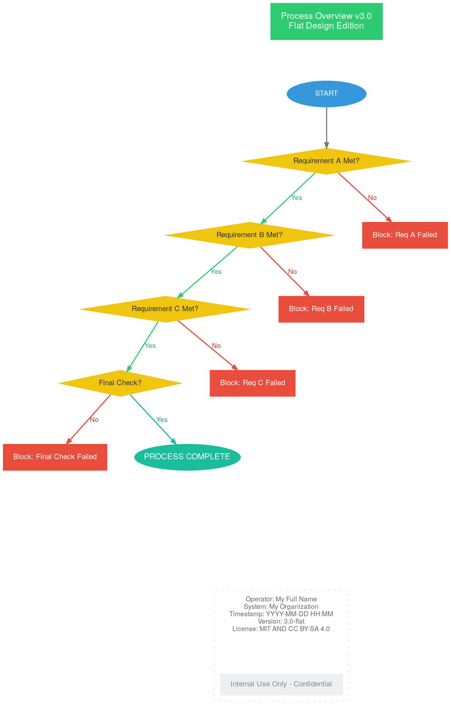

# Bright and Modern Flat UI Style
> **Disclaimer:**
>
> This document contains my personal notes on the topic,
> compiled from publicly available documentation and various cited sources.
> The materials are intended for educational purposes, personal study, and reference.
> The content is dual-licensed:
> 1. **MIT License:** Applies to all code implementations (Swift, Mermaid, and other programming languages).
> 2. **Creative Commons Attribution-ShareAlike 4.0 International License (CC BY-SA 4.0):** Applies to all non-code content, including text, explanations, diagrams, and illustrations.
---

Let's try a **"Bright & Modern Flat UI"** style. This style emphasizes:

*   **Clean lines and simple shapes.**
*   **Vibrant, solid colors** with good contrast.
*   **No shadows or overly complex gradients.**
*   **Clear, sans-serif typography.**
*   **A light and airy feel.**

Here's the DOT code with this aesthetic:

---

## Bright Modern Flat UI Style

  

Rendered code of the Bright and Modern Flat UI Style

rendered_code_bright_and_modern_flat_ui_template
digraph Modern_flat_ui_style {
    graph [
        rankdir=TB,
        fontname="Helvetica Neue",
        fontsize=10,
        bgcolor="white",
        nodesep=0.5,
        ranksep=0.75,
        splines=polyline
    ];
    node [
        fontname="Helvetica Neue",
        fontsize=10,
        style="filled",
        shape="box",
        margin="0.2,0.1",
        color="transparent",
        fontcolor="#333333"
    ];
    edge [
        fontname="Helvetica Neue",
        fontsize=9,
        color="#777777",
        fontcolor="#555555",
        arrowhead=normal,
        arrowsize=0.7
    ];
    HEADER [
        label="Process Overview v3.0\nFlat Design Edition",
        fillcolor="#2ECC71",
        fontcolor="white",
        fontsize=12,
        shape="box",
        style="filled,bold",
        height=0.7
    ];
    START_NODE [
        shape=ellipse,
        label="START",
        fillcolor="#3498DB",
        fontcolor="white",
        width=1.5,
        fixedsize=true
    ];
    Statement_0 [ shape=diamond, label="Requirement A Met?", fillcolor="#F1C40F", fontcolor="#333333" ];
    Statement_1 [ shape=diamond, label="Requirement B Met?", fillcolor="#F1C40F", fontcolor="#333333" ];
    Statement_2 [ shape=diamond, label="Requirement C Met?", fillcolor="#F1C40F", fontcolor="#333333" ];
    Statement_3 [ shape=diamond, label="Final Check?", fillcolor="#F1C40F", fontcolor="#333333" ];
    ERROR_NODE0 [ label="Block: Req A Failed", fillcolor="#E74C3C", fontcolor="white", shape=box, peripheries=1 ];
    ERROR_NODE1 [ label="Block: Req B Failed", fillcolor="#E74C3C", fontcolor="white", shape=box, peripheries=1 ];
    ERROR_NODE2 [ label="Block: Req C Failed", fillcolor="#E74C3C", fontcolor="white", shape=box, peripheries=1 ];
    ERROR_NODE3 [ label="Block: Final Check Failed", fillcolor="#E74C3C", fontcolor="white", shape=box, peripheries=1 ];
    SUCCESS_NODE [
        label="PROCESS COMPLETE",
        fillcolor="#1ABC9C",
        fontcolor="white",
        shape=ellipse,
        width=2.0,
        fixedsize=true,
        fontsize=11,
        style="filled,bold"
    ];
    subgraph cluster_footer_flat {
        style="dotted";
        color="#DDDDDD";
        label="";
        rank="sink";
        LABEL_1 [
            shape="plaintext",
            margin=0,
            fontcolor="#666666",
            fontsize=9,
            label="Operator: Cong Le\nSystem: CongLeSolutionX\nTimestamp: YYYY-MM-DD HH:MM\nVersion: 3.0-flat\nLicense: MIT AND CC BY-SA 4.0"
        ];
        FOOTER_BAR [
            shape="rect",
            label="Internal Use Only - Confidential",
            fillcolor="#ECF0F1",
            fontcolor="#7F8C8D",
            height=0.4,
            style="filled"
        ];
    }
    HEADER -> START_NODE [style=invis];
    START_NODE -> Statement_0 [penwidth=1.5];
    Statement_0 -> ERROR_NODE0 [label="No", fontcolor="#C0392B", color="#E74C3C", penwidth=1.5];
    Statement_0 -> Statement_1 [label="Yes", fontcolor="#27AE60", color="#2ECC71", penwidth=1.5];
    Statement_1 -> ERROR_NODE1 [label="No", fontcolor="#C0392B", color="#E74C3C", penwidth=1.5];
    Statement_1 -> Statement_2 [label="Yes", fontcolor="#27AE60", color="#2ECC71", penwidth=1.5];
    Statement_2 -> ERROR_NODE2 [label="No", fontcolor="#C0392B", color="#E74C3C", penwidth=1.5];
    Statement_2 -> Statement_3 [label="Yes", fontcolor="#27AE60", color="#2ECC71", penwidth=1.5];
    Statement_3 -> ERROR_NODE3 [label="No", fontcolor="#C0392B", color="#E74C3C", penwidth=1.5];
    Statement_3 -> SUCCESS_NODE [label="Yes", fontcolor="#16A085", color="#1ABC9C", penwidth=1.5];
    MAIN_FLOW_END [shape=point, style=invis];
    ERROR_NODE0 -> MAIN_FLOW_END [style=invis];
    ERROR_NODE1 -> MAIN_FLOW_END [style=invis];
    ERROR_NODE2 -> MAIN_FLOW_END [style=invis];
    ERROR_NODE3 -> MAIN_FLOW_END [style=invis];
    SUCCESS_NODE -> MAIN_FLOW_END [style=invis];
    MAIN_FLOW_END -> LABEL_1 [style=invis, minlen=2];
    LABEL_1 -> FOOTER_BAR [style=invis];
}
rendered_code_bright_and_modern_flat_ui_template

---

Click to show/hide the full DOT implementation with comment documentation.

---

## Key Characteristics of the "Bright & Modern Flat UI" Style

*   **`bgcolor="white"`**: Clean white background for the entire graph.
*   **Font**: "Helvetica Neue" is a common choice for flat, modern UIs.
*   **Node `style="filled"` and `color="transparent"`**: Nodes get their color purely from `fillcolor`, and borders are off by default.
*   **`splines=polyline`**: Edges are made of straight line segments. `splines=ortho` could also work but `polyline` is often more flexible for complex graphs while maintaining a non-curvy look.
*   **Vibrant Colors**: Used a selection of bright, flat colors (e.g., from Flat UI Colors).
    *   Header: `#2ECC71` (Emerald)
    *   Start: `#3498DB` (Peter River)
    *   Decisions: `#F1C40F` (Sun Flower)
    *   Errors: `#E74C3C` (Alizarin)
    *   Success: `#1ABC9C` (Turquoise)
    *   Footer Text: `#666666` (Dark Grey)
    *   Footer Bar: `#ECF0F1` (Clouds)
*   **Simple Shapes**: Primarily `box`, `ellipse`, `diamond`.
*   **Footer Cluster**: Made very light with a `dotted` border and no label. `LABEL_1` is `plaintext`.
*   **`penwidth=1.5` on main flow edges**: Makes the primary path edges slightly thicker for emphasis.
*   **`fixedsize=true` and `width` for Start/Success**: To give them a defined, consistent size.
*   **Minimalism**: Avoided excessive visual clutter. The focus is on the flow and the state indicated by color.

---

<!-- 

---
>**Licenses:**
>
>- **MIT License:**   - Full text in [LICENSE](LICENSE) file.
>- **Creative Commons Attribution-ShareAlike 4.0 International**: [CC BY-SA 4.0](https://creativecommons.org/licenses/by-sa/4.0/)  - Legal details in [LICENSE-CC-BY-SA-4.0](LICENSE-CC-BY-SA-4.0) and at [Creative Commons official site](https://creativecommons.org/licenses/by-sa/4.0/).
>
---