```dot
/*
 * title: Engineering Diagram Template
 * author: Cong Le
 * version: 1.0
 * license(s): MIT, CC BY-SA 4.0
 * copyright: Copyright (c) 2025 Cong Le. All Rights Reserved.
 * 
 */
digraph BlueprintStyle_Sized {
    // === GLOBAL BLUEPRINT SETTINGS ===
    graph [
        rankdir=TB,
        bgcolor="lightsteelblue1",
        fontname="Monaco",
        fontsize=10, // Can be reduced further
        nodesep=0.6, // Slightly reduced
        ranksep=0.8, // Slightly reduced
        splines=ortho,
        concentrate=true,

        // --- Attempt to control size ---
        size="10,15!", // Request 10 inches wide, 15 inches tall. The "!" forces this size.
                      // Adjust these numbers based on what you think your editor can handle.
                      // You can also try without "!" initially: size="10,15"
        ratio="fill", // You can try adding this if size alone isn't enough
        // dpi="96"      // Default is often 96 or 72.
    ];

    node [
        fontname="Bradley Hand",
        fontsize=8, // Reduced font size
        style="filled",
        shape="box",
        fillcolor="white",
        color="navyblue",
        fontcolor="black",
        margin="0.05,0.05" // Reduced margin
    ];

    edge [
        fontname="Bradley Hand",
        fontsize=7, // Reduced font size
        color="midnightblue",
        arrowhead="normal"
    ];

    // === DOCUMENT INFO BLOCK (Top-Left) - SIMPLIFIED ===
    subgraph cluster_DocInfo {
        label="DOCUMENT SPECIFICATIONS";
        style="filled,rounded";
        fillcolor="aliceblue";
        color="royalblue4";
        fontname="Monaco";
        fontsize=10; // Reduced
        margin=15; // Reduced

        DOC_META [
            shape="box",
            style="filled",
            fillcolor="white",
            color="navyblue",
            align="left",
            label="TITLE: Process Flow Schematic v1.0\n\
PROJECT: System Analysis Initiative\n\
DOC. ID: PF-SYS-001\n\
DATE: YYYY-MM-DD\n\
AUTHOR: My Full Name\n\
ORGANIZATION: My Organization\n\
LICENSE: MIT AND CC BY-SA 4.0"
        ];
    }

    // === MAIN PROCESS FLOW ===
    subgraph cluster_MainFlow {
        label="PRIMARY PROCESS LOGIC";
        style="dashed";
        color="slategray";
        fontname="Monaco";
        fontsize=10; // Reduced
        margin=20; // Reduced

        START_NODE [
            shape="circle",
            label="START",
            fillcolor="lightseagreen",
            fontcolor="white",
            style="filled,bold",
            width=0.7, height=0.7 // Reduced
        ];

        // Further reduce node sizes if needed for diamonds and boxes
        Statement_0 [ shape=diamond, label="STAGE 0:\nInitial Check", fillcolor="lightgoldenrodyellow", color="darkgoldenrod", width=1.3, height=0.9 ];
        Statement_1 [ shape=diamond, label="STAGE 1:\nData Validation", fillcolor="lightgoldenrodyellow", color="darkgoldenrod", width=1.3, height=0.9 ];
        Statement_2 [ shape=diamond, label="STAGE 2:\nResource Query", fillcolor="lightgoldenrodyellow", color="darkgoldenrod", width=1.3, height=0.9 ];
        Statement_3 [ shape=diamond, label="STAGE 3:\nFinal Confirmation", fillcolor="lightgoldenrodyellow", color="darkgoldenrod", width=1.3, height=0.9 ];

        ERROR_NODE0 [ shape=box, style="filled,rounded", label="TERMINATED:\nConfig Fail (E0)", fillcolor="lightcoral", color="firebrick", fontcolor="white", width=1.5, height=0.6 ]; // Shorter labels
        ERROR_NODE1 [ shape=box, style="filled,rounded", label="TERMINATED:\nInvalid Input (E1)", fillcolor="lightcoral", color="firebrick", fontcolor="white", width=1.5, height=0.6 ];
        ERROR_NODE2 [ shape=box, style="filled,rounded", label="TERMINATED:\nDep. Missing (E2)", fillcolor="lightcoral", color="firebrick", fontcolor="white", width=1.5, height=0.6 ];
        ERROR_NODE3 [ shape=box, style="filled,rounded", label="TERMINATED:\nTimeout (E3)", fillcolor="lightcoral", color="firebrick", fontcolor="white", width=1.5, height=0.6 ];

        SUCCESS_NODE [
            shape="doublecircle",
            label="PASS",
            fillcolor="mediumspringgreen",
            fontcolor="black",
            style="filled,bold",
            width=0.7, height=0.7 // Reduced
        ];

        START_NODE -> Statement_0 [minlen=1]; // Reduced minlen

        Statement_0 -> ERROR_NODE0 [label=" [REJECT]", fontcolor="firebrick", color="firebrick", style="dashed"]; // Shorter labels
        Statement_0 -> Statement_1 [label=" [ACCEPT]", fontcolor="forestgreen", color="forestgreen"];

        Statement_1 -> ERROR_NODE1 [label=" [REJECT]", fontcolor="firebrick", color="firebrick", style="dashed"];
        Statement_1 -> Statement_2 [label=" [ACCEPT]", fontcolor="forestgreen", color="forestgreen"];

        Statement_2 -> ERROR_NODE2 [label=" [REJECT]", fontcolor="firebrick", color="firebrick", style="dashed"];
        Statement_2 -> Statement_3 [label=" [ACCEPT]", fontcolor="forestgreen", color="forestgreen"];

        Statement_3 -> ERROR_NODE3 [label=" [REJECT]", fontcolor="firebrick", color="firebrick", style="dashed"];
        Statement_3 -> SUCCESS_NODE [label=" [ACCEPT]", fontcolor="forestgreen", color="forestgreen"];

        { rank=same; ERROR_NODE0; ERROR_NODE1; ERROR_NODE2; ERROR_NODE3; SUCCESS_NODE; }
    }

    // === FOOTER / NOTES BLOCK ===
    subgraph cluster_NotesFooter {
        label="REMARKS & SIGN-OFF";
        style="filled,rounded";
        fillcolor="aliceblue";
        color="royalblue4";
        fontname="Monaco";
        fontsize=7; // Reduced
        margin=10; // Reduced

        FOOTER_TEXT [
            shape="plaintext",
            fontsize=7,
            label="NOTES:\
            \n1. All stages critical.\
            \n2. Errors require manual intervention.\
            \n3. Ref DOC-GUIDE-042 for error handling.\
            \n------------------------------------------\
            \nAPPROVED BY: [__________] DATE: [______]\
            \nREVIEWED BY: [__________] DATE: [______]\
            \nCONFIDENTIAL - Internal Use Only"
        ];
        //  _footer_anchor [shape=point, style=invis];
        // FOOTER_TEXT -> _footer_anchor [style=invis];
    }

    _main_flow_exit_anchor [shape=point, style=invis];

    DOC_META -> START_NODE [style=invis, weight=100, minlen=1];
    ERROR_NODE0 -> _main_flow_exit_anchor [style=invis];
    ERROR_NODE1 -> _main_flow_exit_anchor [style=invis];
    ERROR_NODE2 -> _main_flow_exit_anchor [style=invis];
    ERROR_NODE3 -> _main_flow_exit_anchor [style=invis];
    SUCCESS_NODE -> _main_flow_exit_anchor [style=invis];
    _main_flow_exit_anchor -> FOOTER_TEXT [style=invis, weight=100, minlen=1];
}
```

# Engineering Diagram DOT Template
> **Disclaimer:**
>
> This document contains my personal notes on the topic,
> compiled from publicly available documentation and various cited sources.
> The materials are intended for educational purposes, personal study, and reference.
> The content is dual-licensed:
> 1. **MIT License:** Applies to all code implementations (Swift, Mermaid, and other programming languages).
> 2. **Creative Commons Attribution-ShareAlike 4.0 International License (CC BY-SA 4.0):** Applies to all non-code content, including text, explanations, diagrams, and illustrations.
---

Let's go for a style that's more like a **"Blueprint" or an "Engineering Diagram"**.

This style will emphasize:

1.  **Monochromatic or Limited Color Palette:** Think blues, greys, and white, like traditional blueprints.
2.  **Structured Shapes:** Using `record` or `Mrecord` for information blocks.
3.  **Orthogonal or Straight Lines:** `splines=ortho` or `splines=line` for a very clean, angular look.
4.  **Clear Annotations:** Labels will be key.
5.  **Grid-like Feel (Implied):** The `rankdir` and node separation will contribute to this.
6.  **Different Node Grouping:** Perhaps the header/footer become side panels or distinct zones.

Here's a DOT structure aiming for this "Blueprint" style:

----

## Engineering Diagram Template

Rendered code for the Engineering Diagram Template

rendered_code_engineering_diagram_template
digraph BlueprintStyle_Sized {
    graph [
        rankdir=TB,
        bgcolor="lightsteelblue1",
        fontname="Monaco",
        fontsize=10,
        nodesep=0.6,
        ranksep=0.8, 
        splines=ortho,
        concentrate=true,

        
        size="10,15!", 
        ratio="fill",
    ];

    node [
        fontname="Bradley Hand",
        fontsize=8,
        style="filled",
        shape="box",
        fillcolor="white",
        color="navyblue",
        fontcolor="black",
        margin="0.05,0.05"
    ];

    edge [
        fontname="Bradley Hand",
        fontsize=7, 
        color="midnightblue",
        arrowhead="normal"
    ];

    subgraph cluster_DocInfo {
        label="DOCUMENT SPECIFICATIONS";
        style="filled,rounded";
        fillcolor="aliceblue";
        color="royalblue4";
        fontname="Monaco";
        fontsize=10;
        margin=15;

        DOC_META [
            shape="box",
            style="filled",
            fillcolor="white",
            color="navyblue",
            align="left",
            label="TITLE: Process Flow Schematic v1.0\n\
PROJECT: System Analysis Initiative\n\
DOC. ID: PF-SYS-001\n\
DATE: YYYY-MM-DD\n\
AUTHOR: Cong Le\n\
ORGANIZATION: CongLeSolutionX\n\
LICENSE: MIT AND CC BY-SA 4.0"
        ];
    }

    subgraph cluster_MainFlow {
        label="PRIMARY PROCESS LOGIC";
        style="dashed";
        color="slategray";
        fontname="Monaco";
        fontsize=10;
        margin=20;

        START_NODE [
            shape="circle",
            label="START",
            fillcolor="lightseagreen",
            fontcolor="white",
            style="filled,bold",
            width=0.7, height=0.7
        ];

        Statement_0 [ shape=diamond, label="STAGE 0:\nInitial Check", fillcolor="lightgoldenrodyellow", color="darkgoldenrod", width=1.3, height=0.9 ];
        Statement_1 [ shape=diamond, label="STAGE 1:\nData Validation", fillcolor="lightgoldenrodyellow", color="darkgoldenrod", width=1.3, height=0.9 ];
        Statement_2 [ shape=diamond, label="STAGE 2:\nResource Query", fillcolor="lightgoldenrodyellow", color="darkgoldenrod", width=1.3, height=0.9 ];
        Statement_3 [ shape=diamond, label="STAGE 3:\nFinal Confirmation", fillcolor="lightgoldenrodyellow", color="darkgoldenrod", width=1.3, height=0.9 ];

        ERROR_NODE0 [ shape=box, style="filled,rounded", label="TERMINATED:\nConfig Fail (E0)", fillcolor="lightcoral", color="firebrick", fontcolor="white", width=1.5, height=0.6 ];
        ERROR_NODE1 [ shape=box, style="filled,rounded", label="TERMINATED:\nInvalid Input (E1)", fillcolor="lightcoral", color="firebrick", fontcolor="white", width=1.5, height=0.6 ];
        ERROR_NODE2 [ shape=box, style="filled,rounded", label="TERMINATED:\nDep. Missing (E2)", fillcolor="lightcoral", color="firebrick", fontcolor="white", width=1.5, height=0.6 ];
        ERROR_NODE3 [ shape=box, style="filled,rounded", label="TERMINATED:\nTimeout (E3)", fillcolor="lightcoral", color="firebrick", fontcolor="white", width=1.5, height=0.6 ];

        SUCCESS_NODE [
            shape="doublecircle",
            label="PASS",
            fillcolor="mediumspringgreen",
            fontcolor="black",
            style="filled,bold",
            width=0.7, height=0.7
        ];

        START_NODE -> Statement_0 [minlen=1];

        Statement_0 -> ERROR_NODE0 [label=" [REJECT]", fontcolor="firebrick", color="firebrick", style="dashed"];
        Statement_0 -> Statement_1 [label=" [ACCEPT]", fontcolor="forestgreen", color="forestgreen"];

        Statement_1 -> ERROR_NODE1 [label=" [REJECT]", fontcolor="firebrick", color="firebrick", style="dashed"];
        Statement_1 -> Statement_2 [label=" [ACCEPT]", fontcolor="forestgreen", color="forestgreen"];

        Statement_2 -> ERROR_NODE2 [label=" [REJECT]", fontcolor="firebrick", color="firebrick", style="dashed"];
        Statement_2 -> Statement_3 [label=" [ACCEPT]", fontcolor="forestgreen", color="forestgreen"];

        Statement_3 -> ERROR_NODE3 [label=" [REJECT]", fontcolor="firebrick", color="firebrick", style="dashed"];
        Statement_3 -> SUCCESS_NODE [label=" [ACCEPT]", fontcolor="forestgreen", color="forestgreen"];

        { rank=same; ERROR_NODE0; ERROR_NODE1; ERROR_NODE2; ERROR_NODE3; SUCCESS_NODE; }
    }

    subgraph cluster_NotesFooter {
        label="REMARKS & SIGN-OFF";
        style="filled,rounded";
        fillcolor="aliceblue";
        color="royalblue4";
        fontname="Monaco";
        fontsize=7;
        margin=10;

        FOOTER_TEXT [
            shape="plaintext",
            fontsize=7,
            label="NOTES:\
            \n1. All stages critical.\
            \n2. Errors require manual intervention.\
            \n3. Ref DOC-GUIDE-042 for error handling.\
            \n------------------------------------------\
            \nAPPROVED BY: [__________] DATE: [______]\
            \nREVIEWED BY: [__________] DATE: [______]\
            \nCONFIDENTIAL - Internal Use Only"
        ];
    }

    _main_flow_exit_anchor [shape=point, style=invis];

    DOC_META -> START_NODE [style=invis, weight=100, minlen=1];
    ERROR_NODE0 -> _main_flow_exit_anchor [style=invis];
    ERROR_NODE1 -> _main_flow_exit_anchor [style=invis];
    ERROR_NODE2 -> _main_flow_exit_anchor [style=invis];
    ERROR_NODE3 -> _main_flow_exit_anchor [style=invis];
    SUCCESS_NODE -> _main_flow_exit_anchor [style=invis];
    _main_flow_exit_anchor -> FOOTER_TEXT [style=invis, weight=100, minlen=1];
}
rendered_code_engineering_diagram_template

---

Click to show/hide the full DOT implementation with comment documentation.

---

## Key Characteristics of the "Blueprint" style

1.  **`graph` attributes:**
    *   `bgcolor="lightsteelblue1"`: A very light, paper-like blue.
    *   `fontname="Consolas"`: Common monospaced font for a technical/drafting look.
    *   `splines=ortho`: Enforces 90-degree angle lines, characteristic of blueprints.
    *   `concentrate=true`: Tries to merge edges, can sometimes make diagrams cleaner.
2.  **`node` attributes:**
    *   `fillcolor="white"`, `color="navyblue"`: White fill with dark blue borders.
    *   `shape="box"` as default.
3.  **`edge` attributes:**
    *   `color="midnightblue"`: Dark blue lines.
4.  **`cluster_DocInfo`:**
    *   Uses `Mrecord` for a structured block of document metadata, styled distinctively.
    *   The `label_just="l"` BARELY works in some dot versions for Mrecord internal text sometimes but it's not standard. The `\l` at the end of each line inside the label is more reliable for left justification.
5.  **`cluster_MainFlow`:**
    *   More descriptive labels for decision stages.
    *   Distinct shapes and colors for `START_NODE` (circle, lightseagreen) and `SUCCESS_NODE` (doublecircle, mediumspringgreen).
    *   `ERROR_NODE`s are styled consistently.
    *   Edge labels are more explicit (`[Path: ACCEPT]`, `[Path: REJECT]`).
    *   `{ rank=same; ... }` is used to align final outcome nodes horizontally.
6.  **`cluster_NotesFooter`:**
    *   Styled as a remarks/sign-off section, common in technical drawings.
    *   Uses `shape="plaintext"` for a large block of text, which is more flexible for formatting notes.
7.  **Invisible Edges for Ordering:** Retained to guide the vertical placement of the major sections.
8.  **Font Choices:** Using "Consolas" throughout and "Consolas-Bold" for cluster titles.

---

This version should give a much more formal, technical, and "engineered" appearance. Rendering this will show how well `splines=ortho` and the chosen color scheme achieve the blueprint effect.

---

<!-- 

---
>**Licenses:**
>
>- **MIT License:**   - Full text in [LICENSE](LICENSE) file.
>- **Creative Commons Attribution-ShareAlike 4.0 International**: [CC BY-SA 4.0](https://creativecommons.org/licenses/by-sa/4.0/)  - Legal details in [LICENSE-CC-BY-SA-4.0](LICENSE-CC-BY-SA-4.0) and at [Creative Commons official site](https://creativecommons.org/licenses/by-sa/4.0/).
>
---