```dot
/*
 * title: Holographic Interface - Sci-Fi HUD Style
 * author: Cong Le
 * version: 1.0
 * license(s): MIT, CC BY-SA 4.0
 * copyright: Copyright (c) 2025 Cong Le. All Rights Reserved.
 * 
 */
digraph holographic_interface_sci_fi_hud_style {
    // Global graph attributes for a Holographic HUD feel
    graph [
        rankdir=TB,
        fontname="Roboto Condensed", // A clean, slightly condensed sans-serif. "Orbitron", "Aldrich" if available for more sci-fi.
        fontsize=9,
        bgcolor="#050818", // Very dark blue, almost black, for deep space or dark screen
        nodesep=0.6,
        ranksep=0.85,
        splines=polyline // Keep lines mostly straight, angular
    ];

    // Default node attributes
    node [
        fontname="Roboto Condensed",
        fontsize=9,
        style="filled,rounded",
        shape="rect", // Default to sharp rectangles, can be overridden
        margin="0.18,0.1",
        color="#00AFFF", // Bright, light blue - a common holographic color
        fillcolor="#0A1F3A90", // Translucent dark blue fill (Alpha for "holographic")
        fontcolor="#B0E0E6", // Powder Blue / Light Cyan text for readability
        penwidth=1 // Thin, precise lines
    ];

    // Default edge attributes
    edge [
        fontname="Roboto Condensed",
        fontsize=8,
        color="#00AFFF70", // Semi-transparent light blue for connections
        fontcolor="#7FDBFF", // Lighter cyan for edge labels
        arrowhead=normal, // or "vee" for a sharper arrow
        arrowsize=0.6,
        penwidth=0.8,
        style=dashed // Dashed lines can look like projected guides
    ];

    // === HEADER - System Status Display ===
    HEADER_SYSTEM_STATUS [
        shape=plaintext,
        label=<
            <TABLE BORDER="0" CELLBORDER="0" CELLSPACING="0" BGCOLOR="transparent" WIDTH="300">
            <TR>
                <TD ALIGN="LEFT" WIDTH="33%"><FONT COLOR="#00FFD1" POINT-SIZE="10">SYSTEM: AEGIS_CORE</FONT></TD>
                <TD ALIGN="CENTER" WIDTH="34%"><FONT COLOR="#FFD700" POINT-SIZE="12" FACE="Orbitron">PROCESS OVERVIEW</FONT></TD>
                <TD ALIGN="RIGHT" WIDTH="33%"><FONT COLOR="#00FFD1" POINT-SIZE="10">STATUS: ONLINE</FONT></TD>
            </TR>
            <TR><TD COLSPAN="3" HEIGHT="5"></TD></TR>
            <TR>
                <TD ALIGN="LEFT" COLSPAN="3"><FONT COLOR="#50C878" POINT-SIZE="8">ACTIVE PROTOCOL: P-XYZ-7.3 // SECURITY LEVEL: 5</FONT></TD>
            </TR>
            </TABLE>
        >,
        fontcolor="#D0D0D0" // Fallback color
    ];


    // === MAIN FLOW ELEMENTS ===
    // Node shapes: try to use angular or geometric common in HUDs
    START_SEQUENCE [
        shape=Mdiamond, // Or 'invhouse'
        label="INITIATE\nSEQUENCE",
        color="#00FFD1", // Bright Teal/Aqua highlight
        fillcolor="#10305A90",
        fontcolor="#FFFFFF",
        penwidth=1.2,
        style="filled,bold",
        width=1.2, height=0.8
    ];

    // Decision nodes as "gates" or "checkpoints"
    CHECKPOINT_ALPHA [ shape=septagon, label="DATASTREAM CHECK\nREQ_A_VALID?", color="#FFD700", /* Gold yellow accent */ fontcolor="#FFFFE0" ];
    CHECKPOINT_BETA [ shape=septagon, label="RESOURCE ALLOC\nREQ_B_AVAIL?", color="#FFD700", fontcolor="#FFFFE0" ];
    CHECKPOINT_GAMMA [ shape=septagon, label="MODULE SYNC\nREQ_C_READY?", color="#FFD700", fontcolor="#FFFFE0" ];
    CHECKPOINT_DELTA [ shape=septagon, label="FINAL AUTH\nREQ_D_GRANT?", color="#FFD700", fontcolor="#FFFFE0" ];

    // Error/Fail states - angular with a warning color
    ERROR_STATE_A [ shape=invtrapezium, label="<ERR:A>\nINVALID DATA", color="#FF4500", /* Orangey-Red for warning */ fontcolor="#FFDAB9" /* Peachpuff for text */, peripheries=1];
    ERROR_STATE_B [ shape=invtrapezium, label="<ERR:B>\nRES.UNAVAIL", color="#FF4500", fontcolor="#FFDAB9", peripheries=1];
    ERROR_STATE_C [ shape=invtrapezium, label="<ERR:C>\nMOD.OFFLINE", color="#FF4500", fontcolor="#FFDAB9", peripheries=1];
    ERROR_STATE_D [ shape=invtrapezium, label="<ERR:D>\nAUTH.DENIED", color="#FF4500", fontcolor="#FFDAB9", peripheries=1];

    SUCCESS_OUTPUT [
        shape=doublecircle, // Classic, but could be 'house' or 'component'
        label="PROC_COMPLETE\nSIGNAL_OK",
        color="#50C878", // Emerald Green accent for success
        fillcolor="#104020A0",
        fontcolor="#E0FFE0", // Very light green text
        penwidth=1.5,
        style="filled,bold"
    ];

    // Invisible node for routing footer
    MAIN_INTERFACE_END [shape=point, style=invis];


    // === FOOTER - Telemetry / Interface Details ===
    subgraph cluster_footer_hud {
        style=invis; label=""; rank=sink;

        FOOTER_TELEMETRY [
            shape=plaintext,
            fontname="Consolas", // Monospaced for data readouts
            fontsize=7,
            fontcolor="#00AFFF80", // Faded blue
            label=<
                <TABLE BORDER="0" CELLBORDER="0" CELLSPACING="1" CELLPADDING="0" BGCOLOR="transparent" WIDTH="400">
                <TR>
                    <TD ALIGN="LEFT" ><FONT COLOR="#00AFFF50">// OP: My Full Name</FONT></TD>
                    <TD ALIGN="CENTER"><FONT COLOR="#00AFFF50">// SYS_ID: MyOrg_001</FONT></TD>
                    <TD ALIGN="RIGHT"><FONT COLOR="#00AFFF50">// T_STAMP: YYYYMMDD-HHMMSS.μs</FONT></TD>
                </TR>
                <TR><TD HEIGHT="3" COLSPAN="3"></TD></TR>
                <TR>
                    <TD ALIGN="LEFT" COLSPAN="2"><FONT COLOR="#00AFFF50">// VERSION: H_UI_R7.3.1 // LICENSE: CLASSIFIED (INTERNAL USE)</FONT></TD>
                    <TD ALIGN="RIGHT"><FONT COLOR="#FF450070">// PWR_LVL: 97.3%</FONT></TD>
                </TR>
                </TABLE>
            >
        ];
    }

    // === LOGICAL FLOW & CONNECTIONS ===
    // Solid lines for primary path, dashed for alternatives/status might be interesting.
    // Here, default edge is dashed. Main path can be made solid.

    HEADER_SYSTEM_STATUS -> START_SEQUENCE [style=invis, weight=100, minlen=1.5];

    START_SEQUENCE -> CHECKPOINT_ALPHA [style=solid, color="#00FFFF", penwidth=1.2, label="[transmit]"];

    CHECKPOINT_ALPHA -> ERROR_STATE_A [label="FAIL [A01]", fontcolor="#FF8C00", color="#FF4500"];
    CHECKPOINT_ALPHA -> CHECKPOINT_BETA [label="PASS [A00]", style=solid, color="#00FFFF", penwidth=1.2];

    CHECKPOINT_BETA -> ERROR_STATE_B [label="FAIL [B01]", fontcolor="#FF8C00", color="#FF4500"];
    CHECKPOINT_BETA -> CHECKPOINT_GAMMA [label="PASS [B00]", style=solid, color="#00FFFF", penwidth=1.2];

    CHECKPOINT_GAMMA -> ERROR_STATE_C [label="FAIL [C01]", fontcolor="#FF8C00", color="#FF4500"];
    CHECKPOINT_GAMMA -> CHECKPOINT_DELTA [label="PASS [C00]", style=solid, color="#00FFFF", penwidth=1.2];

    CHECKPOINT_DELTA -> ERROR_STATE_D [label="FAIL [D01]", fontcolor="#FF8C00", color="#FF4500"];
    CHECKPOINT_DELTA -> SUCCESS_OUTPUT [label="PASS [D00]", style=solid, color="#50C878", penwidth=1.5, fontcolor="#A0FFA0"];

    // Send all terminal nodes to the invisible end point
    ERROR_STATE_A -> MAIN_INTERFACE_END [style=invis];
    ERROR_STATE_B -> MAIN_INTERFACE_END [style=invis];
    ERROR_STATE_C -> MAIN_INTERFACE_END [style=invis];
    ERROR_STATE_D -> MAIN_INTERFACE_END [style=invis];
    SUCCESS_OUTPUT -> MAIN_INTERFACE_END [style=invis];

    MAIN_INTERFACE_END -> FOOTER_TELEMETRY [style=invis, weight=50, minlen=2];
}
```

# Holographic Interface - Sci-Fi HUD Style
> **Disclaimer:**
>
> This document contains my personal notes on the topic,
> compiled from publicly available documentation and various cited sources.
> The materials are intended for educational purposes, personal study, and reference.
> The content is dual-licensed:
> 1. **MIT License:** Applies to all code implementations (Swift, Mermaid, and other programming languages).
> 2. **Creative Commons Attribution-ShareAlike 4.0 International License (CC BY-SA 4.0):** Applies to all non-code content, including text, explanations, diagrams, and illustrations.
---

Think of interfaces from movies like Minority Report, Iron Man's HUD, or general futuristic sci-fi control panels.

----

  

Rendered code for the Holographic Interface Style

rendered_code_holographic_interface_sci_fi_hud_template
digraph holographic_interface_style {
    graph [
        rankdir=TB,
        fontname="Roboto Condensed",
        fontsize=9,
        bgcolor="#050818",
        nodesep=0.6,
        ranksep=0.85,
        splines=polyline
    ];
    node [
        fontname="Roboto Condensed",
        fontsize=9,
        style="filled,rounded",
        shape="rect",
        margin="0.18,0.1",
        color="#00AFFF",
        fillcolor="#0A1F3A90",
        fontcolor="#B0E0E6",
        penwidth=1
    ];
    edge [
        fontname="Roboto Condensed",
        fontsize=8,
        color="#00AFFF70",
        fontcolor="#7FDBFF",
        arrowhead=normal,
        arrowsize=0.6,
        penwidth=0.8,
        style=dashed
    ];
   HEADER_SYSTEM_STATUS [
        shape=plaintext,
        label=<
            <TABLE BORDER="0" CELLBORDER="0" CELLSPACING="0" BGCOLOR="transparent" WIDTH="300">
            <TR>
                <TD ALIGN="LEFT" WIDTH="33%">SYSTEM: AEGIS_CORE</TD>
                <TD ALIGN="CENTER" WIDTH="34%">PROCESS OVERVIEW</TD>
                <TD ALIGN="RIGHT" WIDTH="33%">STATUS: ONLINE</TD>
            </TR>
            <TR><TD COLSPAN="3" HEIGHT="5"></TD></TR>
            <TR>
                <TD ALIGN="LEFT" COLSPAN="3">ACTIVE PROTOCOL: P-XYZ-7.3 SECURITY LEVEL: 5</TD>
            </TR>
            </TABLE>
        >,
        fontcolor="#D0D0D0"
    ];
    START_SEQUENCE [
        shape=Mdiamond,
        label="INITIATE\nSEQUENCE",
        color="#00FFD1",
        fillcolor="#10305A90",
        fontcolor="#FFFFFF",
        penwidth=1.2,
        style="filled,bold",
        width=1.2, height=0.8
    ];
    CHECKPOINT_ALPHA [ shape=septagon, label="DATASTREAM CHECK\nREQ_A_VALID?", color="#FFD700", fontcolor="#FFFFE0" ];
    CHECKPOINT_BETA [ shape=septagon, label="RESOURCE ALLOC\nREQ_B_AVAIL?", color="#FFD700", fontcolor="#FFFFE0" ];
    CHECKPOINT_GAMMA [ shape=septagon, label="MODULE SYNC\nREQ_C_READY?", color="#FFD700", fontcolor="#FFFFE0" ];
    CHECKPOINT_DELTA [ shape=septagon, label="FINAL AUTH\nREQ_D_GRANT?", color="#FFD700", fontcolor="#FFFFE0" ];

    ERROR_STATE_A [ shape=invtrapezium, label="<ERR:A>\nINVALID DATA", color="#FF4500", fontcolor="#FFDAB9", peripheries=1];
    ERROR_STATE_B [ shape=invtrapezium, label="<ERR:B>\nRES.UNAVAIL", color="#FF4500", fontcolor="#FFDAB9", peripheries=1];
    ERROR_STATE_C [ shape=invtrapezium, label="<ERR:C>\nMOD.OFFLINE", color="#FF4500", fontcolor="#FFDAB9", peripheries=1];
    ERROR_STATE_D [ shape=invtrapezium, label="<ERR:D>\nAUTH.DENIED", color="#FF4500", fontcolor="#FFDAB9", peripheries=1];

    SUCCESS_OUTPUT [
        shape=doublecircle,
        label="PROC_COMPLETE\nSIGNAL_OK",
        color="#50C878",
        fillcolor="#104020A0",
        fontcolor="#E0FFE0",
        penwidth=1.5,
        style="filled,bold"
    ];
    MAIN_INTERFACE_END [shape=point, style=invis];
    
    subgraph cluster_footer_hud {
        style=invis; label=""; rank=sink;

        FOOTER_TELEMETRY [
            shape=plaintext,
            fontname="Consolas",
            fontsize=7,
            fontcolor="#00AFFF80",
            label=<
                <TABLE BORDER="0" CELLBORDER="0" CELLSPACING="1" CELLPADDING="0" BGCOLOR="transparent" WIDTH="400">
                <TR>
                    <TD ALIGN="LEFT" > OP: Cong Le</TD>
                    <TD ALIGN="CENTER"> SYS_ID: CongLeSolutionX</TD>
                    <TD ALIGN="RIGHT"> T_STAMP: YYYYMMDD-HHMMSS.μs</TD>
                </TR>
                <TR><TD HEIGHT="3" COLSPAN="3"></TD></TR>
                <TR>
                    <TD ALIGN="LEFT" COLSPAN="2">VERSION: H_UI_R7.3.1 LICENSE: CLASSIFIED (INTERNAL USE)</TD>
                    <TD ALIGN="RIGHT"> PWR_LVL: 97.3%</TD>
                </TR>
                </TABLE>
            >
        ];
    }
    HEADER_SYSTEM_STATUS -> START_SEQUENCE [style=invis, weight=100, minlen=1.5];

    START_SEQUENCE -> CHECKPOINT_ALPHA [style=solid, color="#00FFFF", penwidth=1.2, label="[transmit]"];

    CHECKPOINT_ALPHA -> ERROR_STATE_A [label="FAIL [A01]", fontcolor="#FF8C00", color="#FF4500"];
    CHECKPOINT_ALPHA -> CHECKPOINT_BETA [label="PASS [A00]", style=solid, color="#00FFFF", penwidth=1.2];

    CHECKPOINT_BETA -> ERROR_STATE_B [label="FAIL [B01]", fontcolor="#FF8C00", color="#FF4500"];
    CHECKPOINT_BETA -> CHECKPOINT_GAMMA [label="PASS [B00]", style=solid, color="#00FFFF", penwidth=1.2];

    CHECKPOINT_GAMMA -> ERROR_STATE_C [label="FAIL [C01]", fontcolor="#FF8C00", color="#FF4500"];
    CHECKPOINT_GAMMA -> CHECKPOINT_DELTA [label="PASS [C00]", style=solid, color="#00FFFF", penwidth=1.2];

    CHECKPOINT_DELTA -> ERROR_STATE_D [label="FAIL [D01]", fontcolor="#FF8C00", color="#FF4500"];
    CHECKPOINT_DELTA -> SUCCESS_OUTPUT [label="PASS [D00]", style=solid, color="#50C878", penwidth=1.5, fontcolor="#A0FFA0"];

    ERROR_STATE_A -> MAIN_INTERFACE_END [style=invis];
    ERROR_STATE_B -> MAIN_INTERFACE_END [style=invis];
    ERROR_STATE_C -> MAIN_INTERFACE_END [style=invis];
    ERROR_STATE_D -> MAIN_INTERFACE_END [style=invis];
    SUCCESS_OUTPUT -> MAIN_INTERFACE_END [style=invis];

    MAIN_INTERFACE_END -> FOOTER_TELEMETRY [style=invis, weight=50, minlen=2];
}
rendered_code_holographic_interface_sci_fi_hud_template

  
  

----

----

## Key Characteristics of "Holographic Interface / Sci-Fi HUD"

*   **`bgcolor="#050818"`**: Very dark blue/near black for the "screen" or "void" background.
*   **Fonts**:
    *   `Roboto Condensed` is a clean, somewhat technical sans-serif.
    *   `Orbitron` or `Aldrich` (if you can use them, e.g., via HTML labels and web fonts, or if installed) would be more overtly sci-fi.
    *   `Consolas` (monospaced) for the footer telemetry to give it a data readout feel.
*   **Holographic Colors**:
    *   Primary interactive elements/borders: Bright, light blue (`#00AFFF`).
    *   Text: Powder Blue/Light Cyan (`#B0E0E6`, `#7FDBFF`) for sharp visibility on dark.
    *   Accents: Teal/Aqua (`#00FFD1`), Gold Yellow (`#FFD700`), Orangey-Red (`#FF4500` for warnings), Emerald Green (`#50C878` for success).
*   **Node Styling**:
    *   `fillcolor` uses an RGBA-like hex string with alpha (e.g., `#0A1F3A90`) to simulate translucency. *Note: True alpha transparency in Graphviz fills can be inconsistent across output formats/renderers. This is an attempt.* If true alpha doesn't work well, pick a solid, slightly lighter dark blue.
    *   `penwidth=1` for thin, precise borders.
    *   Shapes: Geometric and angular like `Mdiamond` (looks like a targeting reticle), `septagon`, `invtrapezium`.
*   **Edge Styling**:
    *   `style=dashed` for edges by default, to make them look like projected lines or data pathways. Key "PASS" pathways are overridden to `style=solid` and a brighter color for emphasis.
    *   `color="#00AFFF70"` (semi-transparent edges).
*   **HTML Labels for Header/Footer**: Used to get more complex layouts, different font alignments, and embedded color changes typical of HUDs.
*   **Text Labels**: Labels like `FAIL [A01]` or `PASS [B00]` add to the technical/system-status feel.

-----

## Challenges and Considerations

1.  **Translucency**: True alpha transparency for fills is the biggest challenge in Graphviz. The `#RRGGBBAA` format is sometimes supported but can be renderer-dependent (e.g., SVG output might handle it better than PNG from some older versions). If it doesn't render well, you'll need to use solid, slightly lighter shades of the background for node fills.
2.  **Font Glyphs & Symbols**: Adding small icons or specific HUD-like symbols directly is hard unless they are Unicode characters in your chosen font.
3.  **Animations/Dynamic Elements**: Graphviz is static. A true HUD is dynamic. This style captures the static visual language.
4.  **Complexity vs. Clarity**: HUDs can be very dense. It's important to balance the aesthetic with the actual readability of the diagram.

---

<!-- 

---
>**Licenses:**
>
>- **MIT License:**   - Full text in [LICENSE](LICENSE) file.
>- **Creative Commons Attribution-ShareAlike 4.0 International**: [CC BY-SA 4.0](https://creativecommons.org/licenses/by-sa/4.0/)  - Legal details in [LICENSE-CC-BY-SA-4.0](LICENSE-CC-BY-SA-4.0) and at [Creative Commons official site](https://creativecommons.org/licenses/by-sa/4.0/).
>
---