```dot
/*
 * title: Steampunk Contraption - Victorian Technical Drawing Style
 * author: Cong Le
 * version: 1.0
 * license(s): MIT, CC BY-SA 4.0
 * copyright: Copyright (c) 2025 Cong Le. All Rights Reserved.
 * 
 */
digraph steampunk_contraption {
    // Global graph attributes for a Steampunk feel
    graph [
        rankdir=TB,
        fontname="Georgia", // A sturdy serif font. "Copperplate Gothic" if available for a more engraved look.
        fontsize=10,
        bgcolor="#F5E6D3", // Aged Parchment / Light Tan background
        nodesep=0.8,
        ranksep=1.0,
        splines=ortho // Orthogonal lines can look like pipes or structured frameworks
    ];

    // Default node attributes - "Brass Plate" style
    node [
        fontname="Georgia",
        fontsize=9,
        style="filled,rounded",
        shape="rect", // Can be overridden
        margin="0.22,0.11",
        color="#8B4513", // Saddle Brown / Dark Wood for borders
        fillcolor="#CD7F32", // Bronze / Tarnished Brass fill
        fontcolor="#4A2C2A", // Dark Brown, almost Sepia for text
        penwidth=1.5
    ];

    // Default edge attributes - "Copper Piping" style
    edge [
        fontname="Times New Roman", // Classic serif for labels on pipes
        fontsize=8,
        color="#B87333", // Copper color
        fontcolor="#5D4037", // Dark brown for labels
        arrowhead=normal, // Could be 'icurve' or a custom arrow if supported
        arrowsize=0.7,
        penwidth=2 // Thicker lines for "pipes"
    ];

    // === HEADER - Ornate Title Plaque ===
    HEADER_PLAQUE [
        shape=plaintext,
        label=<
            <TABLE BORDER="1" CELLBORDER="1" CELLSPACING="0" CELLPADDING="5" BGCOLOR="#D4AF37" COLOR="#5C4033"> {/* Brass with dark border */}
            <TR><TD ALIGN="CENTER" COLSPAN="2">
                <FONT POINT-SIZE="16" FACE="Copperplate Gothic Light" COLOR="#4A2C2A">The Aetheric Process Engine</FONT>
            </TD></TR>
            <TR><TD ALIGN="CENTER" COLSPAN="2">
                <I><FONT POINT-SIZE="9" COLOR="#603913">Schematic Document No. 1888-Alpha</FONT></I>
            </TD></TR>
            </TABLE>
        >,
        fontcolor="#4A2C2A"
    ];


    // === MAIN MECHANISM COMPONENTS ===
    START_VALVE [
        shape=cds, // Looks like a gear or valve wheel
        label="COMMENCE\nOPERATION",
        width=1.2, height=1.2, fixedsize=true,
        fillcolor="#A0522D", // Sienna - reddish brown, like a Bakelite or wooden knob
        color="#4A3B31", // Very dark brown
        fontcolor="#F0E68C", // Khaki/Light text
        style="filled,bold",
        peripheries=2 // Double border like a reinforced component
    ];

    // Decision "Junction Boxes" or "Gauge Panels"
    JUNCTION_BOX_A [ shape=Mrecord, style="filled,bold", color="#654321", /* Dark Brown */ fillcolor="#DEB887", /* BurlyWood */
                     label="<f0> Pressure Check: Foo | <f1> Gauge | <f2> Status: ?" ];
    JUNCTION_BOX_B [ shape=Mrecord, style="filled,bold", color="#654321", fillcolor="#DEB887",
                     label="<f0> Flux Modulator: Foo1 | <f1> Meter | <f2> Status: ?" ];
    JUNCTION_BOX_C [ shape=Mrecord, style="filled,bold", color="#654321", fillcolor="#DEB887",
                     label="<f0> Cogitator Array: Foo2 | <f1> Monitor | <f2> Status: ?" ];
    JUNCTION_BOX_D [ shape=Mrecord, style="filled,bold", color="#654321", fillcolor="#DEB887",
                     label="<f0> Chrono-Synclastor: Foo3 | <f1> Display | <f2> Status: ?" ];

    // "Malfunction Indicators" or "Safety Vents"
    MALFUNCTION_A [ shape=cylinder, label="VENT:\nPressure High", fillcolor="#800000AA", /* Maroon with alpha */ color="#500000", fontcolor="#FFEBCD" /* BlanchedAlmond */];
    MALFUNCTION_B [ shape=cylinder, label="VENT:\nNo Flux", fillcolor="#800000AA", color="#500000", fontcolor="#FFEBCD"];
    MALFUNCTION_C [ shape=cylinder, label="VENT:\nArray Offline", fillcolor="#800000AA", color="#500000", fontcolor="#FFEBCD"];
    MALFUNCTION_D [ shape=cylinder, label="VENT:\nSync Failed", fillcolor="#800000AA", color="#500000", fontcolor="#FFEBCD"];

    SYSTEM_OPTIMAL [
        shape=doubleoctagon, // A sturdy, final component shape
        label="SYSTEM\nNOMINAL",
        fillcolor="#556B2F", // Dark Olive Green - for "operational"
        color="#364522", // Darker green for border
        fontcolor="#FFFFF0", // Ivory text
        style="filled,bold",
        penwidth=2
    ];

    // Invisible node for layout
    MAIN_CONTRAPTION_OUTPUT [shape=point, style=invis];


    // === FOOTER - Manufacturer's Plate / Inventor's Notes ===
    subgraph cluster_footer_steampunk {
        style="rounded"; // A simple rounded border for the "plate"
        label="Inventor's Log & Specifications";
        fontname="Garamond";
        fontsize=8;
        fontcolor="#704214"; // Sepia
        color="#B8860B"; // DarkGoldenrod - like a brass plate edge
        bgcolor="#FAF0E690"; // Slightly tinted parchment

        FOOTER_NOTES [
            shape=note, // Or rect
            style=filled,
            fillcolor="#FDF5E6", // Old Lace - very light paper
            color="#C19A6B", // Faded Brass / Camel
            fontname="Lucida Handwriting", // Or "Brush Script MT", "Segoe Print" for a "handwritten" note feel
            fontsize=7,
            fontcolor="#5C3317", // Baker's Chocolate
            label="This is label for footnotes"
            // label=<
            //     <TABLE BORDER="0" CELLPADDING="3" CELLSPACING="0" BGCOLOR="transparent">
            //     <TR><TD ALIGN="LEFT"><B>Artificer:</B> My Full Name, Esq.</TD></TR>
            //     <TR><TD ALIGN="LEFT"><B>Workshop:</B> The Cogsworth & Babbage Fabricators Co.</TD></TR>
            //     <TR><TD ALIGN="LEFT"><B>Date of Commissioning:</B> Anno Domini 18XX, Month DD</TD></TR>
            //     <TR><TD ALIGN="LEFT"><B>Patent Assertion:</B> Her Majesty's Royal Patent Office No. 774-B</TD></TR>
            //     <TR><TD ALIGN="LEFT"><B>License:</B> MIT & CC BY-SA 4.0 (For Modern Dissemination)</TD></TR>
            //     </TABLE>
            // >
        ];
    }

    // === CONNECTIONS - PIPES & LINKAGES ===
    HEADER_PLAQUE -> START_VALVE [style=invis, weight=100, minlen=1.5];

    START_VALVE -> JUNCTION_BOX_A:f0 [dir=both, arrowhead=icurve, arrowtail=icurve, color="#A0522D", /* Sienna for distinct pipe */ label="Main\nSteam\nLine"];

    JUNCTION_BOX_A:f2 -> MALFUNCTION_A [label="OVERLOAD", style="dashed,bold", color="#772222", fontcolor="#8B0000"];
    JUNCTION_BOX_A:f2 -> JUNCTION_BOX_B:f0 [label="OK", color="#B8860B"]; // DarkGoldenrod accent pipe

    JUNCTION_BOX_B:f2 -> MALFUNCTION_B [label="FAILURE", style="dashed,bold", color="#772222", fontcolor="#8B0000"];
    JUNCTION_BOX_B:f2 -> JUNCTION_BOX_C:f0 [label="OK", color="#B8860B"];

    JUNCTION_BOX_C:f2 -> MALFUNCTION_C [label="ERROR", style="dashed,bold", color="#772222", fontcolor="#8B0000"];
    JUNCTION_BOX_C:f2 -> JUNCTION_BOX_D:f0 [label="OK", color="#B8860B"];

    JUNCTION_BOX_D:f2 -> MALFUNCTION_D [label="REJECT", style="dashed,bold", color="#772220", fontcolor="#8B0000"];
    JUNCTION_BOX_D:f2 -> SYSTEM_OPTIMAL [label="OPTIMAL", style=bold, color="#556B2F", fontcolor="#3CB371"];

    // To footer
    MALFUNCTION_A -> MAIN_CONTRAPTION_OUTPUT [style=invis];
    MALFUNCTION_B -> MAIN_CONTRAPTION_OUTPUT [style=invis];
    MALFUNCTION_C -> MAIN_CONTRAPTION_OUTPUT [style=invis];
    MALFUNCTION_D -> MAIN_CONTRAPTION_OUTPUT [style=invis];
    SYSTEM_OPTIMAL -> MAIN_CONTRAPTION_OUTPUT [style=invis];

    MAIN_CONTRAPTION_OUTPUT -> FOOTER_NOTES [style=invis, weight=50, minlen=2];
}
```

# Steampunk Contraption - Victorian Technical Drawing Style
> **Disclaimer:**
>
> This document contains my personal notes on the topic,
> compiled from publicly available documentation and various cited sources.
> The materials are intended for educational purposes, personal study, and reference.
> The content is dual-licensed:
> 1. **MIT License:** Applies to all code implementations (Swift, Mermaid, and other programming languages).
> 2. **Creative Commons Attribution-ShareAlike 4.0 International License (CC BY-SA 4.0):** Applies to all non-code content, including text, explanations, diagrams, and illustrations.
---

This style aims to give the diagram a heavy, mechanical, and almost antique feel, as if it were a blueprint for a fantastical Victorian-era machine.

This aesthetic will feature brass, copper, and wood tones, ornate details where possible, serif or "engraved" style fonts, and shapes that evoke gears, pipes, and mechanical components.

----

## Steampunk Contraption - Victorian Technical Drawing Style

---

https%3A%2F%2Fraw.githubusercontent.com%2FCongLeSolutionX%2FThe-Language-Atlas%2Frefs%2Fheads%2Fmain%2Fregions%2FDOT_language%2Fstyle_templates%2FSteampunk_Contraption_Victorian_Technical_Drawing_Style.md

  

Rendered code for the Steampunk Contraption Drawing Style

rendered_code_steampunk_contraption_style_template

digraph steampunk_contraption {
    graph [
        rankdir=TB,
        fontname="Georgia",
        fontsize=10,
        bgcolor="#F5E6D3",
        nodesep=0.8,
        ranksep=1.0,
        splines=ortho
    ];
    node [
        fontname="Georgia",
        fontsize=9,
        style="filled,rounded",
        shape="rect",
        margin="0.22,0.11",
        color="#8B4513",
        fillcolor="#CD7F32",
        fontcolor="#4A2C2A",
        penwidth=1.5
    ];
    edge [
        fontname="Times New Roman",
        fontsize=8,
        color="#B87333",
        fontcolor="#5D4037",
        arrowhead=normal,
        arrowsize=0.7,
        penwidth=2
    ];
    HEADER_PLAQUE [
        shape=plaintext,
        label=<
            <TABLE BORDER="1" CELLBORDER="1" CELLSPACING="0" CELLPADDING="5" BGCOLOR="#D4AF37" COLOR="#5C4033"> { }
            <TR><TD ALIGN="CENTER" COLSPAN="2">
                The Aetheric Process Engine
            </TD></TR>
            <TR><TD ALIGN="CENTER" COLSPAN="2">
                <I>Schematic Document No. 1888-Alpha</I>
            </TD></TR>
            </TABLE>
        >,
        fontcolor="#4A2C2A"
    ];
    START_VALVE [
        shape=cds,
        label="COMMENCE\nOPERATION",
        width=1.2, height=1.2, fixedsize=true,
        fillcolor="#A0522D",
        color="#4A3B31",
        fontcolor="#F0E68C",
        style="filled,bold",
        peripheries=2
    ];
    JUNCTION_BOX_A [ shape=Mrecord, style="filled,bold", color="#654321", fillcolor="#DEB887",
                     label="<f0> Pressure Check: Foo | <f1> Gauge | <f2> Status: ?" ];
    JUNCTION_BOX_B [ shape=Mrecord, style="filled,bold", color="#654321", fillcolor="#DEB887",
                     label="<f0> Flux Modulator: Foo1 | <f1> Meter | <f2> Status: ?" ];
    JUNCTION_BOX_C [ shape=Mrecord, style="filled,bold", color="#654321", fillcolor="#DEB887",
                     label="<f0> Cogitator Array: Foo2 | <f1> Monitor | <f2> Status: ?" ];
    JUNCTION_BOX_D [ shape=Mrecord, style="filled,bold", color="#654321", fillcolor="#DEB887",
                     label="<f0> Chrono-Synclastor: Foo3 | <f1> Display | <f2> Status: ?" ];

    MALFUNCTION_A [ shape=cylinder, label="VENT:\nPressure High", fillcolor="#800000AA", color="#500000", fontcolor="#FFEBCD"];
    MALFUNCTION_B [ shape=cylinder, label="VENT:\nNo Flux", fillcolor="#800000AA", color="#500000", fontcolor="#FFEBCD"];
    MALFUNCTION_C [ shape=cylinder, label="VENT:\nArray Offline", fillcolor="#800000AA", color="#500000", fontcolor="#FFEBCD"];
    MALFUNCTION_D [ shape=cylinder, label="VENT:\nSync Failed", fillcolor="#800000AA", color="#500000", fontcolor="#FFEBCD"];

    SYSTEM_OPTIMAL [
        shape=doubleoctagon,
        label="SYSTEM\nNOMINAL",
        fillcolor="#556B2F",
        color="#364522",
        fontcolor="#FFFFF0",
        style="filled,bold",
        penwidth=2
    ];
    MAIN_CONTRAPTION_OUTPUT [shape=point, style=invis];
    subgraph cluster_footer_steampunk {
        style="rounded";
        label="Inventor's Log & Specifications";
        fontname="Garamond";
        fontsize=8;
        fontcolor="#704214";
        color="#B8860B";
        bgcolor="#FAF0E690";

        FOOTER_NOTES [
            shape=note,
            style=filled,
            fillcolor="#FDF5E6",
            color="#C19A6B",
            fontname="Lucida Handwriting",
            fontsize=7,
            fontcolor="#5C3317",
            label="This is a placeholder for for footnotes - TBD"
        ];
    }
    HEADER_PLAQUE -> START_VALVE [style=invis, weight=100, minlen=1.5];

    START_VALVE -> JUNCTION_BOX_A:f0 [dir=both, arrowhead=icurve, arrowtail=icurve, color="#A0522D", label="Main\nSteam\nLine"];

    JUNCTION_BOX_A:f2 -> MALFUNCTION_A [label="OVERLOAD", style="dashed,bold", color="#772222", fontcolor="#8B0000"];
    JUNCTION_BOX_A:f2 -> JUNCTION_BOX_B:f0 [label="OK", color="#B8860B"];

    JUNCTION_BOX_B:f2 -> MALFUNCTION_B [label="FAILURE", style="dashed,bold", color="#772222", fontcolor="#8B0000"];
    JUNCTION_BOX_B:f2 -> JUNCTION_BOX_C:f0 [label="OK", color="#B8860B"];

    JUNCTION_BOX_C:f2 -> MALFUNCTION_C [label="ERROR", style="dashed,bold", color="#772222", fontcolor="#8B0000"];
    JUNCTION_BOX_C:f2 -> JUNCTION_BOX_D:f0 [label="OK", color="#B8860B"];

    JUNCTION_BOX_D:f2 -> MALFUNCTION_D [label="REJECT", style="dashed,bold", color="#772220", fontcolor="#8B0000"];
    JUNCTION_BOX_D:f2 -> SYSTEM_OPTIMAL [label="OPTIMAL", style=bold, color="#556B2F", fontcolor="#3CB371"];

    MALFUNCTION_A -> MAIN_CONTRAPTION_OUTPUT [style=invis];
    MALFUNCTION_B -> MAIN_CONTRAPTION_OUTPUT [style=invis];
    MALFUNCTION_C -> MAIN_CONTRAPTION_OUTPUT [style=invis];
    MALFUNCTION_D -> MAIN_CONTRAPTION_OUTPUT [style=invis];
    SYSTEM_OPTIMAL -> MAIN_CONTRAPTION_OUTPUT [style=invis];

    MAIN_CONTRAPTION_OUTPUT -> FOOTER_NOTES [style=invis, weight=50, minlen=2];
}
rendered_code_steampunk_contraption_style_template

  

----

Click to show/hide the full DOT implementation with comment documentation.

----

## Key Characteristics of Steampunk Contraption / Victorian Technical Drawing

*   **`bgcolor="#F5E6D3"`**: Aged parchment or light tan background.
*   **Fonts**:
    *   Main: `Georgia` (sturdy serif). `Copperplate Gothic Light` referenced in HTML for a more "engraved" title. `Times New Roman` for edge labels.
    *   Footer Notes: `Lucida Handwriting` (or similar script/handwritten font) to simulate inventor's notes. `Garamond` for cluster label.
*   **Color Palette**:
    *   Metals: Bronze (`#CD7F32`), Copper (`#B87333`), Brass (`#D4AF37`), DarkGoldenrod (`#B8860B`).
    *   Wood/Dark Accents: Saddle Brown (`#8B4513`), Sienna (`#A0522D`), Dark Brown (`#654321`, `#4A2C2A`, `#5D4037`).
    *   Paper: Old Lace (`#FDF5E6`), Khaki (`#F0E68C`), BlanchedAlmond (`#FFEBCD`).
    *   Status: Dark Olive Green (`#556B2F`) for success, Maroon (`#800000`) for malfunctions.
*   **Node Styling**:
    *   Default nodes are like "brass plates."
    *   `shape=cds` for `START_VALVE` to look like a gear or large valve handle.
    *   `shape=Mrecord` for "junction boxes" to simulate panels with sections for name, gauge, and status.
    *   `shape=cylinder` for "malfunction vents."
    *   `shape=doubleoctagon` for `SYSTEM_OPTIMAL` (a robust, final component).
    *   `peripheries=2` for `START_VALVE` to give it a thicker, more reinforced look.
*   **Edge Styling**:
    *   `penwidth=2` and copper color to look like pipes. `splines=ortho` helps them look structured.
    *   `dir=both, arrowhead=icurve, arrowtail=icurve` for the first main pipe to suggest a connection rather than just flow.
    *   Status edges are `dashed,bold` with a dark red color.
*   **HTML Labels**: Used extensively for the Header Plaque and Footer Notes to get rich formatting (borders, different fonts within a label, alignment).
*   **Specific Labels**: Text like "Pressure Check," "Flux Modulator," "Vent," "System Nominal" enhance the theme.

----

## Challenges and Considerations

1.  **Font Availability**: As always, specific fonts like "Copperplate Gothic Light" or "Lucida Handwriting" must be available on the system rendering the DOT. If not, Graphviz will use fallbacks.
2.  **Shape Complexity**: Graphviz has a set list of shapes. `Mrecord` is powerful for creating complex-looking nodes. True custom shapes (like intricate gears) are not directly possible without image nodes.
3.  **Texture**: True metallic or wood textures are not possible. We rely on color and shading suggestions (e.g., darker border, lighter fill).
4.  **Ornateness**: The level of "ornateness" is limited by what Graphviz attributes can achieve. HTML labels help a lot.

---

---

<!-- 

---
>**Licenses:**
>
>- **MIT License:**   - Full text in [LICENSE](LICENSE) file.
>- **Creative Commons Attribution-ShareAlike 4.0 International**: [CC BY-SA 4.0](https://creativecommons.org/licenses/by-sa/4.0/)  - Legal details in [LICENSE-CC-BY-SA-4.0](LICENSE-CC-BY-SA-4.0) and at [Creative Commons official site](https://creativecommons.org/licenses/by-sa/4.0/).
>
---