```dot
/*
 * title: Synthwave Theme
 * author: Cong Le
 * version: 1.0
 * license(s): MIT, CC BY-SA 4.0
 * copyright: Copyright (c) 2025 Cong Le. All Rights Reserved.
 * 
 */
digraph synthwave_grid_theme {
    // Global graph attributes for a Synthwave feel
    graph [
        rankdir=TB,
        fontname="Monaco", // A font that has a retro or pixelated feel if available. "Fixedsys Excelsior", "Press Start 2P", or a generic "Monospace" as fallback
        fontsize=10,
        bgcolor="#1A1A2E", // Deep Indigo/Purple background
        nodesep=0.7,
        ranksep=0.9,
        splines=polyline // Straighter lines, can feel more "digital"
    ];

    // Default node attributes
    node [
        fontname="Monaco", // Or "Monospace"
        fontsize=10,
        style="filled,rounded",
        margin="0.2,0.12",
        color="#FF00FF", // Bright Magenta outline (classic Synthwave neon)
        fillcolor="#2A2A4E", // Darker shade of background for node fill
        fontcolor="#00FFFF", // Bright Cyan text (another classic neon)
        penwidth=1.5 // Thicker neon "glow" for borders
    ];

    // Default edge attributes
    edge [
        fontname="Monaco", // Or "Monospace"
        fontsize=9,
        color="#F72585", // Neon Pink/Rose for edges
        fontcolor="#FFD700", // Neon Gold/Yellow for edge labels
        arrowhead=normal, // or "tee" for a more blocky arrow
        arrowsize=0.8,
        penwidth=1.2 // Slightly thinner than node borders but still "neon"
    ];

    // === HEADER - Like a retro game title ===
    HEADER_TITLE [
        shape="rect", // box
        label=<
            <TABLE BORDER="0" CELLBORDER="0" CELLSPACING="5" BGCOLOR="transparent">
            <TR><TD ALIGN="CENTER"><FONT POINT-SIZE="18" COLOR="#FF00FF" FACE="Major Mono Display">SYNTHWAVE PROCESSOR</FONT></TD></TR>
            <TR><TD ALIGN="CENTER"><FONT POINT-SIZE="10" COLOR="#00FFFF" FACE="Monospace">SYSTEM FLOW // GRID V1.0</FONT></TD></TR>
            </TABLE>
        >,
        style="filled",
        fillcolor="transparent", // No fill, let the text be the focus
        color="transparent", // No border for the table holder
        fontcolor="#00FFFF"
    ];

    // === MAIN GRID NODES ===
    // Using a subgraph to try and simulate a "grid" effect if possible, though Graphviz doesn't have explicit grids
    subgraph cluster_grid_main {
        style="invis"; // No visible border for the cluster itself
        label="";

        START_NODE [
            shape=hexagon, // Geometric shape
            label="[ START ]",
            fillcolor="#3A0CA3", // Dark Violet
            color="#FF00FF", // Magenta
            fontcolor="#FFFFFF", // White for high contrast
            style="filled,bold"
        ];

        // Decision Nodes - like control panels
        Decision_Gate_A [ label="SCAN FOO\nACCESS?", shape=parallelogram, color="#F72585" /* Pink */, fillcolor="#1E1E3E", fontcolor="#00EAD3" /* Neon Mint */];
        Decision_Gate_B [ label="ANALYZE FOO1\nACTIVE?", shape=parallelogram, color="#F72585", fillcolor="#1E1E3E", fontcolor="#00EAD3" ];
        Decision_Gate_C [ label="VERIFY FOO2\nINTEGRITY?", shape=parallelogram, color="#F72585", fillcolor="#1E1E3E", fontcolor="#00EAD3" ];
        Decision_Gate_D [ label="CONFIRM FOO3\nPROTOCOL?", shape=parallelogram, color="#F72585", fillcolor="#1E1E3E", fontcolor="#00EAD3" ];

        // Error/Termination Nodes - like system alerts
        ERROR_HALT_A [ label="<FAIL>\nINVALID FOO", shape=octagon, style="filled,dashed", color="#FF3EA5", fillcolor="#4A001F", fontcolor="#FF9E00" /* Neon Orange */];
        ERROR_HALT_B [ label="<FAIL>\nFOO1 OFFLINE", shape=octagon, style="filled,dashed", color="#FF3EA5", fillcolor="#4A001F", fontcolor="#FF9E00" ];
        ERROR_HALT_C [ label="<FAIL>\nFOO2 CORRUPT", shape=octagon, style="filled,dashed", color="#FF3EA5", fillcolor="#4A001F", fontcolor="#FF9E00" ];
        ERROR_HALT_D [ label="<FAIL>\nFOO3 REJECTED", shape=octagon, style="filled,dashed", color="#FF3EA5", fillcolor="#4A001F", fontcolor="#FF9E00" ];

        SUCCESS_TRANSMIT [
            label="[ END TRANSMISSION ]\nGRID SYNC OK",
            shape=doubleoctagon, // Another geometric, distinct shape
            fillcolor="#00EAD3", // Neon Mint/Teal
            color="#00FFFF", // Cyan border
            fontcolor="#1A1A2E", // Dark background color for text on light fill
            style="filled,bold"
        ];
        
        MAIN_GRID_EXIT [shape=point, style=invis];
    }


    // === FOOTER - System Info / Watermark ===
    subgraph cluster_footer_synth {
        style="invis"; label=""; rank="sink";

        FOOTER_GRIDLINES [ // Attempt to mimic grid lines with plaintext
            shape=plaintext,
            fontname="Monospace",
            fontsize=6,
            fontcolor="#4CA850", // Faded Purple (background color with alpha)
            // label="This is the footer"
            label="- - - - - - - - - - - - - - - - - -- - - - - -\nSYSTEM ONLINE // TERMINAL ACTIVE\n- - - - - - - - - - - - -  - - - - - - - - - -\nDESIGNATION: IO_AGENT_X // SECTOR: ALPHA-7 // \nBUILD: 88.03.21\nLICENSE: R E T R O W A R E (MIT/CC-BY-SA)"
        ];
    }

    // === FLOW CONNECTIONS ===
    HEADER_TITLE -> START_NODE [style=invis, weight=100, minlen=1.5];

    START_NODE -> Decision_Gate_A [style="bold", color="#B5179E" /* Lighter Purple */, headlabel=">", labelfontcolor="#B5179E", labelfontsize=12];

    Decision_Gate_A -> ERROR_HALT_A [label="REJECT", style="dashed", color="#FF3EA5", fontcolor="#FF60C3"];
    Decision_Gate_A -> Decision_Gate_B [label="ACCEPT", color="#7209B7", fontcolor="#9D4EDD"];

    Decision_Gate_B -> ERROR_HALT_B [label="REJECT", style="dashed", color="#FF3EA5", fontcolor="#FF60C3"];
    Decision_Gate_B -> Decision_Gate_C [label="ACCEPT", color="#7209B7", fontcolor="#9D4EDD"];

    Decision_Gate_C -> ERROR_HALT_C [label="REJECT", style="dashed", color="#FF3EA5", fontcolor="#FF60C3"];
    Decision_Gate_C -> Decision_Gate_D [label="ACCEPT", color="#7209B7", fontcolor="#9D4EDD"];

    Decision_Gate_D -> ERROR_HALT_D [label="REJECT", style="dashed", color="#FF3EA5", fontcolor="#FF60C3"];
    Decision_Gate_D -> SUCCESS_TRANSMIT [label="ACCEPT", color="#560BAD", fontcolor="#C77DFF", style="bold", taillabel="<", labelangle=-25, labeldistance=1.5];

    // Invisible links to footer
    ERROR_HALT_A -> MAIN_GRID_EXIT [style=invis];
    ERROR_HALT_B -> MAIN_GRID_EXIT [style=invis];
    ERROR_HALT_C -> MAIN_GRID_EXIT [style=invis];
    ERROR_HALT_D -> MAIN_GRID_EXIT [style=invis];
    SUCCESS_TRANSMIT -> MAIN_GRID_EXIT [style=invis];
    
    MAIN_GRID_EXIT -> FOOTER_GRIDLINES [style=invis, weight=70, minlen=2];
}
```

# Synthwave Theme
> **Disclaimer:**
>
> This document contains my personal notes on the topic,
> compiled from publicly available documentation and various cited sources.
> The materials are intended for educational purposes, personal study, and reference.
> The content is dual-licensed:
> 1. **MIT License:** Applies to all code implementations (Swift, Mermaid, and other programming languages).
> 2. **Creative Commons Attribution-ShareAlike 4.0 International License (CC BY-SA 4.0):** Applies to all non-code content, including text, explanations, diagrams, and illustrations.
---

Rendered code for Synthwave Theme

synthwave_theme

digraph synthwave_grid_theme {
    graph [
        rankdir=TB,
        fontname="Monaco",
        fontsize=10,
        bgcolor="#1A1A2E",
        nodesep=0.7,
        ranksep=0.9,
        splines=polyline
    ];
    node [
        fontname="Monaco",
        fontsize=10,
        style="filled,rounded",
        margin="0.2,0.12",
        color="#FF00FF", 
        fillcolor="#2A2A4E",
        fontcolor="#00FFFF",
        penwidth=1.5
    ];
    edge [
        fontname="Monaco",
        fontsize=9,
        color="#F72585",
        fontcolor="#FFD700",
        arrowhead=normal,
        arrowsize=0.8,
        penwidth=1.2
    ];
    HEADER_TITLE [
        shape="rect",
        fontname="Major Mono Display",
        fontsize=18,
        color="#00FFFF", 
        fontcolor="#FF00FF",
        label="SYNTHWAVE PROCESSOR\nSYSTEM FLOW\nGRID V1.0\n"
        style="filled",
        fillcolor="transparent"
    ];
    subgraph cluster_grid_main {
        style="invis";
        label="";

        START_NODE [
            shape=hexagon,
            label="[ START ]",
            fillcolor="#3A0CA3",
            color="#FF00FF",
            fontcolor="#FFFFFF",
            style="filled,bold"
        ];
        Decision_Gate_A [ label="SCAN FOO\nACCESS?", shape=parallelogram, color="#F72585", fillcolor="#1E1E3E", fontcolor="#00EAD3"];
        Decision_Gate_B [ label="ANALYZE FOO1\nACTIVE?", shape=parallelogram, color="#F72585", fillcolor="#1E1E3E", fontcolor="#00EAD3" ];
        Decision_Gate_C [ label="VERIFY FOO2\nINTEGRITY?", shape=parallelogram, color="#F72585", fillcolor="#1E1E3E", fontcolor="#00EAD3" ];
        Decision_Gate_D [ label="CONFIRM FOO3\nPROTOCOL?", shape=parallelogram, color="#F72585", fillcolor="#1E1E3E", fontcolor="#00EAD3" ];

        ERROR_HALT_A [ label="<FAIL>\nINVALID FOO", shape=octagon, style="filled,dashed", color="#FF3EA5", fillcolor="#4A001F", fontcolor="#FF9E00"];
        ERROR_HALT_B [ label="<FAIL>\nFOO1 OFFLINE", shape=octagon, style="filled,dashed", color="#FF3EA5", fillcolor="#4A001F", fontcolor="#FF9E00" ];
        ERROR_HALT_C [ label="<FAIL>\nFOO2 CORRUPT", shape=octagon, style="filled,dashed", color="#FF3EA5", fillcolor="#4A001F", fontcolor="#FF9E00" ];
        ERROR_HALT_D [ label="<FAIL>\nFOO3 REJECTED", shape=octagon, style="filled,dashed", color="#FF3EA5", fillcolor="#4A001F", fontcolor="#FF9E00" ];

        SUCCESS_TRANSMIT [
            label="[ END TRANSMISSION ]\nGRID SYNC OK",
            shape=doubleoctagon,
            fillcolor="#00EAD3",
            color="#00FFFF",
            fontcolor="#1A1A2E",
            style="filled,bold"
        ];
        
        MAIN_GRID_EXIT [shape=point, style=invis];
    }
    subgraph cluster_footer_synth {
        style="invis"; label=""; rank="sink";

        FOOTER_GRIDLINES [
            shape=plaintext,
            fontname="Monospace",
            fontsize=6,
            fontcolor="#4CA850",
            label="- - - - - - - - - - - - - - - - - -- - - - - -\nSYSTEM ONLINE // TERMINAL ACTIVE\n- - - - - - - - - - - - -  - - - - - - - - - -\nDESIGNATION: IO_AGENT_X // SECTOR: ALPHA-7 // \nBUILD: 88.03.21\nLICENSE: R E T R O W A R E (MIT/CC-BY-SA)"
        ];
    }
    HEADER_TITLE -> START_NODE [style=invis, weight=100, minlen=1.5];

    START_NODE -> Decision_Gate_A [style="bold", color="#B5179E", headlabel=">", labelfontcolor="#B5179E", labelfontsize=12];

    Decision_Gate_A -> ERROR_HALT_A [label="REJECT", style="dashed", color="#FF3EA5", fontcolor="#FF60C3"];
    Decision_Gate_A -> Decision_Gate_B [label="ACCEPT", color="#7209B7", fontcolor="#9D4EDD"];

    Decision_Gate_B -> ERROR_HALT_B [label="REJECT", style="dashed", color="#FF3EA5", fontcolor="#FF60C3"];
    Decision_Gate_B -> Decision_Gate_C [label="ACCEPT", color="#7209B7", fontcolor="#9D4EDD"];

    Decision_Gate_C -> ERROR_HALT_C [label="REJECT", style="dashed", color="#FF3EA5", fontcolor="#FF60C3"];
    Decision_Gate_C -> Decision_Gate_D [label="ACCEPT", color="#7209B7", fontcolor="#9D4EDD"];

    Decision_Gate_D -> ERROR_HALT_D [label="REJECT", style="dashed", color="#FF3EA5", fontcolor="#FF60C3"];
    Decision_Gate_D -> SUCCESS_TRANSMIT [label="ACCEPT", color="#560BAD", fontcolor="#C77DFF", style="bold", taillabel="<", labelangle=-25, labeldistance=1.5];

    ERROR_HALT_A -> MAIN_GRID_EXIT [style=invis];
    ERROR_HALT_B -> MAIN_GRID_EXIT [style=invis];
    ERROR_HALT_C -> MAIN_GRID_EXIT [style=invis];
    ERROR_HALT_D -> MAIN_GRID_EXIT [style=invis];
    SUCCESS_TRANSMIT -> MAIN_GRID_EXIT [style=invis];
    
    MAIN_GRID_EXIT -> FOOTER_GRIDLINES [style=invis, weight=70, minlen=2];
}
synthwave_theme

---

> [!NOTE]  
> Highlights information that users should take into account, even when skimming.

---

Click to show/hide the full DOT implementation with comment documentation.

---

## Key Characteristics for "Synthwave Grid"

*   **`bgcolor="#1A1A2E"`**: A very dark indigo/purple, common in synthwave art.
*   **Fonts**:
    *   The ideal would be a pixelated or retro-80s computer font. I've put `"स्पूनर"` (Spooner) as a placeholder – you'd need to have such a font installed and known to Graphviz.
    *   **Fallbacks**: `Monospace`, `Fixedsys Excelsior`, or `Press Start 2P` (if available). I used generic "Monospace" in the HTML table font for broader compatibility, and `Major Mono Display` as an example if you use HTML labels.
*   **Neon Colors**:
    *   Node Borders: Bright Magenta (`#FF00FF`).
    *   Node Text: Bright Cyan (`#00FFFF`).
    *   Edge Lines: Neon Pink/Rose (`#F72585`).
    *   Edge Labels: Neon Gold/Yellow (`#FFD700`).
    *   Other accents: Various bright neons like Mint (`#00EAD3`), Orange (`#FF9E00`), and different shades of purple/pink.
*   **Node Styling**:
    *   `penwidth=1.5` on nodes for a thicker "neon tube" border.
    *   `fillcolor="#2A2A4E"` (a darker shade of the background) to make them distinct but still dark.
    *   Geometric shapes: `hexagon`, `parallelogram`, `octagon`, `doubleoctagon`.
*   **Header**: Used an HTML-like table for the header to allow for different font sizes and a more "title screen" appearance. `Major Mono Display` is a Google Font that has a suitable feel.
*   **Edge Styling**:
    *   `splines=polyline` for more angular, digital-looking lines.
    *   `style="dashed"` for "REJECT" paths.
    *   Some edges are made `bold`.
    *   `headlabel` and `taillabel` with characters like `>` and `<` to simulate data flow arrows on paths.
*   **Footer**: `shape=plaintext` with monospaced font and dashed lines to simulate a terminal output or grid lines. The font color is a semi-transparent version of a background purple to make it look like a watermark or faint grid.

----

## Important Considerations for this Style

1.  **Font Availability**: This style relies heavily on appropriate fonts. If the specific retro/pixel fonts aren't available on the system rendering the Graphviz DOT, it will fall back to defaults, and the effect will be diminished. HTML labels (like in the Header) give you more control if you can specify web fonts that might be fetched.
2.  **True Neon Glow**: Graphviz doesn't inherently support "glow" effects. The thick, bright borders against a dark background are the closest approximation.
3.  **Grid Effect**: Graphviz isn't designed for true grid layouts in the background. The footer's attempt is purely textual. The arrangement of nodes will still be determined by Graphviz's layout algorithms.
4.  **Color Palette**: The chosen colors are typical of the synthwave genre. You can find many synthwave palettes online to customize further.

---

<!-- 

---
>**Licenses:**
>
>- **MIT License:**   - Full text in [LICENSE](LICENSE) file.
>- **Creative Commons Attribution-ShareAlike 4.0 International**: [CC BY-SA 4.0](https://creativecommons.org/licenses/by-sa/4.0/)  - Legal details in [LICENSE-CC-BY-SA-4.0](LICENSE-CC-BY-SA-4.0) and at [Creative Commons official site](https://creativecommons.org/licenses/by-sa/4.0/).
>
---