# Vintage Parchment - Old Manuscript Style
> **Disclaimer:**
>
> This document contains my personal notes on the topic,
> compiled from publicly available documentation and various cited sources.
> The materials are intended for educational purposes, personal study, and reference.
> The content is dual-licensed:
> 1. **MIT License:** Applies to all code implementations (Swift, Mermaid, and other programming languages).
> 2. **Creative Commons Attribution-ShareAlike 4.0 International License (CC BY-SA 4.0):** Applies to all non-code content, including text, explanations, diagrams, and illustrations.
---

This style evoke a sense of history and classical documentation. The specific appearance of fonts heavily depends on them being installed on the system where Graphviz generates the image. Standard serif fonts like Times New Roman or Georgia are safer if Palatino Linotype or Garamond aren't available.

This aesthetic will aim for:

*   **Aged paper background.**
*   **Sepia tones or faded ink colors** for text and lines.
*   **Serif fonts** to evoke a classic, printed feel.
*   **Perhaps slightly more ornamented or classic shapes.**
*   **A general feel of antiquity and craftsmanship.**

Here's the DOT code for this style:

---

## Vintage Parchment - Old Manuscript Style

Rendered code for Vintage Parchment Style

vintage_parchment_style
digraph vintage_parchment_old_manuscript_style {
    graph [
        rankdir=TB,
        fontname="Palatino Linotype",
        fontsize=11,
        bgcolor="#FAF0E6",
        nodesep=0.6,
        ranksep=0.8,
        splines=curved
    ];
    node [
        fontname="Palatino Linotype",
        fontsize=10,
        style="filled",
        margin="0.18,0.08",
        color="#A0522D", 
        fillcolor="#FFF8DC",
        fontcolor="#5D4037"
    ];
    edge [
        fontname="Palatino Linotype",
        fontsize=9,
        color="#704214", 
        fontcolor="#654321",
        arrowhead=normal,
        arrowsize=0.7,
        penwidth=1
    ];
    subgraph cluster_header_vintage {
        label="";
        style="invis";
        margin=0;

        HEADER [
            shape="plaintext",
            label=<
                <TABLE BORDER="0" CELLBORDER="1" CELLSPACING="0" BGCOLOR="#F5DEB3" COLOR="#8B4513">
                <TR><TD ALIGN="CENTER" COLSPAN="2">Chronicle of the Process</TD></TR>
                <TR><TD ALIGN="CENTER" COLSPAN="2"><I>Document Revision Alpha</I></TD></TR>
                </TABLE>
            >,
            fontcolor="#5D4037"
        ];
    }
    subgraph cluster_main_process {
        label="Primary Workflow";
        fontname="Garamond";
        fontsize=10;
        fontcolor="#8B4513";
        style="rounded,dotted";
        color="#D2B48C";
        bgcolor="#FAF0E650";
        margin=20;

        START_NODE [
            shape=oval,
            label="Commence",
            fillcolor="#EADDCA",
            color="#B8860B",
            style="filled,bold"
        ];
        Statement_0 [ shape=cds, label="Initial Scrutiny\n(Condition Foo)", fillcolor="#F0E68C",  color="#8B7355"];
        Statement_1 [ shape=cds, label="Secondary Review\n(Condition Foo1)", fillcolor="#F0E68C", color="#8B7355" ];
        Statement_2 [ shape=cds, label="Tertiary Check\n(Condition Foo2)", fillcolor="#F0E68C", color="#8B7355" ];
        Statement_3 [ shape=cds, label="Final Validation\n(Condition Foo3)", fillcolor="#F0E68C", color="#8B7355" ];

        ERROR_NODE0 [ shape=note, label="Outcome: Diversion Alpha\n(Error 0)", fillcolor="#FFE4C470" , color="#CD5C5C", peripheries=1 ];
        ERROR_NODE1 [ shape=note, label="Outcome: Diversion Beta\n(Error 1)", fillcolor="#FFE4C470", color="#CD5C5C" ];
        ERROR_NODE2 [ shape=note, label="Outcome: Diversion Gamma\n(Error 2)", fillcolor="#FFE4C470", color="#CD5C5C" ];
        ERROR_NODE3 [ shape=note, label="Outcome: Diversion Delta\n(Error 3)", fillcolor="#FFE4C470", color="#CD5C5C" ];

        SUCCESS_NODE [
            shape=doublecircle,
            label="Fulfilled",
            fillcolor="#90EE9070",
            color="#228B22",
            style="filled,bold",
            fontcolor="#2E8B57"
        ];
        
        MAIN_PROCESS_EXIT [shape=point, style=invis];

        START_NODE -> Statement_0 [minlen=1.5];

        Statement_0 -> ERROR_NODE0 [label="If Adverse", style=dashed, color="#A52A2A"];
        Statement_0 -> Statement_1 [label="If Favorable", color="#556B2F"];

        Statement_1 -> ERROR_NODE1 [label="If Adverse", style=dashed, color="#A52A2A"];
        Statement_1 -> Statement_2 [label="If Favorable", color="#556B2F"];

        Statement_2 -> ERROR_NODE2 [label="If Adverse", style=dashed, color="#A52A2A"];
        Statement_2 -> Statement_3 [label="If Favorable", color="#556B2F"];

        Statement_3 -> ERROR_NODE3 [label="If Adverse", style=dashed, color="#A52A2A"];
        Statement_3 -> SUCCESS_NODE [label="If Favorable", color="#556B2F"];

        ERROR_NODE0 -> MAIN_PROCESS_EXIT [style=invis];
        ERROR_NODE1 -> MAIN_PROCESS_EXIT [style=invis];
        ERROR_NODE2 -> MAIN_PROCESS_EXIT [style=invis];
        ERROR_NODE3 -> MAIN_PROCESS_EXIT [style=invis];
        SUCCESS_NODE -> MAIN_PROCESS_EXIT [style=invis];
    }
    subgraph cluster_footer_vintage {
        label=""; style="invis"; margin=0; rank="sink";
        LABEL_1 [
            shape=plaintext,
            fontname="Courier New",
            fontsize=8,
            fontcolor="#696969",
            label=<
                <TABLE BORDER="0" CELLPADDING="2">
                <TR><TD ALIGN="LEFT">Scribe: Cong Le</TD></TR>
                <TR><TD ALIGN="LEFT">Guild: CongLeSolutionX</TD></TR>
                <TR><TD ALIGN="LEFT">Date of Record: YYYY-MM-DD</TD></TR>
                <TR><TD ALIGN="LEFT">Folio: 1.0c</TD></TR>
                <TR><TD ALIGN="LEFT">Charter: MIT AND CC BY-SA 4.0</TD></TR>
                </TABLE>
            >
        ];
        FOOTER_SIGIL [
            shape="signature",
            label="Veritas",
            fillcolor="#DEB887",
            color="#8B4513",
            fontcolor="#5D4037",
            fontsize=8,
            width=0.6, height=0.4, fixedsize=true
        ];
    }
    HEADER -> START_NODE [style=invis, weight=100];
    MAIN_PROCESS_EXIT -> LABEL_1 [style=invis, weight=50, minlen=2];
    LABEL_1 -> FOOTER_SIGIL [style=invis, weight=10, minlen=1];
}
vintage_parchment_style

---

Click to show/hide the full DOT implementation with comment documentation.

```dot
/*
 * title: Vintage Parchment - Old Manuscript Style
 * author: Cong Le
 * version: 1.0
 * license(s): MIT, CC BY-SA 4.0
 * copyright: Copyright (c) 2025 Cong Le. All Rights Reserved.
 * 
 */
digraph vintage_parchment_old_manuscript_style {
    // Global graph attributes for a "Vintage Parchment" feel
    graph [
        rankdir=TB,
        fontname="Palatino Linotype", // A classic, elegant serif font (Times New Roman or Georgia are alternatives)
        fontsize=11,
        bgcolor="#FAF0E6", // Linen - a light, parchment-like color
        nodesep=0.6,
        ranksep=0.8,
        splines=curved // Curved lines suit the organic feel
    ];

    // Default node attributes
    node [
        fontname="Palatino Linotype",
        fontsize=10,
        style="filled",
        margin="0.18,0.08",
        color="#A0522D", // Sienna - a reddish-brown for borders
        fillcolor="#FFF8DC", // Cornsilk - a lighter, aged paper fill
        fontcolor="#5D4037" // Dark Brown - for text, like old ink
    ];

    // Default edge attributes
    edge [
        fontname="Palatino Linotype",
        fontsize=9,
        color="#704214", // Sepia - for lines
        fontcolor="#654321", // Darker Brown for edge labels
        arrowhead=normal, // Could use 'icurve' or 'curve' for a softer arrow
        arrowsize=0.7,
        penwidth=1 // Thinner lines
    ];

    // === HEADER SECTION ===
    // Treated as a title block
    subgraph cluster_header_vintage {
        label=""; // No visible label
        style="invis";
        margin=0;

        HEADER [
            shape="plaintext", // Render as plain text for a manuscript title feel
            label=<
                <TABLE BORDER="0" CELLBORDER="1" CELLSPACING="0" BGCOLOR="#F5DEB3" COLOR="#8B4513">
                <TR><TD ALIGN="CENTER" COLSPAN="2"><FONT POINT-SIZE="14" COLOR="#5D4037">Chronicle of the Process</FONT></TD></TR>
                <TR><TD ALIGN="CENTER" COLSPAN="2"><I><FONT POINT-SIZE="10" COLOR="#704214">Document Revision Alpha</FONT></I></TD></TR>
                </TABLE>
            >,
            fontcolor="#5D4037" // Ensuring text color if not set by HTML
        ];
    }


    // === MAIN PROCESS FLOW ===
    // Optional cluster for visual grouping with a subtle border
    subgraph cluster_main_process {
        label="Primary Workflow";
        fontname="Garamond"; // Another classic serif
        fontsize=10;
        fontcolor="#8B4513"; // Saddle Brown
        style="rounded,dotted"; // Dotted rounded border
        color="#D2B48C"; // Tan color for the cluster border
        bgcolor="#FAF0E650"; // Slight tint to differentiate
        margin=20;

        START_NODE [
            shape=oval, // Classic oval
            label="Commence",
            fillcolor="#EADDCA", // Lighter parchment
            color="#B8860B", // DarkGoldenrod
            style="filled,bold"
        ];

        Statement_0 [ shape=cds, /* Media shape, could be book-like */ label="Initial Scrutiny\n(Condition Foo)", fillcolor="#F0E68C", /* Khaki */ color="#8B7355" /* Light Brown */];
        Statement_1 [ shape=cds, label="Secondary Review\n(Condition Foo1)", fillcolor="#F0E68C", color="#8B7355" ];
        Statement_2 [ shape=cds, label="Tertiary Check\n(Condition Foo2)", fillcolor="#F0E68C", color="#8B7355" ];
        Statement_3 [ shape=cds, label="Final Validation\n(Condition Foo3)", fillcolor="#F0E68C", color="#8B7355" ];

        ERROR_NODE0 [ shape=note, label="Outcome: Diversion Alpha\n(Error 0)", fillcolor="#FFE4C470" /* Bisque, semi-transparent */, color="#CD5C5C" /* IndianRed */, peripheries=1 ];
        ERROR_NODE1 [ shape=note, label="Outcome: Diversion Beta\n(Error 1)", fillcolor="#FFE4C470", color="#CD5C5C" ];
        ERROR_NODE2 [ shape=note, label="Outcome: Diversion Gamma\n(Error 2)", fillcolor="#FFE4C470", color="#CD5C5C" ];
        ERROR_NODE3 [ shape=note, label="Outcome: Diversion Delta\n(Error 3)", fillcolor="#FFE4C470", color="#CD5C5C" ];

        SUCCESS_NODE [
            shape=doublecircle, // Classic end/success indicator
            label="Fulfilled",
            fillcolor="#90EE9070", // LightGreen, semi-transparent
            color="#228B22", // ForestGreen
            style="filled,bold",
            fontcolor="#2E8B57" // SeaGreen
        ];
        
        MAIN_PROCESS_EXIT [shape=point, style=invis];

        START_NODE -> Statement_0 [minlen=1.5];

        Statement_0 -> ERROR_NODE0 [label="If Adverse", style=dashed, color="#A52A2A"];
        Statement_0 -> Statement_1 [label="If Favorable", color="#556B2F"];

        Statement_1 -> ERROR_NODE1 [label="If Adverse", style=dashed, color="#A52A2A"];
        Statement_1 -> Statement_2 [label="If Favorable", color="#556B2F"];

        Statement_2 -> ERROR_NODE2 [label="If Adverse", style=dashed, color="#A52A2A"];
        Statement_2 -> Statement_3 [label="If Favorable", color="#556B2F"];

        Statement_3 -> ERROR_NODE3 [label="If Adverse", style=dashed, color="#A52A2A"];
        Statement_3 -> SUCCESS_NODE [label="If Favorable", color="#556B2F"];

        ERROR_NODE0 -> MAIN_PROCESS_EXIT [style=invis];
        ERROR_NODE1 -> MAIN_PROCESS_EXIT [style=invis];
        ERROR_NODE2 -> MAIN_PROCESS_EXIT [style=invis];
        ERROR_NODE3 -> MAIN_PROCESS_EXIT [style=invis];
        SUCCESS_NODE -> MAIN_PROCESS_EXIT [style=invis];
    }


    // === FOOTER ANNOTATIONS ===
    subgraph cluster_footer_vintage {
        label=""; style="invis"; margin=0; rank="sink";

        LABEL_1 [
            shape=plaintext,
            fontname="Courier New", // Monospaced for a "typed" annotation feel
            fontsize=8,
            fontcolor="#696969", // DimGray
            label=<
                <TABLE BORDER="0" CELLPADDING="2">
                <!-- <TR><TD ALIGN="LEFT">Scribe: My Full Name</TD></TR> -->
                <!-- <TR><TD ALIGN="LEFT">Guild: My Organization</TD></TR> -->
                <TR><TD ALIGN="LEFT">Scribe: Cong Le</TD></TR>
                <TR><TD ALIGN="LEFT">Guild: CongLeSolutionX</TD></TR>
                <TR><TD ALIGN="LEFT">Date of Record: YYYY-MM-DD</TD></TR>
                <TR><TD ALIGN="LEFT">Folio: 1.0c</TD></TR>
                <TR><TD ALIGN="LEFT">Charter: MIT AND CC BY-SA 4.0</TD></TR>
                </TABLE>
            >
        ];

        FOOTER_SIGIL [ // A simple "sigil" or stamp
            shape="signature", // Or "septagon", "octagon" if "signature" not supported
            label="Veritas",
            fillcolor="#DEB887", // BurlyWood
            color="#8B4513", // SaddleBrown
            fontcolor="#5D4037",
            fontsize=8,
            width=0.6, height=0.4, fixedsize=true
        ];
    }

    // === STRUCTURAL LINKS ===
    HEADER -> START_NODE [style=invis, weight=100];
    MAIN_PROCESS_EXIT -> LABEL_1 [style=invis, weight=50, minlen=2];
    LABEL_1 -> FOOTER_SIGIL [style=invis, weight=10, minlen=1];
}
```

----

## Key Elements of the "Vintage Parchment" Style

*   **`bgcolor="#FAF0E6"` (Linen)**: Sets a light, aged paper-like background.
*   **Fonts**:
    *   Global: `Palatino Linotype` (a graceful serif).
    *   Cluster Label: `Garamond` (another classic serif).
    *   Footer Annotation: `Courier New` (for a typed, manuscript note look).
*   **Colors (Sepia/Brown Tones)**:
    *   Node Borders: `#A0522D` (Sienna)
    *   Node Fills: `#FFF8DC` (Cornsilk) and other light, earthy tones.
    *   Text & Lines: `#5D4037` (Dark Brown), `#704214` (Sepia).
    *   Accents (like error paths or success paths) use desaturated or earthier versions of typical status colors.
*   **Shapes**:
    *   Start: `oval`
    *   Decisions: `cds` (Compact Disc Shape, can look a bit like a seal or a round document).
    *   Errors: `note` (fits the manuscript theme).
    *   Success: `doublecircle`.
    *   Footer "Sigil": `signature` (this shape might not be universally available in all Graphviz versions/renderers; `septagon` or `octagon` could be fallbacks, or even a simple small `box`).
*   **Header/Footer as HTML-like Tables**: Used `shape=plaintext` and HTML-like table labels for the Header and Footer `LABEL_1` to get more control over formatting, simulating a title block or colophon.
*   **`splines=curved`**: Curved lines can feel more organic and hand-drawn.
*   **Cluster `main_process`**: Given a visible `dotted` border in a `Tan` color to subtly group the main workflow.
*   **Edge Styles**: "Adverse" paths are `dashed` and use a muted red, "Favorable" paths are solid with a muted green.

---

<!-- 

---
>**Licenses:**
>
>- **MIT License:**   - Full text in [LICENSE](LICENSE) file.
>- **Creative Commons Attribution-ShareAlike 4.0 International**: [CC BY-SA 4.0](https://creativecommons.org/licenses/by-sa/4.0/)  - Legal details in [LICENSE-CC-BY-SA-4.0](LICENSE-CC-BY-SA-4.0) and at [Creative Commons official site](https://creativecommons.org/licenses/by-sa/4.0/).
>
---