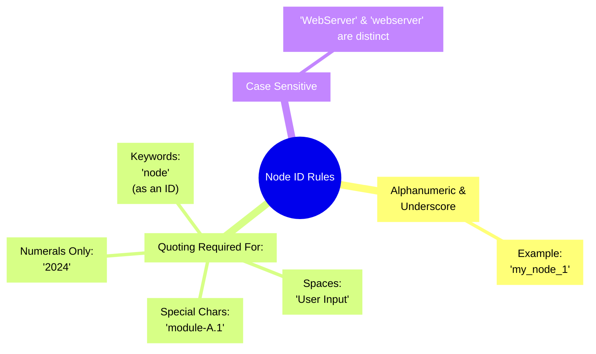
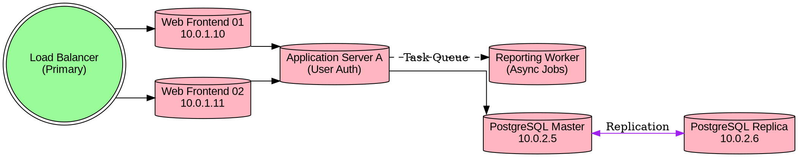
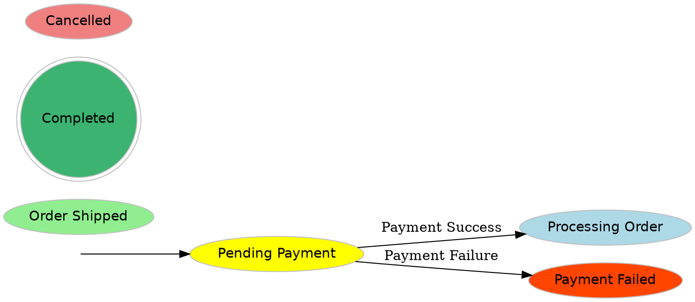
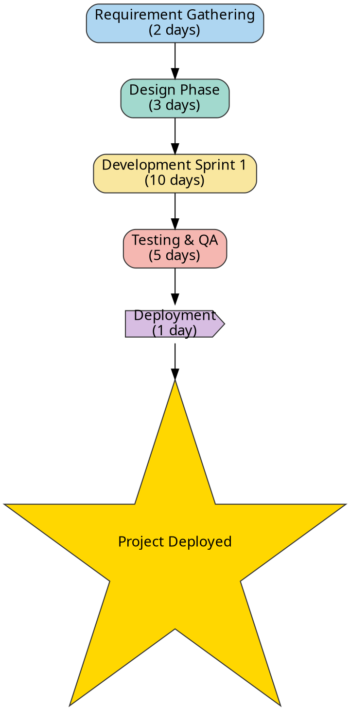

# Syntax Terrain: Defining Nodes in DOT
> This content is dual-licensed under your choice of the following licenses:
> 1.  **MIT License:** For the code implementations in Swift and Mermaid provided in this document.
> 2.  **Creative Commons Attribution 4.0 International License (CC BY 4.0):** For all other content, including the text, explanations, and the Mermaid diagrams and illustrations.

---


Nodes, or vertices, are the foundational elements of any graph, representing the entities or objects within your system. In DOT, defining and customizing nodes is straightforward, allowing for a rich visual representation.

## Node Identification (Node IDs)

Each node in a DOT graph is typically identified by a unique **Node ID**. These IDs are used to refer to nodes when creating edges or setting attributes.

*   **Syntax Rules for Node IDs:**
    *   Can consist of alphanumeric characters (`a-z`, `A-Z`, `0-9`) and underscores (`_`).
    *   Should ideally not start with a number unless quoted.
    *   Must not be a DOT keyword (e.g., `node`, `edge`, `graph`, `digraph`, `subgraph`, `strict`).
    *   **Quoting:** If an ID contains spaces, special characters (like `-`, `.`, `/`), is a keyword, or is purely numeric, it **must** be enclosed in double quotes (`"`). For example, `"My Node"`, `"123"`, `"data-source"`.
    *   Node IDs are case-sensitive. `NodeA` is different from `nodea`.



---

## Declaring Nodes

Nodes can be declared implicitly or explicitly:

1.  **Implicit Declaration:** A node is automatically created if it's mentioned in an edge definition and hasn't been declared before. It will use default attributes.
    ```dot
    digraph G {
        user -> process; // 'user' and 'process' nodes are implicitly created
    }
    ```

2.  **Explicit Declaration:** To assign specific attributes to a node, you must declare it explicitly.
    *   Simple declaration (uses default attributes):
        `node_id;`
    *   Declaration with attributes:
        `node_id [attribute1=value1, attribute2=value2, ...];`

----

## Common Node Attributes and Examples

Attributes allow you to customize the appearance of nodes. Here are some of the most frequently used:

*   **`label`**: The text displayed inside or near the node. If not set, the node's ID is used as the label.
    ```dot
    digraph G {
        n1 [label="Start Process"];
        "User Input" [label="Enter User Data"]; // ID with space, needs quotes
    }
    ```
    For more complex labels with internal structure or formatting, DOT supports HTML-like labels (e.g., `label=<...>`) and record-based shapes, which provide powerful layout capabilities within a single node. These are often explored in more advanced syntax discussions.

*   **`shape`**: Determines the geometric shape of the node.
    ```dot
    digraph Shapes {
        node [fontname="Arial"]; // Default font for all nodes
        s1 [label="Database", shape=cylinder]; // Common for DBs
        s2 [label="Decision", shape=diamond];
        s3 [label="Component", shape=box]; // or rectangle
        s4 [label="Start/End", shape=ellipse]; // or circle
        s5 [label="User", shape=egg];
        s6 [label="Raw Data", shape=plaintext]; // No shape, just text
        s7 [label="Module", shape=component];
    }
    ```
    Other shapes include `triangle`, `pentagon`, `hexagon`, `septagon`, `octagon`, `doublecircle`, `doubleoctagon`, `tripleoctagon`, `invtriangle`, `invtrapezium`, `invhouse`, `Mdiamond`, `Msquare`, `Mcircle` (for specific molecular visualizations), `record`, `Mrecord`, `note`, `tab`, `folder`, `box3d`, `underline`, `none`.

*   **`style`**: Modifies the visual style of the node's border and fill. Common values include `filled`, `dashed`, `dotted`, `solid` (default), `bold`, `rounded`, `invis` (invisible).
    ```dot
    digraph Styles {
        n1 [label="Active", style=filled, fillcolor=lightgreen];
        n2 [label="Deprecated", style="filled,dashed", fillcolor=lightgrey, color=gray];
        n3 [label="External", style=rounded];
        n4 [label="Hidden Node", shape=point, style=invis]; // Often used for layout control
    }
    ```

*   **`color`**: Sets the color of the node's border (and text if `fontcolor` isn't set and `style` isn't `filled`).
*   **`fillcolor`**: Sets the fill color of the node when `style=filled`.
    ```dot
    digraph Colors {
        db_server [label="Primary DB", shape=cylinder, style=filled, color=blue, fillcolor=lightblue];
        app_server [label="App Server", shape=box, style="filled,rounded", color="#FF0000", fillcolor="#FFDDDD"]; // Hex colors
    }
    ```

*   **`fontname`, `fontsize`, `fontcolor`**: Control the font family, size (in points), and color of the label text.
    ```dot
    digraph Fonts {
        critical_alert [label="CRITICAL", fontname="Helvetica-Bold", fontsize=24, fontcolor=red, shape=octagon, style=filled, fillcolor=yellow];
    }
    ```

*   **`width`, `height`**: Specifies the minimum width and height of the node in inches.
*   **`fixedsize`**: If `true`, the `width` and `height` are treated as fixed dimensions. If `false` (default), they act as minimums, and the node can grow to accommodate its label.
    ```dot
    digraph Sizing {
        n1 [label="This label determines size"];
        n2 [label="Fixed", width=2, height=1, fixedsize=true, style=filled, fillcolor=beige];
    }
    ```

*   **`image`**: Allows you to use an external image file (e.g., PNG, JPG, SVG) as the node's appearance. The `imagescale` attribute can control how the image is scaled. The `label` attribute can be used to place text over or near the image.
    ```dot
    digraph ImageNode {
        // Ensure 'server_icon.png' is accessible by Graphviz in its image path
        web01 [label="Web Server 01", image="path/to/server_icon.png", labelloc=b, shape=none];
        // labelloc=b places label at bottom. shape=none or shape=plaintext is common with images.
    }
    ```
    *Note: The path to the image must be accessible by the Graphviz renderer. Graphviz searches in directories specified by the `imagepath` graph attribute or environment variables.*

---

## Practical "Production" Examples

Here are a few illustrative snippets of how nodes might be defined in real-world scenarios:

### 1. Server Nodes in a Network Diagram


*Cartographer's Note: Here, we use `group` as a conceptual attribute (Graphviz doesn't use it directly for layout unless a layout engine is specifically programmed to), but it helps organize the DOT source. We apply different default styles and then define individual servers.*

### 2. States in a Software State Machine


*Cartographer's Note: Different fill colors distinguish states. `shape=doublecircle` often indicates a final or significant state. An invisible `init` node points to the starting state.*

### 3. Tasks in a Simple Workflow


*Cartographer's Note: Nodes represent tasks, labels include estimated duration. `shape=star` can highlight milestones. Colors can indicate task types or phases.*

-----

## Charting Your Course

Nodes are the anchors of your graph. By mastering their definition and attributes, you gain fine-grained control over how your data structures, processes, or systems are visually mapped. Experiment with different shapes, styles, and colors to best convey the meaning of your diagrams.

---

This detailed exploration of node definition should provide a solid foundation for any DOT language explorer. Next, we would typically chart the terrain of **Edges**, showing how these nodes are connected.

----

<!-- 
```mermaid
%% Current Mermaid version
info
```
-->


```mermaid
---
title: "CongLeSolutionX"
author: "Cong Le"
version: "1.0"
license(s): "MIT, CC BY 4.0"
copyright: "Copyright (c) 2025 Cong Le. All Rights Reserved."
config:
  theme: base
---
%%{
  init: {
    'flowchart': { 'htmlLabels': false },
    'fontFamily': 'Bradley Hand',
    'themeVariables': {
      'primaryColor': '#fc82',
      'primaryTextColor': '#F8B229',
      'primaryBorderColor': '#27AE60',
      'secondaryColor': '#81c784',
      'secondaryTextColor': '#6C3483',
      'lineColor': '#F8B229',
      'fontSize': '20px'
    }
  }
}%%
flowchart LR
    My_Meme@{ img: "https://raw.githubusercontent.com/CongLeSolutionX/MY_GRAPHIC_ASSETS/refs/heads/Designing_graphic_syntax/MY_MEME/My-meme-icon-design.png", label: "Ăn uống gì chưa ngừi đẹp?", pos: "b", w: 200, h: 150, constraint: "on" }

    Closing_quote@{ shape: braces, label: "I'll leave this Earth empty-handed anyway!<br/>YOLO" }

My_Meme ~~~ Closing_quote


```


---
>**Licenses:**
>
>- **MIT License:**  [](LICENSE) - Full text in [LICENSE](LICENSE) file.
>- **Creative Commons Attribution 4.0 International:** [](LICENSE-CC-BY) - Legal details in [LICENSE-CC-BY](LICENSE-CC-BY) and at [Creative Commons official site](http://creativecommons.org/licenses/by/4.0/).
>
---