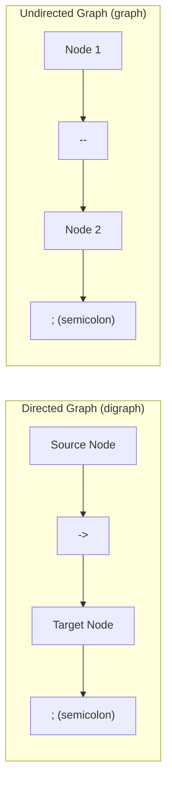
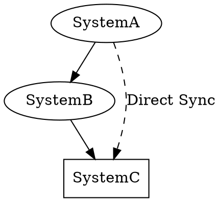
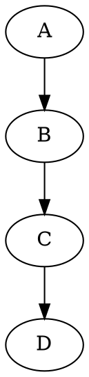
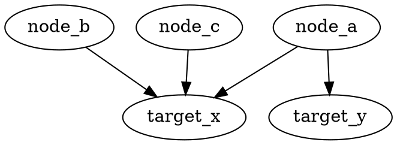
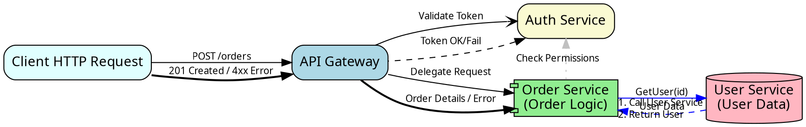
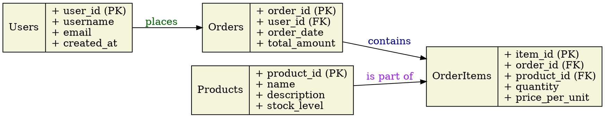

# Syntax Terrain: Defining Edges in DOT
> This content is dual-licensed under your choice of the following licenses:
> 1.  **MIT License:** For the code implementations in Swift and Mermaid provided in this document.
> 2.  **Creative Commons Attribution 4.0 International License (CC BY 4.0):** For all other content, including the text, explanations, and the Mermaid diagrams and illustrations.

---

Edges, also known as arcs or links, represent the connections and relationships between nodes in a graph. In DOT, defining edges is intuitive, and like nodes, they can be customized with a variety of attributes to convey specific meanings.

## Edge Operators

The syntax for defining an edge depends on whether the graph is directed (`digraph`) or undirected (`graph`):

1.  **Directed Edge (`->`)**: Used in `digraph`. Signifies a connection with a direction from a source node (or "tail") to a target node (or "head").
    ```dot
    digraph G {
        A -> B; // Edge from Node A to Node B
    }
    ```

2.  **Undirected Edge (`--`)**: Used in `graph`. Signifies a connection without a specific direction. The relationship between two nodes is mutual.
    ```dot
    graph G {
        X -- Y; // Edge between Node X and Node Y
    }
    ```

--

## Basic Edge Definition

An edge is defined by specifying the source node, the appropriate edge operator, and the target node, typically terminated by a semicolon `;`.



**Example:**



## Chaining Edges

DOT allows for a concise way to define a sequence of edges:



## Grouping Source/Target Nodes

You can group multiple source or target nodes using curly braces `{}` to create multiple edges efficiently:


*Cartographer's Note: When grouping, quotes are needed if node IDs within the braces have spaces or special characters, e.g., `{"Node Alpha" "Node Beta"} -> common_target;`*

## Common Edge Attributes and Examples

Edges can have attributes to control their appearance and provide additional information:

*   **`label`**: Text displayed near the edge. Useful for naming relationships or indicating data flow.
    ```dot
    digraph EdgeLabels {
        User -> Action [label="Performs"];
        Database -> Application [label="Returns Data", fontcolor=blue];
    }
    ```

*   **`style`**: Visual style of the edge line. Common values: `solid` (default), `dashed`, `dotted`, `bold`, `invis` (invisible, useful for layout control without visual clutter).
    ```dot
    digraph EdgeStyles {
        A -> B [style=dashed, label="Optional"];
        B -> C [style=dotted, label="Infrequent"];
        C -> D [style=bold, label="Primary Path"];
    }
    ```

*   **`color`**: Sets the color of the edge line and its arrowhead/tail (unless overridden by `arrowheadcolor` etc.).
    ```dot
    digraph EdgeColors {
        Critical -> System [color=red, penwidth=2.0]; // penwidth for thickness
        Normal -> System [color=blue];
        LowPriority -> System [color=grey];
    }
    ```

*   **`arrowhead`, `arrowtail`**: Defines the shape of the arrow at the head (target) and tail (source) of the edge.
    *   Common values: `none`, `normal` (default for digraphs), `dot`, `odot`, `diamond`, `odiamond`, `box`, `obox`, `tee`, `vee`, `curve`, `icurve`, `inv`, `invempty`, `open`, `halfopen`, `empty`.
    *   Can combine multiple shapes (e.g., `arrowhead="dotnormal"`).
    ```dot
    digraph ArrowShapes {
        A -> B [arrowhead=vee];
        C -> D [arrowhead=dot, arrowtail=dot, dir=both]; // dir=both makes it appear bidirectional
        E -> F [arrowhead=diamond, arrowtail=inv];
        X -- Y [arrowhead=none, arrowtail=none]; // Explicitly no arrows for an undirected edge look, even in digraph
    }
    ```

*   **`arrowsize`**: A scaling factor for the size of the arrowhead/tail. Default is `1.0`.
    ```dot
    digraph ArrowSizes {
        A -> B [arrowsize=2.0]; // Larger arrow
        C -> D [arrowsize=0.5]; // Smaller arrow
    }
    ```

*   **`dir`**: Controls edge directionality in a more nuanced way than just `->` vs `--`.
    *   `forward`: (Default for `->`) Arrow at head.
    *   `back`: Arrow at tail.
    *   `both`: Arrows at both head and tail.
    *   `none`: No arrows.
    ```dot
    digraph EdgeDirections {
        A -> B [dir=both, label="Bidirectional"];
        C -> D [dir=back, label="Flows Back"];
    }
    ```

*   **`constraint`**: A boolean (`true` or `false`). If `false`, the edge is drawn but does not influence node ranking or positioning in hierarchical layouts (like the default `dot` engine). Useful for annotation edges or secondary relationships that shouldn't affect the main layout.
    ```dot
    digraph Constraints {
        rankdir=TB;
        A -> B; // Main flow, affects rank
        B -> C;
        A -> C [constraint=false, style=dashed, color=gray, label="Reference"]; // Does not push C down
    }
    ```

*   **`len`**: Preferred edge length in inches (for layout engines like `neato`, `fdp` that aim for specific lengths). `dot` uses it more as a minimum.
*   **`weight`**: Higher weight values make edges "shorter" and "straighter" and more important in hierarchical layouts (`dot`). In force-directed layouts (`neato`, `fdp`), higher weights mean stronger attraction between nodes.
    ```dot
    digraph EdgeWeights {
        // In 'dot' layout:
        Source -> CriticalPath1 [weight=100];
        CriticalPath1 -> CriticalPath2 [weight=100];
        Source -> SidePath [weight=1]; // Less 'important' for layout
        CriticalPath2 -> Sink;
        SidePath -> Sink;
    }
    ```

*   **`headlabel`, `taillabel`**: Labels placed specifically at the head or tail of an edge.
*   **`labelfontcolor`, `labelfontname`, `labelfontsize`**: Control font properties for edge labels.

## Connecting to Node Ports (Compass Points & Record/HTML Ports)

Nodes can have defined connection points, called "ports." Edges can connect to these specific ports rather than just the center of the node.

1.  **Compass Points:** Every node implicitly has compass point ports (e.g., `n`, `ne`, `e`, `se`, `s`, `sw`, `w`, `nw`, `c` - center).
    *Syntax: `node_id:compass_point -> another_node:compass_point;`*
    ```dot
    digraph CompassPorts {
        A [shape=box]; B [shape=box];
        A:e -> B:w [label="East to West"]; // Connect east port of A to west port of B
        A:s -> B:n [label="South to North"];
    }
    ```

2.  **Record and HTML-Like Label Ports:** If a node uses `shape=record` or an HTML-like label, you can define named ports within the label.
    *Syntax: `node_id:port_name -> another_node;`*
    ```dot
    digraph RecordHTMLPorts {
        nodeA [shape=record, label="<f0> Field 0 | <f1> Field 1 | <f2> Field 2"];
        nodeB [label=<
            <TABLE BORDER="0" CELLBORDER="1" CELLSPACING="0">
            <TR><TD PORT="in1">Input 1</TD><TD PORT="in2">Input 2</TD></TR>
            <TR><TD COLSPAN="2" PORT="out">Combined Output</TD></TR>
            </TABLE>
        >];
        nodeC;

        nodeA:f1 -> nodeC [label="From Field 1"];
        nodeC -> nodeB:in2 [label="To Input 2"];
    }
    ```

## Practical "Production" Examples

**1. API Call Flow:**


*Cartographer's Note: Different arrowheads (`open`), styles (`dashed`, `bold`), and colors (`blue`, `grey`) illustrate various aspects of the communication. `constraint=false` is used for a secondary, non-layout-driving interaction.*

**2. Database Schema Relationships:**


*Cartographer's Note: `shape=record` is perfect for tables. `\l` creates left-justified newlines within record labels. `arrowtail=crow` represents the "many" side of a one-to-many relationship, and `tee` can represent the "one" side.*

----

## Charting Your Paths

Edges are the vital conduits in your graph maps. Through careful use of their attributes and connection points, you can precisely define the nature of relationships, the flow of processes, and the structure of hierarchies, making your DOT diagrams both informative and visually compelling.

---

This detailed cartography of **Edges** should equip you well for connecting the landmarks in your DOT diagrams. Next, we could systematically survey the "General Attribute Syntax Rules" to ensure our attribute declarations are always well-formed.

----


<!-- 
```mermaid
%% Current Mermaid version
info
```
-->


```mermaid
---
title: "CongLeSolutionX"
author: "Cong Le"
version: "1.0"
license(s): "MIT, CC BY 4.0"
copyright: "Copyright (c) 2025 Cong Le. All Rights Reserved."
config:
  theme: base
---
%%{
  init: {
    'flowchart': { 'htmlLabels': false },
    'fontFamily': 'Bradley Hand',
    'themeVariables': {
      'primaryColor': '#fc82',
      'primaryTextColor': '#F8B229',
      'primaryBorderColor': '#27AE60',
      'secondaryColor': '#81c784',
      'secondaryTextColor': '#6C3483',
      'lineColor': '#F8B229',
      'fontSize': '20px'
    }
  }
}%%
flowchart LR
    My_Meme@{ img: "https://raw.githubusercontent.com/CongLeSolutionX/MY_GRAPHIC_ASSETS/refs/heads/Designing_graphic_syntax/MY_MEME/My-meme-icon-design.png", label: "Ăn uống gì chưa ngừi đẹp?", pos: "b", w: 200, h: 150, constraint: "on" }

    Closing_quote@{ shape: braces, label: "I'll leave this Earth empty-handed anyway!<br/>YOLO" }

My_Meme ~~~ Closing_quote


```


---
>**Licenses:**
>
>- **MIT License:**  [](LICENSE) - Full text in [LICENSE](LICENSE) file.
>- **Creative Commons Attribution 4.0 International:** [](LICENSE-CC-BY) - Legal details in [LICENSE-CC-BY](LICENSE-CC-BY) and at [Creative Commons official site](http://creativecommons.org/licenses/by/4.0/).
>
---