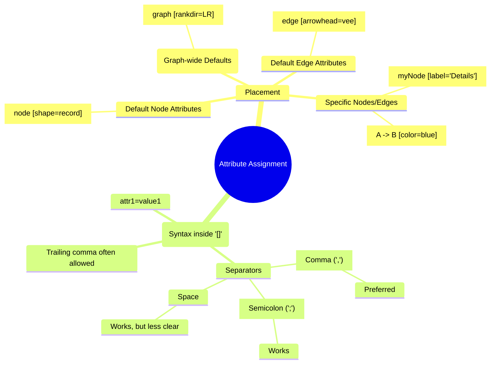
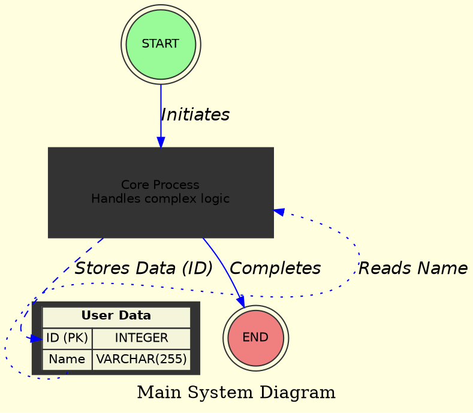
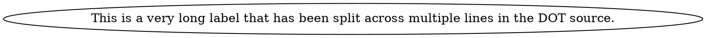

# Syntax Terrain: General Attribute Syntax Rules in DOT
> **Disclaimer:**
>
> This document contains my personal notes on the topic,
> compiled from publicly available documentation and various cited sources.
> The materials are intended for educational purposes, personal study, and reference.
> The content is dual-licensed:
> 1. **MIT License:** Applies to all code implementations (Swift, Mermaid, and other programming languages).
> 2. **Creative Commons Attribution-ShareAlike 4.0 International License (CC BY-SA 4.0):** Applies to all non-code content, including text, explanations, diagrams, and illustrations.
---

Attributes are the primary means of controlling the visual appearance, layout behavior, and textual labeling of graphs, nodes, and edges in DOT. Understanding the syntax for defining and assigning attributes is crucial for creating precise and effective diagrams.

## Attribute Lists

Attributes are typically assigned within square brackets `[]` following the element declaration (graph, node, or edge statement) or standalone attribute setting statements (`graph [...]`, `node [...]`, `edge [...]`).

*   **Placement:**
    *   For graph-wide defaults: `graph [attribute1=value1, attribute2=value2];`
    *   For default node attributes: `node [shape=box, color=blue];`
    *   For default edge attributes: `edge [color=red, style=dashed];`
    *   For specific nodes: `myNode [label="My Special Node", shape=ellipse];`
    *   For specific edges: `nodeA -> nodeB [label="Connects via API", weight=5];`

*   **Structure:**
    *   Multiple attributes in a list are separated by commas (`,`) or semicolons (`;`) or even just spaces (though commas are most common and clear).
        *   `[label="A", color=red, style=filled]`
        *   `[label="B"; color=blue; style=dashed]` (Semicolons also work as separators)
        *   `[label="C" color=green style=dotted]` (Spaces can work but are less explicit)
    *   A trailing comma is usually permitted: `[label="D", color=black,]`

---

## Attribute Name-Value Pairs

Each attribute is specified as a `name=value` pair.

*   **Attribute Names (IDs):**
    *   Typically, standard identifiers (alphanumeric, underscores, not starting with a number).
    *   Case-sensitive according to the Graphviz documentation, although some layout engines might be more forgiving, it's best to assume case-sensitivity (e.g., `color` is different from `Color`). Standard attributes are usually lowercase.

*   **Attribute Values:**
    *   **IDs (Identifiers):** If the value is a simple string that conforms to ID rules (alphanumeric, underscores, no spaces/special chars, not purely numeric) and is not a recognized keyword for that attribute type (like `true`, `false`, color names), it can often be unquoted.
        *   `shape=box`
        *   `color=red`
        *   `arrowhead=normal`
    *   **Strings (Quoted):** If the value contains spaces, special characters, is empty, is a DOT keyword, is purely numeric but should be treated as a string, or could be ambiguous, it **must** be enclosed in double quotes (`"`).
        *   `label="Node with spaces"`
        *   `tooltip="Click for details!"`
        *   `fontname="Courier New"`
        *   `URL="https://example.com/node_info.html"`
        *   `some_custom_attr="123.45"` (if "123.45" isn't a recognized number type for this attr)
        *   `target="_blank"` (common for HTML links)
        *   To include a double quote `"` within a quoted string, escape it with a backslash: `label="This is a \"quote\"."`
        *   Newline (`\n`), Tab (`\t`), and other C-like escape sequences are recognized within quoted strings for labels.
    *   **HTML-Like Labels:** A special type of string value for `label` attributes, enclosed in angle brackets `<...>`. These allow a subset of HTML for structuring node or edge labels.
        *   `label=< <B>Bold Text</B> and a new line. >`
    *   **Numbers:** Numerical values (integers or floating-point) for attributes like `fontsize`, `width`, `height`, `penwidth`, `arrowsize`, `weight`, `len`.
        *   `fontsize=12`
        *   `width=0.75`
        *   `penwidth=2.0`
        *   Quotes are generally *not* used for simple numeric values unless they contain units or special characters not directly supported, in which case they'd be treated as strings.
    *   **Booleans:** Some attributes expect boolean values, which can be specified as `true` or `false` (case-insensitive, generally unquoted).
        *   `fixedsize=true`
        *   `constraint=false`
    *   **Colors:** Can be specified as:
        *   Named colors (e.g., `red`, `blue`, `lightgrey`). Case-insensitivity is common.
        *   Hexadecimal RGB: `"#RRGGBB"` (e.g., `"#FF0000"` for red).
        *   Hexadecimal RGBA: `"#RRGGBBAA"` (e.g., `"#FF000080"` for semi-transparent red).
        *   HSV (Hue, Saturation, Value): `"H,S,V"` (e.g., `"0.0,1.0,1.0"` for red).
        *   Color scheme names from `colorscheme` attribute (e.g., `color=5` if using a scheme like `accent8`).

## Setting Attributes

The general syntax for an attribute definition is:
`element_type [ attribute_name = attribute_value, ... ];`

**Example Breakdown:**

## Concatenation of Strings for Labels (Graphviz >= 2.20)

For long labels, you can concatenate strings using the `+` operator. This is useful for breaking up long lines in your DOT source without introducing unwanted newlines in the rendered label (unless `\n` is used).

---

## Important Considerations

*   **Order of Definition:** Default attributes (`graph`, `node`, `edge` statements) apply to elements defined *after* them. An element's specific attributes always override the defaults.
*   **Quoting is Key:** When in doubt, especially with labels or values containing non-alphanumeric characters (other than underscore), use double quotes. This is the most common source of syntax errors.
*   **Tool-Specific Attributes:** While most attributes are standard Graphviz DOT, some tools or libraries that generate or consume DOT might introduce their own custom attributes. These might not be recognized by all Graphviz layout engines. Always refer to the Graphviz documentation for the canonical list of attributes.

By adhering to these syntax rules, you ensure that your attribute definitions are clear, unambiguous, and correctly interpreted by Graphviz, allowing you to precisely control the cartography of your diagrams.

---

With a firm grasp on how to apply attributes, our maps become much more expressive! The next logical point of exploration on our syntax terrain would be **Advanced DOT Features**, such as the detailed use of record shapes, HTML-like labels, ports, and ranking controls, which we've touched upon but deserve a dedicated survey.

---

<!-- 

---
>**Licenses:**
>
>- **MIT License:**   - Full text in [LICENSE](LICENSE) file.
>- **Creative Commons Attribution-ShareAlike 4.0 International**: [CC BY-SA 4.0](https://creativecommons.org/licenses/by-sa/4.0/)  - Legal details in [LICENSE-CC-BY-SA-4.0](LICENSE-CC-BY-SA-4.0) and at [Creative Commons official site](https://creativecommons.org/licenses/by-sa/4.0/).
>
---