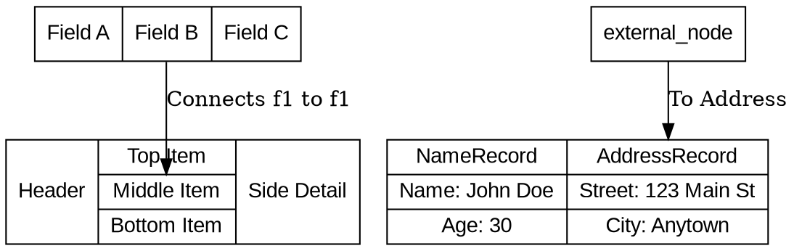
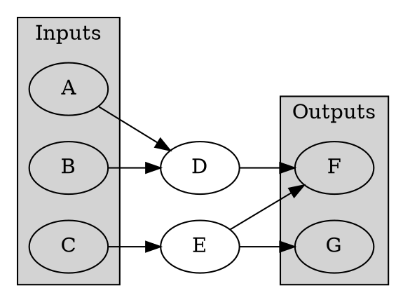
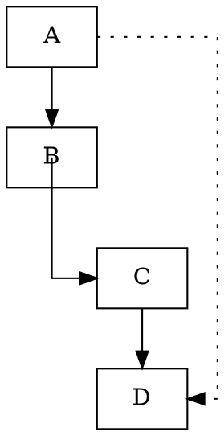
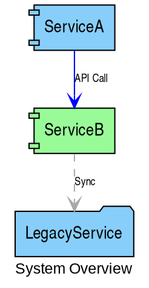

# Syntax Terrain: Advanced DOT Features
> **Disclaimer:**
>
> This document contains my personal notes on the topic,
> compiled from publicly available documentation and various cited sources.
> The materials are intended for educational purposes, personal study, and reference.
> The content is dual-licensed:
> 1. **MIT License:** Applies to all code implementations (Swift, Mermaid, and other programming languages).
> 2. **Creative Commons Attribution-ShareAlike 4.0 International License (CC BY-SA 4.0):** Applies to all non-code content, including text, explanations, diagrams, and illustrations.
---


Beyond basic node and edge definitions, DOT offers advanced features that provide finer control over element structure, appearance, and layout. Mastering these allows for the creation of sophisticated and highly informative diagrams.

## 1. Record-Based Shapes (`shape=record` or `shape=Mrecord`)

Record shapes are powerful for representing data structures, objects with fields, or any node that requires internal compartmentalization.

*   **Syntax:** The `label` attribute for a record shape uses a specific syntax with curly braces `{}` to define rows or columns, and vertical bars `|` to separate fields (cells).
    *   `{ field1 | field2 | ... }` creates horizontally arranged fields.
    *   `{{fieldA | fieldB} | fieldC}` creates nested structures. The inner `{}` creates a sub-record, usually displayed vertically.
*   **Ports:** Each field can be given a port name using `<port_name>`. This allows edges to connect to specific parts of the record.
    *   `label="{<f0> Item One | <f1> Item Two | <details> More Details...}"`

**Example (Horizontal and Vertical Layout):**


*Cartographer's Note: `shape=Mrecord` offers rounded corners for a more modern look.*

---

## 2. HTML-Like Labels

For even greater control over node (and sometimes edge) label appearance and structure, DOT supports a subset of HTML. This is often more flexible than record shapes for complex formatting.

*   **Syntax:** The `label` is enclosed in angle brackets `<...>`.
*   **Supported Tags (Commonly):**
    *   `<TABLE>`: The most powerful tag, allowing for complex table structures with `BORDER`, `CELLBORDER`, `CELLSPACING`, `CELLPADDING`, `ROWSPAN`, `COLSPAN`, `ALIGN`, `VALIGN`, `BGCOLOR`, `COLOR`.
    *   `<TR>`, `<TD>`: Table rows and cells.
    *   `<FONT>`: With attributes `FACE` (font name), `COLOR`, `POINT-SIZE`.
    *   `<B>`, `<I>`, `<U>`, `<S>`: Bold, Italic, Underline, Strikethrough.
    *   `<SUB>`, `<SUP>`: Subscript, Superscript.
    *   `<BR/>`: Line break (ALIGN attribute can control justification: `LEFT`, `RIGHT`, `CENTER`).
    *   ``: Embed images within labels (path must be accessible).
    *   `<HR/>`: Horizontal rule.
*   **Ports in HTML:** `<TD>` elements can have a `PORT="port_name"` attribute, allowing edges to connect to specific cells.

**Example:**

```dot
/*
 * title: HTML-Like Labels
 * author: Cong Le
 * version: 1.0
 * license(s): MIT, CC BY-SA 4.0
 * copyright: Copyright (c) 2025 Cong Le. All Rights Reserved.
 * 
 */
digraph HTMLLabels {
    node [fontname="Verdana"];

    html_node1 [label=<
        <TABLE BORDER="0" CELLBORDER="1" CELLSPACING="0" CELLPADDING="4">
            <TR><TD COLSPAN="2" BGCOLOR="lightblue"><B>Server Status</B></TD></TR>
            <TR><TD ALIGN="LEFT">Hostname:</TD><TD PORT="hostname" ALIGN="LEFT">server01.example.com</TD></TR>
            <TR><TD ALIGN="LEFT">IP Address:</TD><TD PORT="ip" ALIGN="LEFT">192.168.1.100</TD></TR>
            <TR><TD ALIGN="LEFT">Load:</TD><TD BGCOLOR="lightgreen">0.75</TD></TR>
            <TR><TD ALIGN="CENTER" COLSPAN="2"><FONT POINT-SIZE="8" COLOR="gray">Last Update: 10:30 AM</FONT></TD></TR>
        </TABLE>
    >, shape=plaintext]; // shape=plaintext lets the HTML table define the visual bounds

    user_node [label=<
        <TABLE BORDER="1" CELLPADDING="5">
            <TR><TD ROWSPAN="2"></TD>
                <TD><B>Jane Doe</B></TD></TR>
            <TR><TD><FONT POINT-SIZE="10">Engineer</FONT></TD></TR>
        </TABLE>
    >, shape=plaintext];

    html_node1:hostname -> some_other_node [label="Hostname Lookup"];
}
```
*Cartographer's Note: When using HTML-like labels, `shape=plaintext` or `shape=none` is often used if you want the HTML table itself to define the node's visual boundary. Otherwise, the HTML content will be placed inside the specified an explicit node shape.*

---

## 3. Clusters (Subgraphs)

Clusters are special subgraphs that group nodes visually and can influence layout. They are rendered as a bounding box around their member nodes.

*   **Syntax:** A subgraph whose name starts with `cluster` (e.g., `subgraph cluster_A { ... }`).
*   **Attributes:** Clusters can have their own attributes, including `label` (displayed as the cluster title), `bgcolor` (background color), `color` (border color), `style` (e.g., `filled`, `rounded`).
*   **Layout Impact:** Edges can connect to a cluster itself, or to nodes within. `dot` tries to keep nodes within their cluster.

**Example:**


```dot
/*
 * title: Clusters
 * author: Cong Le
 * version: 1.0
 * license(s): MIT, CC BY-SA 4.0
 * copyright: Copyright (c) 2025 Cong Le. All Rights Reserved.
 * 
 */
digraph Microservices {
    graph [compound=true, rankdir=LR]; // compound=true allows edges to connect to clusters
    node [shape=box, style=filled];

    subgraph cluster_Ordering {
        label = "Ordering Service";
        bgcolor = "lightblue";
        style = "filled,rounded";
        color = "blue";

        OrderAPI [fillcolor=azure];
        OrderDB [shape=cylinder, fillcolor=azure];
        KafkaProducer [shape=cds, fillcolor=aliceblue, label="Order Events"];

        OrderAPI -> KafkaProducer;
        OrderAPI -> OrderDB;
    }

    subgraph cluster_Inventory {
        label = "Inventory Service";
        bgcolor = "lightgoldenrodyellow";
        style = "filled,rounded";
        color = "orange";

        InventoryAPI [fillcolor=cornsilk];
        InventoryDB [shape=cylinder, fillcolor=cornsilk];
        KafkaConsumer [shape=cds, fillcolor=oldlace, label="Order Events Consumer"];

        KafkaConsumer -> InventoryAPI;
        InventoryAPI -> InventoryDB;
    }

    // Inter-cluster communication
    // Note: lhead/ltail for logical head/tail refer to cluster name
    KafkaProducer -> KafkaConsumer [label="OrderCreated Event", lhead=cluster_Inventory, ltail=cluster_Ordering, minlen=2];

    Client -> OrderAPI [label="Place Order"];
}
```

*Cartographer's Note: `compound=true` is crucial for edges that logically connect to clusters (`lhead`, `ltail`). `minlen` can help adjust edge lengths.*

----

## 4. Ranking Control (`rank` and `rankdir`)

Graphviz `dot` (the default layout engine) arranges nodes in discrete ranks (typically top-to-bottom or left-to-right).

*   **`rankdir`**: A graph attribute setting the direction of ranks.
    *   `TB`: Top to Bottom (default)
    *   `BT`: Bottom to Top
    *   `LR`: Left to Right
    *   `RL`: Right to Left
*   **`rank=same`**: Groups nodes specified within a subgraph to appear on the same rank.
    ```dot
    subgraph { rank=same; node1; node2; node3; }
    ```
*   **`rank=sink | source | min | max`**: Forces nodes to be at the lowest (sink), highest (source), minimum, or maximum rank respectively.
    ```dot
    subgraph { rank=source; StartA; StartB; }
    subgraph { rank=sink; EndX; EndY; }
    ```

**Example:**



----

## 5. Controlling Edge Appearance and Routing

*   **Splines:** The `splines` graph attribute controls edge routing.
    *   `splines=true` (default): Edges are drawn as splines (curved lines) to avoid nodes.
    *   `splines=false` or `splines=line`: Edges are straight lines.
    *   `splines=ortho`: Edges are routed as sequences of orthogonal (horizontal/vertical) segments. Requires Graphviz 2.30+.
    *   `splines=polyline`: Edges are polylines.
*   **Node/Edge Ports:** As seen earlier (`node_id:port_id`), connecting to specific ports gives finer control over where edges attach.
*   **Invisible Nodes/Edges for Layout:** Sometimes, invisible nodes (`style=invis`) and edges (`style=invis` or `constraint=false`) are used as structural "scaffolding" to guide the layout algorithm without being visually rendered.
*   **`headport`, `tailport`**: Edge attributes specifying the compass point on the head/tail node where the edge should connect (e.g., `headport=n`, `tailport=se`).



---

## 6. Graph, Node, and Edge Default Attributes

Setting default attributes at the graph, node, or edge level can simplify your DOT source significantly.




---

## Charting the Depths

These advanced features unlock tremendous potential in DOT. Record shapes and HTML-like labels allow for information-rich nodes. Clusters organize complex diagrams. Rank and spline controls provide precise layout management. By skillfully combining these, your DOT maps can evolve from simple sketches to detailed blueprints of intricate systems.

----


Our expedition through the DOT syntax terrain has been quite thorough! We've covered the essentials and now these advanced features. The next logical step might be to discuss "Best Practices and Tips" for writing maintainable and effective DOT code, or perhaps delve into specific "Use Cases" to see these features in action in various scenarios.


---

<!-- 


---
>**Licenses:**
>
>- **MIT License:**  [](LICENSE) - Full text in [LICENSE](LICENSE) file.
>- **Creative Commons Attribution-ShareAlike 4.0 International**: [CC BY-SA 4.0](https://creativecommons.org/licenses/by-sa/4.0/) [](https://creativecommons.org/licenses/by-sa/4.0/) - Legal details in [LICENSE-CC-BY-SA-4.0](LICENSE-CC-BY-SA-4.0) and at [Creative Commons official site](https://creativecommons.org/licenses/by-sa/4.0/).
>
---