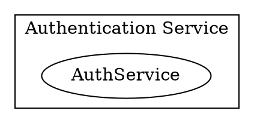
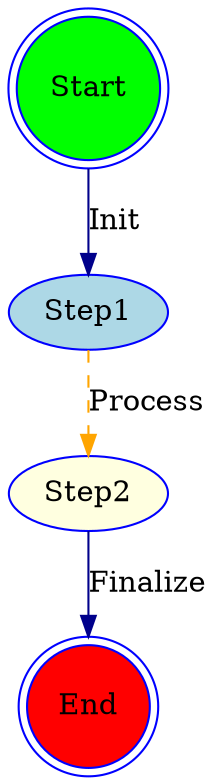

# Syntax Terrain: Best Practices and Tips for Writing DOT
> This content is dual-licensed under your choice of the following licenses:
> 1.  **MIT License:** For the code implementations in Swift and Mermaid provided in this document.
> 2.  **Creative Commons Attribution 4.0 International License (CC BY 4.0):** For all other content, including the text, explanations, and the Mermaid diagrams and illustrations.

---


Creating effective and maintainable DOT diagrams involves more than just knowing the syntax. Adopting best practices can significantly improve workflow, readability of the DOT source, and the clarity of the generated graphs.

## 1. Maintain Readability in DOT Source

Clear DOT source code is easier to understand, debug, and modify.

*   **Indentation and Formatting:**
    *   Use consistent indentation for subgraphs, node/edge definitions, and attribute lists. This visually structures your code.
    *   Align attributes for readability if helpful, especially in default `graph`, `node`, `edge` statements.
    ```dot
    digraph ReadableExample {
        graph [
            rankdir=LR,
            label="My System Diagram",
            fontname="Arial"
        ];
        node [
            shape=box,
            style="filled,rounded",
            fillcolor=lightblue
        ];
        edge [
            color=gray,
            fontsize=10
        ];

        // Main components
        subgraph cluster_Frontend {
            label="User Interface";
            bgcolor=lightyellow;
            WebApp;
            MobileApp;
        }

        subgraph cluster_Backend {
            label="Backend Services";
            bgcolor=lightcyan;
            APIServer;
            Database [shape=cylinder];
        }

        // Connections
        WebApp    -> APIServer [label="HTTP API"];
        MobileApp -> APIServer [label="HTTP API"];
        APIServer -> Database  [label="SQL Query"];
    }
    ```

*   **Comments:** Use C-style (`// ...` or `/* ... */`) comments liberally to explain complex parts, choices, or sections of your DOT code.



*   **Meaningful Node IDs:** Use descriptive Node IDs. If IDs become too long or contain special characters, quote them and use clear `label` attributes.
    *   Good: `APIGateway`, `AuthServiceNode`, `"User Input Stage"`
    *   Less clear: `n1`, `node_23_final`, `x`

*   **Group Related Elements:** Keep definitions of related nodes, edges, and subgraphs close together in the source file.

----

## 2. Leverage Default Attributes Effectively

Setting default `graph`, `node`, and `edge` attributes at the beginning of your DOT file (or within subgraphs) can dramatically reduce redundancy.

*   Override defaults only when necessary for specific elements.
*   This makes the unique properties of individual nodes/edges stand out.



---

## 3. Plan Your Layout

Think about the story your diagram needs to tell and choose layout hints accordingly.

*   **`rankdir`:** Choose `TB` (Top-to-Bottom) for hierarchies, `LR` (Left-to-Right) for process flows.
*   **`rank=same`:** Use to align elements horizontally (in TB/BT) or vertically (in LR/RL) that are at the same conceptual level.
*   **`constraint=false`:** Use for edges that represent secondary relationships or annotations, so they don't disrupt the primary layout flow.
*   **Clusters:** Group related nodes to visually segment your diagram and simplify complex areas.
*   **Invisible Nodes/Edges:** As a last resort, invisible elements (`style=invis`) can sometimes help fine-tune spacing or alignment if other methods are insufficient. Use sparingly, as they can complicate the DOT source.

---

## 4. Use Ports for Precise Edge Connections

When edges need to connect to specific parts of a node, especially with record shapes or HTML tables, use ports.

*   **Record Ports:** `<port_name>` within field definitions.
*   **HTML Ports:** `PORT="port_name"` attribute in `<TD>` tags.
*   **Compass Points:** `:n, :ne, :e, :se, :s, :sw, :w, :nw` for simple directional connections. This improves clarity by showing exactly where an interaction originates or terminates.

---

## 5. Keep Diagrams Focused and Manage Complexity

*   **One Diagram, One Purpose:** Avoid trying to show *everything* in a single diagram. Break down complex systems into multiple, focused diagrams.
*   **Abstraction with Subgraphs/Clusters:** Use clusters to represent complex subsystems as single blocks at a higher level, then create separate diagrams detailing the internals of those clusters.
*   **`compound=true`:** Essential graph attribute when edges connect to clusters (`lhead`, `ltail`).
*   **Limit Information Density:** Too many nodes, edges, or too much text can make a diagram overwhelming and hard to read. Prioritize the most important information.

---

## 6. Choose Appropriate Shapes and Styles

Select shapes and styles that intuitively represent the type of element.

*   **Common Conventions:**
    *   `ellipse` or `circle`: Start/end points, states.
    *   `box` or `rectangle`: Processes, components, general steps.
    *   `diamond`: Decisions.
    *   `cylinder`: Databases, data stores.
    *   `component` (house-like): Software components, services.
    *   `folder` or `tab`: Groupings or modules.
    *   `cds` (cylinder on its side): Queues, storage media.
*   **Color Coding:** Use colors consistently to differentiate types of nodes, states, or domains. Ensure good contrast for readability. Consider color-blindness accessibility.
*   **Edge Styles:**
    *   `solid`: Primary relationship.
    *   `dashed`: Secondary, optional, or asynchronous relationship.
    *   `dotted`: Infrequent or weak relationship.
    *   `bold`: Critical path or important flow.

---

## 7. Iterate and Refine

*   Start with a basic structure and progressively add detail and styling.
*   Generate the diagram frequently to see the results of your changes.
*   Don't be afraid to refactor your DOT code as the diagram evolves.
*   Get feedback from others to ensure the diagram is clear and conveys the intended message.

---

## 8. Quoting and Escaping

*   **Quote Labels and Values:** When in doubt, quote string attribute values, especially if they contain spaces, special characters, or are DOT keywords (`label="My Node"`, `fontname="Times New Roman"`). Quoting numeric IDs (e.g., `label="123"`) is also good practice.
*   **Escaping Special Characters in Quoted Strings:**
    *   `\"` for a double quote.
    *   `\n` for a newline (in labels).
    *   `\l` for a left-justified newline (in labels).
    *   `\r` for a right-justified newline (in labels).
    *   `\t` for a tab.

---

## 9. Version Control Your DOT Files

Treat your `.dot` or `.gv` files like source code. Store them in a version control system (like Git). This allows you to:
*   Track changes over time.
*   Collaborate with others.
*   Revert to previous versions if needed.

---

## 10. Understand Your Layout Engine

While `dot` is the most common for hierarchical layouts, Graphviz offers other engines:
*   `neato`, `fdp`: For "spring model" or force-directed layouts (good for undirected graphs where structure is emergent).
*   `circo`: For circular layouts.
*   `twopi`: For radial layouts.
*   `osage`: For layout of clustered graphs using a tree-like structure.

The effectiveness of certain attributes (like `len` or `weight` for edge length/strength) can vary significantly between layout engines. Specify the engine using the `-Kengine` command-line option (e.g., `dot -Kneato -Tpng mygraph.dot -o mygraph.png`).

----

## Charting with Wisdom

By applying these best practices, your journey through the DOT language will be smoother, and your resulting maps will be clearer, more accurate, and easier for others (and your future self) to navigate. Good cartography is as much about clarity and convention as it is about raw syntax.

---

These guidelines should serve as a reliable compass for navigating the practicalities of DOT diagram creation. We've now covered a significant portion of the DOT language terrain.

Possible next explorations could be:
1.  **Troubleshooting Common DOT Errors:** Focusing on how to identify and fix typical syntax or layout problems.
2.  **DOT Use Cases Deep Dive:** Exploring specific examples (e.g., FSMs, Network Topologies, DB Schemas) in more detail to see these practices in action.
3.  **Integration with Tools/Scripting:** How DOT is used programmatically.


---

<!-- 


---
>**Licenses:**
>
>- **MIT License:**  [](LICENSE) - Full text in [LICENSE](LICENSE) file.
>- **Creative Commons Attribution-ShareAlike 4.0 International**: [CC BY-SA 4.0](https://creativecommons.org/licenses/by-sa/4.0/) [](https://creativecommons.org/licenses/by-sa/4.0/) - Legal details in [LICENSE-CC-BY-SA-4.0](LICENSE-CC-BY-SA-4.0) and at [Creative Commons official site](https://creativecommons.org/licenses/by-sa/4.0/).
>
---