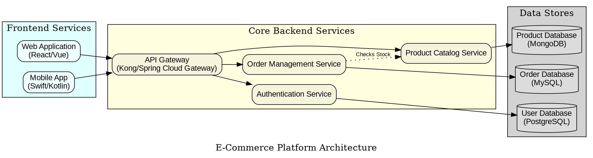
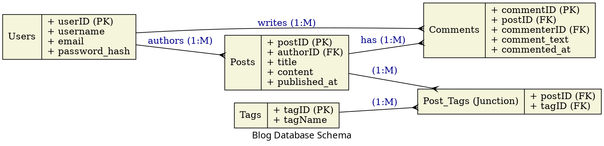
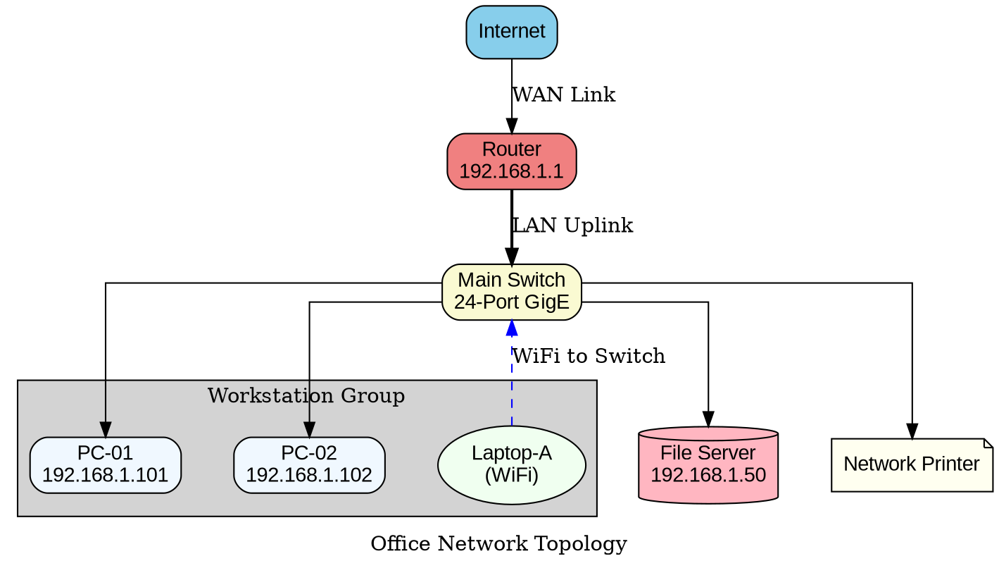
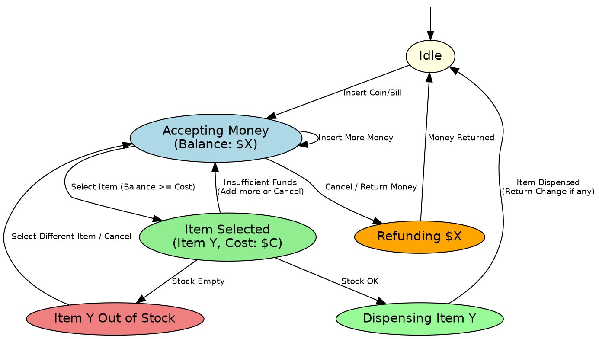
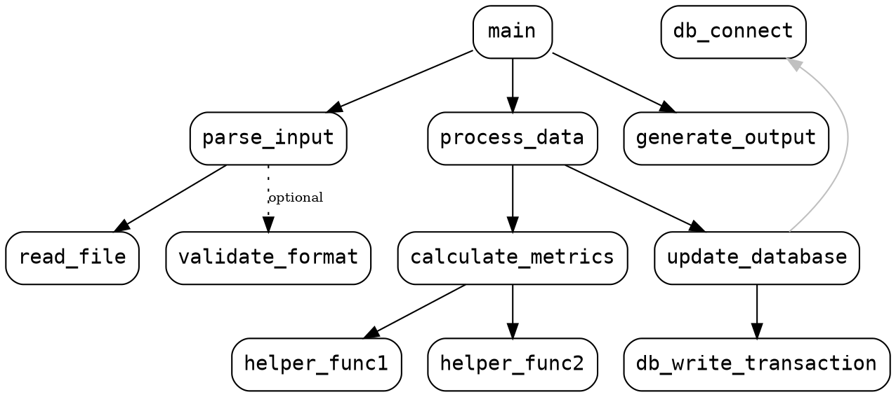
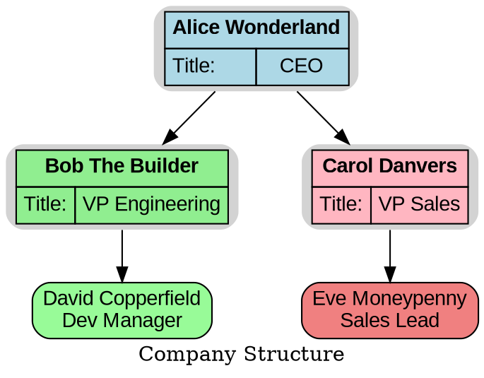
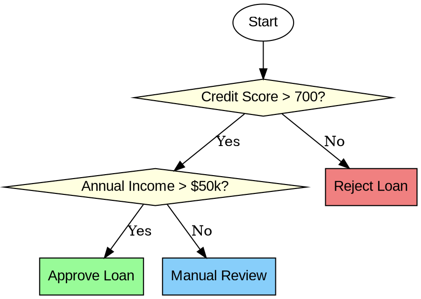

# Syntax Terrain: DOT Language Use Cases
> This content is dual-licensed under your choice of the following licenses:
> 1.  **MIT License:** For the code implementations in Swift and Mermaid provided in this document.
> 2.  **Creative Commons Attribution 4.0 International License (CC BY 4.0):** For all other content, including the text, explanations, and the Mermaid diagrams and illustrations.

---

The DOT language, with Graphviz as its rendering engine, is remarkably versatile. Its ability to describe graph structures programmatically makes it suitable for a wide array of visualization tasks across various domains. Here are some common and illustrative use cases:

----

## 1. Software Architecture and System Design

Visualizing software components, their interactions, and dependencies is a prime use case for DOT.

*   **Features Used:** Directed graphs (`digraph`), nodes (for components, services, modules), edges (for API calls, data flow, dependencies), clusters (for grouping related components, microservices), record/HTML labels (for detailing component interfaces or properties), `rankdir` (LR or TB for flow).

**Example Snippet: Microservice Architecture**

*Cartographer's Insight: Clusters clearly demarcate service groups. Different fill colors can denote service roles or deployment zones. `compound=true` would be needed if edges were drawn between clusters themselves.*

----

## 2. Database Schema Visualization

DOT can effectively represent database tables, columns, and their relationships (primary/foreign keys).

*   **Features Used:** Nodes with `shape=record` or HTML-like `<TABLE>` labels (for table structure), edges (for relationships), arrowheads/arrowtails (e.g., `crow`, `tee`, `dot` to denote cardinality: one-to-many, one-to-one).

**Example Snippet: Simple Blog Schema**

*Cartographer's Insight: Record shapes cleanly show table columns and keys. Edge labels and arrow styles clarify relationship types and cardinalities.*

---

## 3. Network Topology Diagrams

Visualizing network devices (routers, switches, servers) and their connections.

*   **Features Used:** Nodes (for devices, often with specific `shape` or `image`), edges (for network links), labels (for IP addresses, link speeds), `color` and `style` (to denote link types or status), clusters (for network segments or racks).

**Example Snippet: Simple Office Network**

*Cartographer's Insight: Different shapes and colors distinguish device types. `splines=ortho` can make network diagrams tidier. `penwidth` highlights important links.*

---

## 4. Finite State Machines (FSM) and Workflow Diagrams

Representing states and transitions in a system or process.

*   **Features Used:** Nodes (for states, `shape=ellipse` or `doublecircle` for final states), directed edges (for transitions), edge labels (for transition conditions/actions), initial state often indicated by an invisible node pointing to it.

**Example Snippet: Vending Machine FSM**

*Cartographer's Insight: Color-coding states improves readability. `doublecircle` (or other distinct styling) can mark terminal/significant states. Edge labels clearly define transition triggers.*

---

## 5. Call Graphs and Dependency Visualizations

Showing function call relationships in code or dependencies between software packages.

*   **Features Used:** Directed graph, nodes (functions, modules, packages), edges (calls, dependencies), `rankdir`, potentially `color` or `size` attributes proportional to metrics (e.g., call frequency, complexity).

**Example Snippet: Simple Function Call Graph**

*Cartographer's Insight: Useful for understanding code flow and identifying critical paths or tightly coupled components. `constraint=false` can be used for utility functions that don't affect the main ranking.*

---

## 6. Organizational Charts and Hierarchies

Representing reporting structures or hierarchical data.

*   **Features Used:** Directed graph (typically `rankdir=TB` or `BT`), nodes (individuals, departments), edges (reporting lines), HTML labels or record shapes for detailed employee info.

**Example Snippet: Basic Org Chart**

*Cartographer's Insight: HTML labels offer rich formatting for a professional look. For larger org charts, data might be generated from a CSV or database.*

---

## 7. Decision Trees and Flowcharts

Visualizing decision-making processes or algorithmic flows.

*   **Features Used:** Nodes (for steps/decisions; `shape=diamond` for decisions, `shape=box` for actions), edges (for flow), edge labels (for conditions/outcomes).

**Example Snippet: Simple Decision Tree**

*Cartographer's Insight: `shape=diamond` clearly indicates decision points. Consistency in shapes for actions vs. decisions is key.*

----

## Diverse Terrains, One Language

These use cases highlight DOT's adaptability. By selecting the appropriate features—graph types, node shapes, edge styles, labeling techniques, and layout controls—you can map a vast range of structures and processes clearly and effectively. The true power comes from combining DOT's declarative syntax with automated generation from data sources or scripts, turning raw information into insightful visualizations.

---

This tour of **Use Cases** demonstrates the practical power encoded within the DOT language. We've seen how the features we've explored come together to create meaningful diagrams. 

<!-- To round out our journey through the DOT syntax terrain, we could now focus on "Best Practices and Tips" for writing clean, maintainable, and effective DOT code, or perhaps examine how DOT integrates with "Tooling and Automation." -->

---

<!-- 

---
>**Licenses:**
>
>- **MIT License:**   - Full text in [LICENSE](LICENSE) file.
>- **Creative Commons Attribution-ShareAlike 4.0 International**: [CC BY-SA 4.0](https://creativecommons.org/licenses/by-sa/4.0/)  - Legal details in [LICENSE-CC-BY-SA-4.0](LICENSE-CC-BY-SA-4.0) and at [Creative Commons official site](https://creativecommons.org/licenses/by-sa/4.0/).
>
---