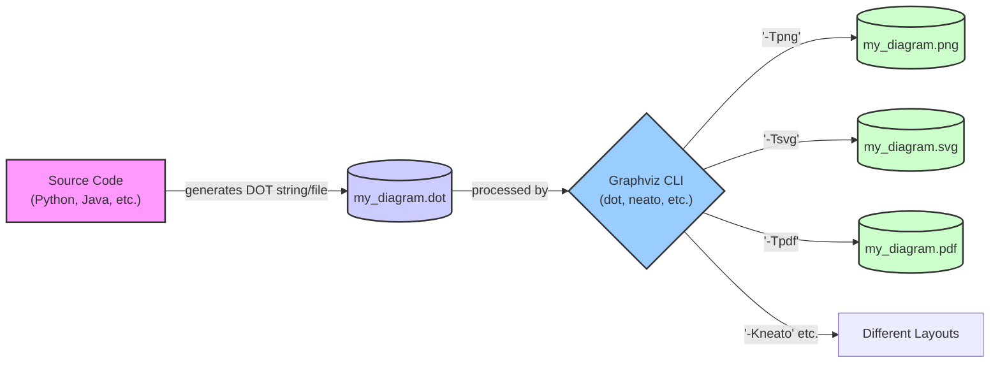

# Syntax Terrain: Integration with Tools and Scripting
> This content is dual-licensed under your choice of the following licenses:
> 1.  **MIT License:** For the code implementations in Swift and Mermaid provided in this document.
> 2.  **Creative Commons Attribution 4.0 International License (CC BY 4.0):** For all other content, including the text, explanations, and the Mermaid diagrams and illustrations.

---


The true power of the DOT language is often realized when it's generated, manipulated, or consumed programmatically. Its simple text-based format makes it ideal for integration with a wide array of tools, programming languages, and scripts.

## 1. Graphviz Command-Line Tools

The core Graphviz package provides command-line utilities that are fundamental for processing DOT files.

*   **`dot`**: The primary tool. Renders DOT files into various output formats.
    *   **Syntax:** `dot -T<format> [-K<engine>] <inputfile.dot> -o <outputfile>`
    *   **Common Formats (`-T` option):**
        *   `png`, `jpg`, `gif`, `svg` (vector graphics), `pdf`, `ps` (PostScript)
        *   `cmap` (client-side image map, for web interactivity)
        *   `json`, `json0` (DOT graph as JSON)
        *   `dot` (canonical DOT output, useful for reformatting/cleaning)
        *   `xdot` (extended DOT format, used by some interactive viewers)
    *   **Layout Engines (`-K` option):**
        *   `dot` (default, for directed, hierarchical graphs)
        *   `neato` (for "spring model" layouts)
        *   `fdp` (another force-directed layout)
        *   `circo` (for circular layouts)
        *   `twopi` (for radial layouts)
        *   `osage` (for clustered graph layout)
    *   **Example:** `dot -Tpng my_diagram.dot -o my_diagram.png`
    *   **Example (specific engine):** `dot -Kneato -Tsvg system_map.dot -o system_map.svg`

*   **Other Utilities:**
    *   `gvpr`: A powerful graph stream editor, allowing complex graph manipulations using a C-like scripting language. Can be used for filtering, transforming, querying graphs.
    *   `gxl2gv`, `gv2gxl`: Converters for GXL (Graph Exchange Language).
    *   `mm2gv`: For `CMap` files.
    *   `nop`: A pretty-printer for DOT files.



---


## 2. Programming Language Libraries

Many programming languages have libraries that facilitate the creation or manipulation of DOT descriptions, or that can directly call Graphviz tools.

*   **Python:**
    *   **`graphviz` library:** A popular choice. Provides a Pythonic API to build DOT graphs and render them.
        ```python
        from graphviz import Digraph

        dot = Digraph(comment='My System Diagram')
        dot.node('A', 'Server A')
        dot.node('B', 'Server B')
        dot.edge('A', 'B', label='connects')

        # print(dot.source) # To see the generated DOT code
        dot.render('output/my_system.gv', view=True) # Saves .gv and .gv.pdf, then opens it
        ```
    *   **`pydot` / `pydotplus`:** Older libraries that can parse, modify, and generate DOT. `pydotplus` is a fork with better Python 3 compatibility.
        ```python
        import pydotplus

        graph = pydotplus.Dot("my_graph", graph_type="digraph")
        node_a = pydotplus.Node("Node A")
        graph.add_node(node_a)
        node_b = pydotplus.Node("Node B")
        graph.add_node(node_b)
        edge = pydotplus.Edge(node_a, node_b, label="Link")
        graph.add_edge(edge)
        graph.write_png("pydot_example.png")
        ```
    *   **Manual string generation:** Simply building the DOT string using f-strings or string concatenation and then calling `subprocess` to run the `dot` command.

*   **JavaScript (Node.js):**
    *   **`viz.js` (renamed to `@hpcc-js/wasm`):** A port of Graphviz to WebAssembly, allowing DOT rendering directly in the browser or Node.js without a separate Graphviz installation (once the WASM module is available).
    *   **`node-graphviz`:** A Node.js wrapper around the `dot` command-line tool.
    *   Many templating engines can be used to generate DOT.

*   **Java:**
    *   **`graphviz-java`:** A library that provides a Java API to Graphviz. Can directly generate images or DOT source.
    *   **`guru.nidi.graphviz-java`:** A modern fluent Java API for Graphviz.
    *   Manual string generation and using `ProcessBuilder` to execute `dot`.

*   **Ruby:**
    *   **`ruby-graphviz` gem:** Provides a Ruby DSL for creating and rendering graphs.

*   **Perl:**
    *   **`GraphViz` module:** A long-standing Perl interface to Graphviz.

*   **C# / .NET:**
    *   **`Graphviz.Net` wrapper** , **`QuikGraph`** (can export to DOT).
    *   Wrapper libraries or direct `Process.Start` calls.

*   **Go:**
    *   **`gographviz`:** Parses DOT language files into an AST (Abstract Syntax Tree).
    *   Libraries for building graphs and then serializing to DOT format, then using `os/exec` package.

**General Approach for Libraries:**
1.  **Construct Graph:** Use the library's objects and methods to define nodes, edges, and their attributes.
2.  **Generate DOT:** The library typically has a method to serialize the graph object into a DOT string or save it to a file.
3.  **Render (Optional):** Some libraries can directly invoke Graphviz to render the graph into an image or other format. Others require you to separately call the `dot` command line tool.

---

## 3. IDEs and Text Editors

Many development environments and text editors have plugins or extensions for DOT/Graphviz:

*   **VS Code:** Extensions like "Graphviz (dot) language support" (by João Pinto) or "Graphviz Interactive Preview" provide syntax highlighting, live previews, and export options.
*   **IntelliJ IDEA (and other JetBrains IDEs):** Plugins like "DOT Language" or "PlantUML integration" (which can also handle DOT via Graphviz) offer similar features.
*   **Atom, Sublime Text:** Packages are available for DOT syntax highlighting and previewing.
*   **Vim, Emacs:** Syntax highlighting and integration scripts exist.

These tools often work by saving the current buffer to a temporary DOT file and running the `dot` command in the background to generate a preview image.

---

## 4. Documentation Generators

Tools used to generate software documentation often integrate Graphviz to embed diagrams.

*   **Doxygen:** Can parse specially commented code to generate call graphs, inheritance diagrams, etc., using DOT as an intermediate format.
*   **Sphinx (Python Documentation Generator):** Has extensions like `sphinx.ext.graphviz` that allow embedding DOT code directly into documentation.
```rst
    .. graphviz::

       digraph MyDiagram {
          A -> B;
          B -> C;
       }
    
```
  
*   **Javadoc:** Through custom doclets or taglets, Graphviz can be integrated.

---

## 5. Web Applications and Services

*   **Online Graphviz Viewers/Editors:** Many websites allow you to paste DOT code and see a rendered image (e.g., Edotor, GraphvizOnline).
*   **Wikis and CMS:** Plugins for MediaWiki, Confluence, etc., allow embedding DOT diagrams.
*   **Custom Web Applications:** A web backend (Python/Flask, Node.js/Express, etc.) can generate DOT strings based on user input or database content, then call Graphviz to render an image served to the browser. `SVG` is a particularly good format for web display due to scalability and interactivity (e.g., with JavaScript).

----

## 6. Data Analysis and Visualization Tools

*   **R:** The `DiagrammeR` package can create, modify, and visualize graphs using Graphviz.
*   **NetworkX (Python):** While NetworkX has its own drawing capabilities, it can export graphs to DOT format, allowing Graphviz to be used for layout and rendering.
    ```python
    import networkx as nx
    from networkx.drawing.nx_pydot import to_pydot

    G = nx.cycle_graph(4)
    pdot_graph = to_pydot(G)
    # print(pdot_graph.to_string())
    pdot_graph.write_png('networkx_example.png')
    ```

---

## Examples of Scripting Workflows

**Workflow 1: Python Script to Visualize a Directory Structure**

```python
import os
from graphviz import Digraph

def visualize_directory(path, dot_graph):
    for item in os.listdir(path):
        item_path = os.path.join(path, item)
        dot_graph.node(item_path, label=item) # Use full path as ID, item name as label
        if path != ".": # Avoid connecting root to itself if path is current
             dot_graph.edge(path, item_path)
        if os.path.isdir(item_path):
            visualize_directory(item_path, dot_graph)

dg = Digraph(comment='Directory Structure', graph_attr={'rankdir':'LR'})
# Add a root node for the starting path to make it cleaner
start_path = "." # Or any specific directory
dg.node(start_path, label=start_path, shape='folder')
visualize_directory(start_path, dg)
dg.render('output/directory_structure.gv', view=True)
```

**Workflow 2: Bash Script to Monitor Network Connections (Conceptual)**

A bash script could parse the output of `netstat` or `ss`, generate a DOT file representing active connections between IPs/ports, and then use `dot` to create a PNG updated periodically.

```bash
#!/bin/bash
OUTPUT_DOT="network_connections.dot"
OUTPUT_PNG="network_connections.png"

while true; do
  echo "digraph Network {" > "$OUTPUT_DOT"
  echo "  rankdir=LR;" >> "$OUTPUT_DOT"
  echo "  node [shape=box];" >> "$OUTPUT_DOT"

  # Example: Parse netstat output (highly simplified)
  # netstat -tulnp | awk '/ESTABLISHED/ {print $4 " -> " $5}' | sed -e 's/::ffff://g' -e 's/:[0-9]*//g' | sort -u \
  #  | while read line; do echo "  \"$line\";" >> "$OUTPUT_DOT"; done
  # (This netstat parsing is very basic and would need significant refinement for real use)
  
  # Placeholder for actual connection data:
  echo "  \"192.168.1.10\" -> \"CloudServer\" [label=\"HTTPS\"];" >> "$OUTPUT_DOT"
  echo "  \"192.168.1.12\" -> \"LocalDB\" [label=\"SQL\"];" >> "$OUTPUT_DOT"

  echo "}" >> "$OUTPUT_DOT"

  dot -Tpng "$OUTPUT_DOT" -o "$OUTPUT_PNG"
  echo "Generated $OUTPUT_PNG at $(date)"
  # feh -r -D 5 "$OUTPUT_PNG" # Example: auto-refresh image viewer
  sleep 10
done
```

---

## Charting Dynamic Landscapes

The true versatility of DOT emerges when it is programmatically generated. This allows for:
*   **Data-Driven Diagrams:** Visualizing data from databases, APIs, log files, or application state.
*   **Automated Documentation:** Generating diagrams as part of build or deployment processes.
*   **Interactive Visualizations:** Combining DOT with web technologies to create explorable graphs.

By understanding these integration points, you can transform DOT from a static diagramming language into a dynamic visualization engine.

---

Our journey through the DOT syntax terrain and its surrounding ecosystem has been comprehensive! We've covered core syntax, advanced features, best practices, and now its integration capabilities.

What remains on your map of curiosity, Fellow Explorer? Perhaps:
1.  **Troubleshooting Common DOT Errors:** A practical guide to fixing what goes wrong.
2.  **A Deep Dive into a Specific Use Case:** e.g., Using DOT for Finite State Machines or more complex Database Schemas, applying all we've learned.
3.  **Exploring Specific Graphviz Layout Engines (`neato`, `fdp`, etc.) in more detail.**

Or, have we charted enough of this region for now?


---

<!-- 


---
>**Licenses:**
>
>- **MIT License:**  [](LICENSE) - Full text in [LICENSE](LICENSE) file.
>- **Creative Commons Attribution-ShareAlike 4.0 International**: [CC BY-SA 4.0](https://creativecommons.org/licenses/by-sa/4.0/) [](https://creativecommons.org/licenses/by-sa/4.0/) - Legal details in [LICENSE-CC-BY-SA-4.0](LICENSE-CC-BY-SA-4.0) and at [Creative Commons official site](https://creativecommons.org/licenses/by-sa/4.0/).
>
---