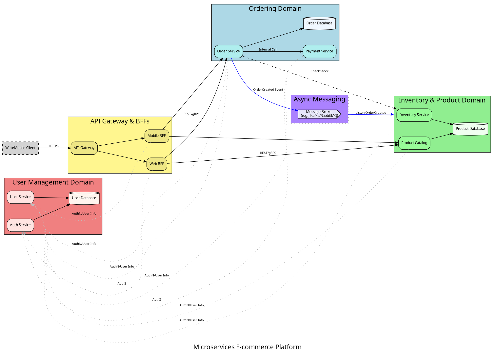
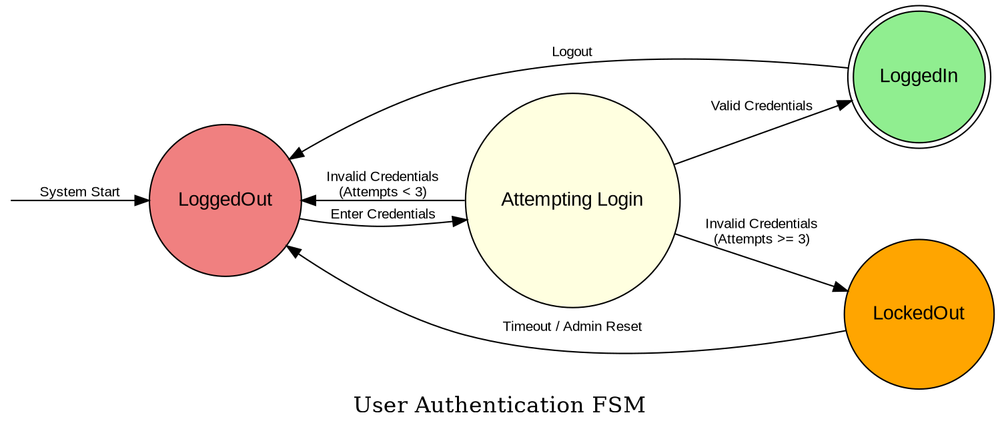
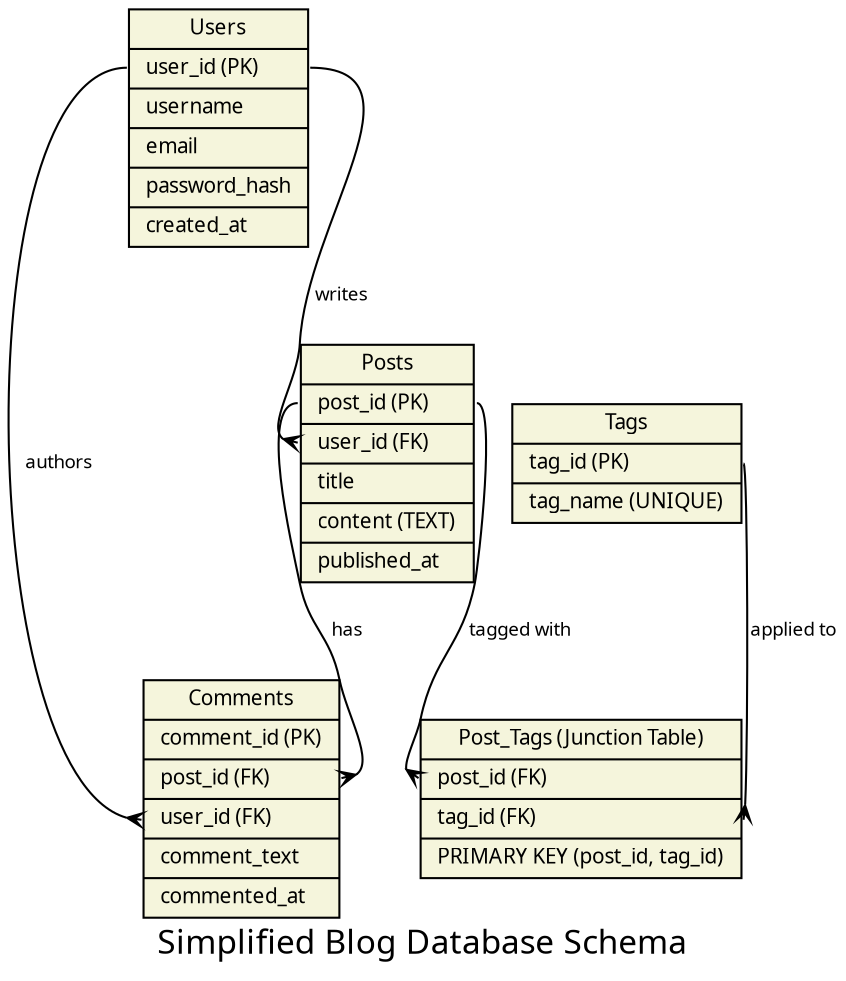
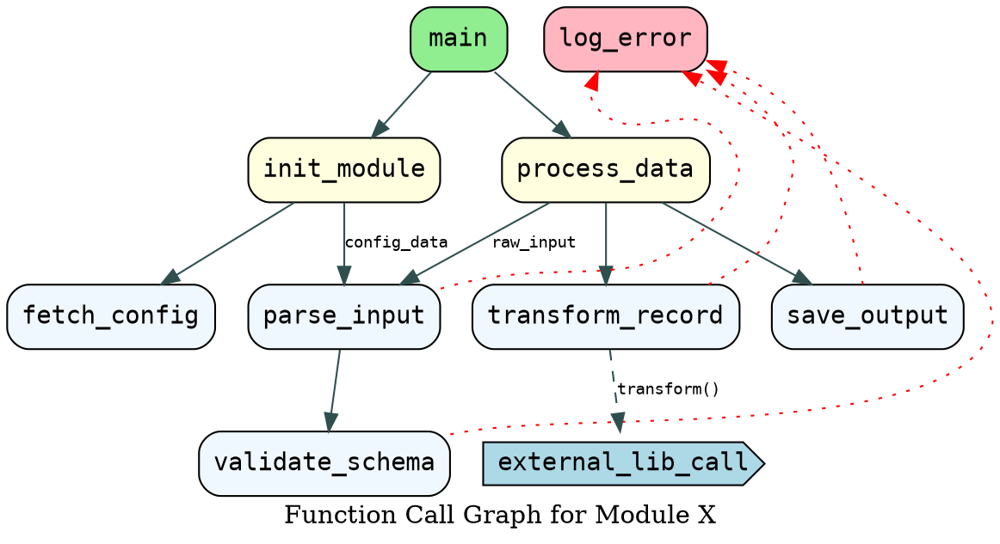
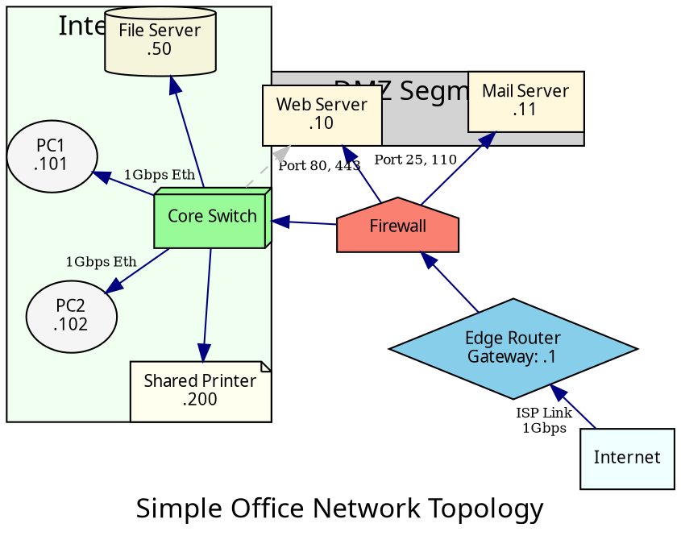

# Syntax Terrain: DOT Use Cases Deep Dive
> **Disclaimer:**
>
> This document contains my personal notes on the topic,
> compiled from publicly available documentation and various cited sources.
> The materials are intended for educational purposes, personal study, and reference.
> The content is dual-licensed:
> 1. **MIT License:** Applies to all code implementations (Swift, Mermaid, and other programming languages).
> 2. **Creative Commons Attribution-ShareAlike 4.0 International License (CC BY-SA 4.0):** Applies to all non-code content, including text, explanations, diagrams, and illustrations.
---

The DOT language, with its versatility and the power of Graphviz, lends itself to a wide array of diagramming needs. This deep dive explores several common use cases, showcasing how DOT features are applied to create clear and informative visuals.

---

## Use Case 1: Software Architecture Diagram (Microservices Example)

**Objective:** Visualize the components of a microservices architecture, their interactions, and their grouping by domain.

**Key DOT Features Used:**
*   `digraph` for directed relationships.
*   `rankdir=LR` for a left-to-right flow.
*   `subgraph cluster_*` for grouping services by domain.
*   Meaningful `label` and `shape` attributes for nodes.
*   `compound=true` for edges connecting to clusters.
*   `lhead`, `ltail` for logical cluster connections.
*   Color-coding for services and clusters.
*   `style=filled,rounded` for modern node appearance.

*Cartographer's Reflection: This diagram effectively uses clusters to demarcate service boundaries and colors to differentiate domains. `compound=true` along with `ltail` and `lhead` shows messaging flow between clusters more cleanly. Constraint-false edges are used for cross-cutting concerns like authentication without disturbing the primary flow.*

---

## Use Case 2: Finite State Machine (FSM)

**Objective:** Represent the states and transitions of a system, such as a network protocol or a UI workflow.

**Key DOT Features Used:**
*   `digraph` for directed transitions.
*   `shape=circle` or `shape=doublecircle` for states (start/end states).
*   `label` on edges to indicate transition triggers or actions.
*   An invisible starting node for a clean entry point arrow.

*Cartographer's Reflection: Simple shapes and clear edge labels make FSMs easy to understand. The invisible `INIT` node provides a neat starting arrow without cluttering a real state.*

---

## Use Case 3: Database Schema (Simplified ERD)

**Objective:** Illustrate tables in a relational database and their relationships (foreign keys).

**Key DOT Features Used:**
*   `shape=record` or HTML-like labels for table structures (fields, PK, FK).
*   Edge attributes `arrowhead`, `arrowtail` to simulate ERD notation (e.g., crow's foot for "many").
*   Labels on edges describe the relationship type.

*Cartographer's Reflection: `shape=record` is excellent for this. Using port names (like `<pk>`, `<fk_user>`) ensures edges connect precisely to the foreign key fields. `arrowhead=crow` and `arrowtail=tee` (or `none` for the "one" side) visually mimic ERD cardinality.* `\l` ensures left justification of field names in record labels.

---

## Use Case 4: Call Graph or Dependency Graph

**Objective:** Show function call relationships or dependencies between modules/libraries.

**Key DOT Features Used:**
*   `digraph`.
*   Node labels for functions/modules.
*   Edge labels (optional) for parameters or call frequency.
*   `weight` attribute on edges can influence layout for critical paths.
*   Color-coding for different scopes or types of calls.

*Cartographer's Reflection: This use case is straightforward. `constraint=false` and `style=dotted` for error logging paths keep them visually distinct and non-interfering with the main call flow layout.*

---

## Use Case 5: Network Topology Diagram

**Objective:** Visualize devices in a network and their connections.

**Key DOT Features Used:**
*   `graph` if connections are mostly bidirectional, or `digraph` if directionality is key.
*   `shape` to represent different device types (router, switch, server, firewall).
*   HTML-like labels or record shapes for device details (IP, hostname).
*   Edge `label` for link speeds or protocols.
*   Clusters for network segments or locations.

*Cartographer's Reflection: Using distinct shapes (`server`, `diamond`, `house`) helps instantly identify device types. `layout=neato` or `fdp` can produce more organic network layouts. `overlap=false` and `splines=true` help in arranging such graphs. `lhead` is used to indicate the edge logically enters a cluster.*

---

## Mapping Your Own Worlds

These examples showcase just a fraction of what's possible with DOT. The key is to understand your diagram's purpose, choose the appropriate DOT features (shapes, styles, layout controls, grouping), and apply best practices for clarity and maintainability. With these tools, you can effectively chart any system or process you encounter.

---

This deep dive into use cases hopefully illuminates how the features we've discussed translate into practical, communicative diagrams. Our journey through the DOT syntax terrain is nearing its completion.

Perhaps our final landmark could be **Troubleshooting Common DOT Errors** or discussing **Integration with Tools/Scripting** to automate diagram generation?

---

<!-- 

---
>**Licenses:**
>
>- **MIT License:**   - Full text in [LICENSE](LICENSE) file.
>- **Creative Commons Attribution-ShareAlike 4.0 International**: [CC BY-SA 4.0](https://creativecommons.org/licenses/by-sa/4.0/)  - Legal details in [LICENSE-CC-BY-SA-4.0](LICENSE-CC-BY-SA-4.0) and at [Creative Commons official site](https://creativecommons.org/licenses/by-sa/4.0/).
>
---