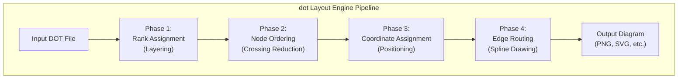

# Syntax Terrain: The `dot` Layout Engine in Graphviz
> **Disclaimer:**
>
> This document contains my personal notes on the topic,
> compiled from publicly available documentation and various cited sources.
> The materials are intended for educational purposes, personal study, and reference.
> The content is dual-licensed:
> 1. **MIT License:** Applies to all code implementations (Swift, Mermaid, and other programming languages).
> 2. **Creative Commons Attribution-ShareAlike 4.0 International License (CC BY-SA 4.0):** Applies to all non-code content, including text, explanations, diagrams, and illustrations.
---


The `dot` layout engine is the default and most well-known algorithm within Graphviz. It is specifically designed for producing **hierarchical or layered drawings of directed graphs**. Its primary goal is to effectively display flow and dependencies, making it ideal for visualizing organizational charts, process flows, state diagrams, call graphs, and any structure where directionality and layering are important.

## Core Algorithm (Simplified Overview)

The `dot` algorithm generally follows a four-phase process:

1.  **Rank Assignment:**
    *   Nodes are assigned to discrete ranks (or levels). The primary goal is to have edges point "downwards" (or in the direction of `rankdir`).
    *   It tries to minimize edge length (in terms of ranks spanned).
    *   Cycles in the graph are handled by temporarily reversing some edges to make the graph a Directed Acyclic Graph (DAG) for ranking, then restoring their direction for drawing.

2.  **Node Ordering within Ranks (Crossing Minimization):**
    *   Once nodes are assigned to ranks, their order within each rank is determined.
    *   The main objective here is to minimize the number of edge crossings between adjacent ranks, which significantly improves readability. This is an NP-hard problem, so heuristics are used.

3.  **Node Coordinate Assignment:**
    *   Exact X and Y coordinates are assigned to each node.
    *   It respects node sizes, `nodesep` (separation between nodes on the same rank), and `ranksep` (separation between ranks).

4.  **Edge Routing (Spline Drawing):**
    *   Paths for edges are determined.
    *   If `splines=true` (default), edges are drawn as smooth splines that avoid overlapping other nodes and, to some extent, other splines.
    *   If `splines=false` or `splines=line`, straight line edges are drawn.
    *   If `splines=ortho` (Graphviz >= 2.30), orthogonal (horizontal/vertical) edge segments are used.



----


## Key Attributes Influencing `dot`

*   **Graph Attributes:**
    *   **`rankdir`**: `TB` (default), `BT`, `LR`, `RL`. Defines the main flow direction.
    *   **`ranksep`**: Minimum vertical (for TB/BT) or horizontal (for LR/RL) distance between ranks, in inches. Can also be a list for non-uniform spacing.
    *   **`nodesep`**: Minimum space between adjacent nodes on the same rank, in inches.
    *   **`splines`**: `true`, `false`, `line`, `ortho`, `polyline`. Controls edge style.
    *   **`compound`**: `true` if edges connect to clusters (`lhead`, `ltail`).
    *   **`concentrate`**: `true` can merge parallel edges with common endpoints, potentially shortening paths. (Default is `false`).
    *   **`newrank`**: `true` allows subgraphs with `rank=same` to also influence the ranking of nodes outside the subgraph more strongly, sometimes needed for complex alignments. (Default is `false`).
    *   **`searchsize`**: Affects the effort `dot` puts into finding a "better" layout, especially regarding edge crossings. Increasing it may improve layout at the cost of time.

*   **Subgraph Attributes (for `rank` control):**
    *   **`rank`**:
        *   `same`: All nodes within this (unclustered) subgraph are placed on the same rank.
        *   `min`: Nodes are placed on the minimum (top most for TB, left most for LR) rank possible.
        *   `max`: Nodes are placed on the maximum (bottom most for TB, right most for LR) rank possible.
        *   `source`: Similar to `min`, often used for graph "source" nodes.
        *   `sink`: Similar to `max`, often used for graph "sink" nodes.
    ```dot
    /*
    * title: Subgraph Attributes
    * author: Cong Le
    * version: 1.0
    * license(s): MIT, CC BY-SA 4.0
    * copyright: Copyright (c) 2025 Cong Le. All Rights Reserved.
    * 
    */
    digraph RankDemo {
        rankdir=LR;
        subgraph { rank=source; A; B; } // A and B will be on the left-most rank
        subgraph { rank=same; C; D; E; } // C, D, E will be aligned vertically
        subgraph { rank=sink; F; }       // F will be on the right-most rank
        A -> C; B -> D; C -> F; D -> F; E -> F;
    }
    ```

*   **Node Attributes:**
    *   **`width`, `height`, `fixedsize`**: Influence the space a node occupies. `fixedsize=true` means `width` and `height` are strictly adhered to.
    *   **`group`**: Nodes with the same `group` name are preferentially kept together (if possible, without violating rank constraints too much or leading to edge crossings). This is a hint for node ordering.
    *   **`pos`**: Can be used to suggest a position, but if `dot` is laying out the graph, it typically calculates node positions. The `pos` attribute is more relevant when using `neato -n` (no-op layout).

*   **Edge Attributes:**
    *   **`weight`**: Higher weight values make edges "shorter" and "straighter" (more vertical in TB, more horizontal in LR), and influences node ordering to reduce crossings of heavy edges. This is a primary control for influencing hierarchy.
    *   **`minlen`**: Minimum rank span for an edge (integer). An edge with `minlen=2` will try to span at least two ranks.
    *   **`constraint`**: `true` (default) means the edge influences rank assignment. `constraint=false` means the edge does not affect node ranking (useful for annotations or secondary relationships).
    *   **`lhead`, `ltail`**: Name of a cluster that this edge logically connects to. Used with `compound=true`.
    *   **`headport`, `tailport`**: Compass points (`n`, `ne`, `e`, `se`, `s`, `sw`, `w`, `nw`, `c` for center) or record/HTML port names, specifying where the edge connects to the node.

----

## Strengths of `dot`

*   **Hierarchical Layout:** Excellent for showing dependencies, process flows, and organizational structures.
*   **Readability for Directed Graphs:** Minimizes edge crossings and aims for a clear flow.
*   **Port Connections:** Allows precise attachment of edges to record fields or HTML table cells.
*   **Cluster Support:** Good for visually grouping related nodes.
*   **Mature and Widely Used:** Extensive documentation and community support.

---

## Limitations and When to Consider Other Engines

*   **Undirected Graphs:** While `dot` can render undirected graphs (treating edges as bidirectional), it may not produce the most aesthetically pleasing layout. `neato` or `fdp` are often better for social networks, protein interaction maps, etc., where hierarchy is not the primary concern.
*   **Very Dense Graphs:** Can become slow and layouts might be cluttered if there are too many nodes and edges, especially with many crossings.
*   **Strict Positional Control:** `dot` prioritizes its layout algorithm. If you need exact pixel-perfect positioning of nodes, `dot` might not be the right tool (or you'd use `neato -n` with pre-calculated positions).
*   **Emphasis on Symmetry:** `dot` doesn't inherently try to make layouts symmetric.

---

## Tips for Working with `dot`

1.  **Start Simple:** Begin with basic node and edge definitions, then gradually add attributes to refine the layout.
2.  **Use `rankdir` Appropriately:** `TB` for vertical hierarchies, `LR` for horizontal flows.
3.  **Leverage `rank=same`:** Crucial for aligning related nodes at the same conceptual level.
4.  **Adjust `weight` on Edges:** This is a powerful heuristic. Increase weight for important hierarchical edges. Decrease for less important ones.
5.  **Use `constraint=false` Judiciously:** For non-hierarchical or annotation edges that shouldn't disrupt the main flow.
6.  **Iterate with Clusters:** Group related nodes within `subgraph cluster_...` to manage complexity and visually segment the graph.
7.  **Control Spacing:** Use `nodesep` and `ranksep` to adjust density.
8.  **Inspect Intermediate Output:** If a layout is unexpected, sometimes outputting to `.dot` format (`dot -Tdot mygraph.dot -o processed.dot`) can show how Graphviz interpreted things (e.g., after reversing edges for cycle removal). *This is less common now, as direct visualization is easier.*
9.  **Don't Over-Constrain:** Too many `rank=same` or high `weight` edges can sometimes lead to suboptimal or very wide/long layouts if they create conflicting demands.

---

## Navigating Hierarchies

The `dot` layout engine is the workhorse for many Graphviz users. By understanding its phases and the attributes that guide its decisions, you can effectively map out complex hierarchical systems and clearly communicate their structure and flow. It's a testament to well-designed algorithms for graph drawing.

---

With this deeper dive into the `dot` engine, our exploration of DOT's core functionalities is quite advanced.

Where shall our cartographic compass point next, Fellow Explorer?
1.  **A Deeper Look at `neato` or other layout engines?**
2.  **Troubleshooting Common DOT/Graphviz Errors?**
3.  **Advanced Edge Routing techniques and attributes?**
4.  **A comprehensive example applying many of these concepts to a specific problem?**


---

<!-- 


---
>**Licenses:**
>
>- **MIT License:**  [](LICENSE) - Full text in [LICENSE](LICENSE) file.
>- **Creative Commons Attribution-ShareAlike 4.0 International**: [CC BY-SA 4.0](https://creativecommons.org/licenses/by-sa/4.0/) [](https://creativecommons.org/licenses/by-sa/4.0/) - Legal details in [LICENSE-CC-BY-SA-4.0](LICENSE-CC-BY-SA-4.0) and at [Creative Commons official site](https://creativecommons.org/licenses/by-sa/4.0/).
>
---